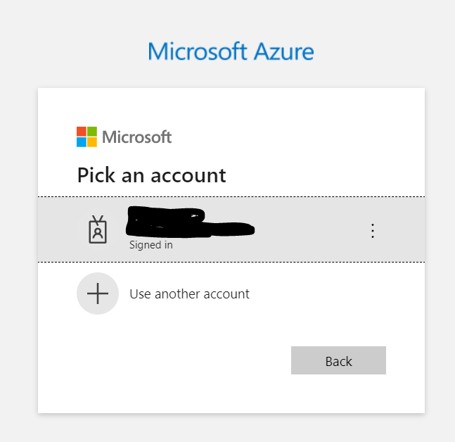
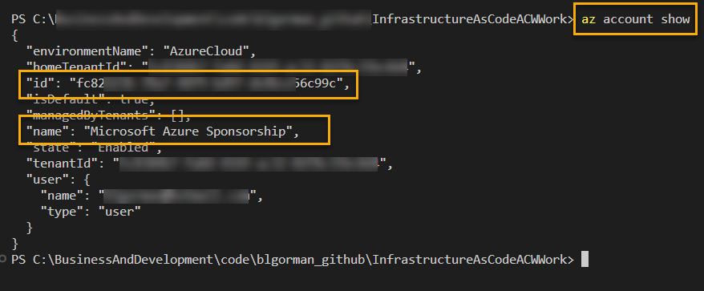
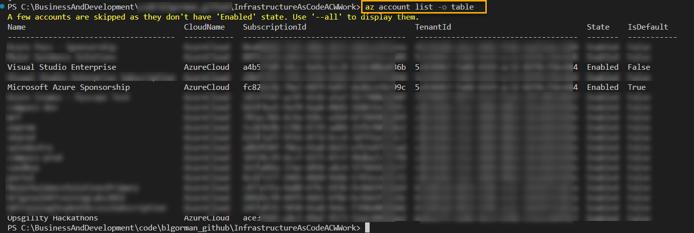
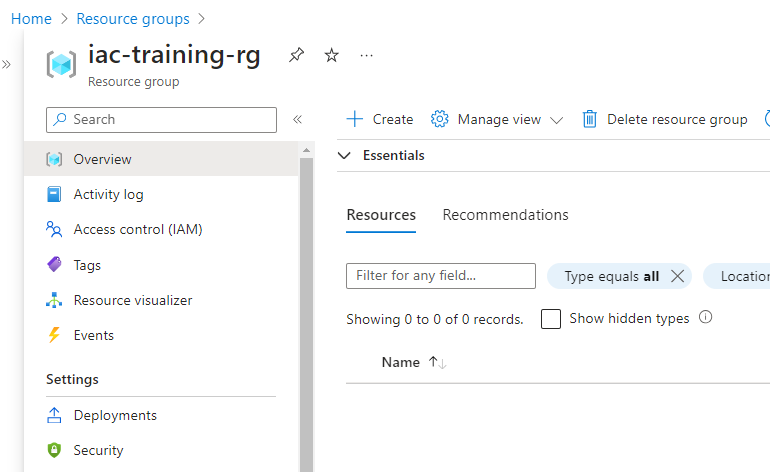

# Part 1: Introduction to IaC 

In this first part of the training walk through, you will have some common tasks to complete, then you will be able to choose if you want to complete the training with Bicep or Terraform (or both). 

First, let's take a minute to get familiar with Azure and how to work with various scopes for management and deployment. 

## Basics of Azure deployment, RBAC, and Policy scopes

Before getting started, it's important to note that there are scopes for executing deployments at Azure.  The following scopes are available:
- management group
- subscription
- resource group

### Management Groups

Management groups can have multiple subscriptions, so they are the top-level scope.  Anything done at the management group level can 'trickle-down' to the subscriptions and resource groups below it.  For example, if you assign a policy at the management group level, it will apply to all subscriptions and resource groups below it. If you create the policy at the management group but don't apply it, it will not apply to the subscriptions and resource groups below it unless they directly implement the policy.

Only some resources make sense to deploy at this level.  For example, you typically deploy policies at this level.  You may also deploy things like Azure Monitor Workspaces, Azure Security Center, etc.  You would not deploy things like storage accounts, virtual machines, etc. at this level, as those are typically scoped to a subscription in a resource group.

Management groups can be nested within other management groups as well. For example, you may have a management group for your entire organization, and then you may have management groups for each department, and then you may have management groups for each team within the department.  This is a good way to organize your resources and deployments, but it is not required, and this is typically not done unless you have a large organization with many teams and/or departments.

### Subscriptions

Subscriptions are the next level down from management groups.  Subscriptions are an excellent barrier for RBAC, policy, and billing so at this level, resources are typically mapped to environments and/or clients.  You can have multiple subscriptions under a single management group.  You can also have multiple resource groups under a subscription.  For example, common solutions for a single organization may be to have a subscription for each environment (dev, prod).  If your company has multiple clients, you may have a subscription for each client, and you many even have multiple subscriptions for each client (for the client dev, prod, etc).

### Resource Groups

Resource groups are a barrier for resources that are typically grouped together for lifecycle and/or security purposes. Resource groups are really for us humans that can't keep things straight in our heads over multiple workloads.  Azure will allow you to group in resource groups but that does not limit you to what can be deployed or to which region the resources can be deployed.  For example, you can deploy a storage account in a resource group in the East US region and a virtual machine in the same resource group in the West US region.  This is not recommended, but it is possible.  Typically, it would be recommended to separate workloads such as your web application with it's database, virtual machines, keyvaults, etc into groups that make sense both from a security and lifecycle perspective.  

For example, RBAC controls can let a client view resources only in one single resource group where your team might need to see all of the groups (subscription-level permissions).  

All resources live in resource groups, so it will be up to your team on how you want to deploy them.

### Why is this important?  

The reason this is important is because you can run deployments that only target a single resource group or you can run a deployment that targets the subscription and can therefore span multiple resource groups.

For example, suppose you just need a single storage account.  You can do that deployment to a single resource group.  Your IAC principal then only needs permission to that resource group (we'll do this in the first activity).

However, in real deployments for your company, you'll likely see a deployment that spans your entire subscription.  For example, you may have a deployment that creates a resource group for your web application and its resources, a resource group for your KeyVault used to encrypt storage and database keys, and in more robust scenarios you may also need to deploy networks and resources related to the networking. In these cases, you'll need to have permissions to the entire subscription, and you will likely create an orchestrator file (just a bicep or terraform file that calls other bicep or terraform files) that will deploy all of the resources with one deployment operation calling to modules. We will do this in part two when we deploy the entire application in part 2.

## Task 1: Get Logged in to Azure from the CLI

In this first task, you will log in to Azure from the CLI.  This will allow you to run commands against your subscription.  You will need to have an Azure subscription to complete this task.  If you don't have an Azure subscription, you can create a free account [here](https://azure.microsoft.com/en-us/free/).  You will also need to make sure you have the Azure CLI installed.  You can find instructions on how to install the Azure CLI [here](https://docs.microsoft.com/en-us/cli/azure/install-azure-cli).

To get started, you will need to have a terminal open to run the azure cli.  You can do this in Visual Studio Code terminal for Bash or PowerShell, or really any other terminal as long as you can run commands (even the windows command line should work).

### Step 1 - Ensure Azure CLI  

Begin by making sure you can run the Azure CLI.  

1. Execute the following command to validate Azure CLI is installed:

    ```bash
    az --version
    ```  
    >**Note:** if you do not see a current version of the Azure CLI as shown below, you will not be able to complete the next part of this task from your local machine.

    

### Step 2 - Log in to Azure

After validating the CLI is installed, make sure to continue on your local machine by logging in to Azure.

1. Log In to Azure

    Enter the following command to log in to Azure:
    ```bash  
    az login
    ```  

      

1. A browser window will open, enter login credentials or select an account that you are already logged in to.

      

1. A confirmation window will appear.

      

>**Note:** If you are having trouble getting logged in from your local machine, you can use the Azure Cloud Shell to complete the work in this training.  You can find instructions on how to use the Azure Cloud Shell [here](https://docs.microsoft.com/en-us/azure/cloud-shell/overview).  You will need to use the shell and run the commands as shown in these walkthroughs, but you will need to also ensure you have the files for your deployments created in the shell as well if you go this route.  Using the azure cloud shell will not be shown in the walkthroughs, so if you go this route you will need to figure out how to create the files in the shell and run the commands as shown in the walkthroughs.

### Step 3 - Ensure your subscription

Before doing any local deployments, it is a very good practice to make sure you are deploying to the correct subscription.  

1. Determine what subscription you are currently set to execute against.

    ```bash
    az account show
    ```  

     

    Review the output and determine that you are on the correct subscription.  You can see the name of the subscription and the subscription id.  Either can be used to set your subscription. 

    If you are on the correct subscription, you can continue to the next task.

1. If you need to change your subscription, you can do so by running the following commands:

    ```bash
    az account list -o table
    ```  

      

    Then, using the subscription id or name, run the following command:

    ```bash
    az account set --subscription <either-the-subscription-id or-name-goes-here>
    ```  

    

    Run the `az account show` command again to ensure you are on the correct subscription.

    Ensure you are on the correct subscription before continuing.

## Task 2 - Create a resource group

In this second task, you'll use the Azure CLI to create a resource group.  You'll need to have an Azure subscription and you'll need to be logged in to Azure from the CLI.  If you haven't completed the first task, please do so before continuing.  

You can create a resource group in the portal or via command line commands with the azure CLI. If you are struggling with the CLI, just pivot and go create a resource group in the portal (or switch to run the commands in the Azure Cloud Shell rather than from your local machine).

Assuming that creating a resource group is straight forward in the portal, let's do it via the CLI for the purposes of learning.

### Step 1 - Create variables

To create a resource group, you will need to set the name and location for the group. You should choose a region that is close to you that also has redundancy to match your needs.  For this walkthrough, any region will suffice, so choose one that is close to you.  You can find a list of regions [here](https://azure.microsoft.com/en-us/global-infrastructure/regions/).  

The name of the resource group should also make sense for the scope of your work.  For this, you are doing a simple deployment, so you can name it something like `iac-training-rg`.  You can name it whatever you want, but make sure it makes sense for the scope of your work and that you'll be confident you could delete the group later without fear of losing your work.

1. Set variables to manage your group name and your location of choice (use either bash or powershell, not both):

    Bash:  

    ```bash
    rg=iac-training-rg
    loc=eastus
    echo $rg
    echo $loc
    ```  

    

    PowerShell:  

    ```PowerShell
    $rg="iac-training-rg"
    $loc="eastus"
    echo $rg
    echo $loc
    ```  

    

### Step 2 - Create the resource group

With the variables in place, you can create and validate the existence of the resource group.

1. Create the group

    >**Note:** Only bash is shown below but the same commands work in PowerShell.

    ```bash  
    az group create -n $rg -l $loc
    ```  

1. Validate the group exists via the CLI:

      

    ```bash
    az group exists -n $rg
    ```  

    

1. You can also validate in the portal

    

>**Note**: The name of your resource group will be whatever you name it, so don't be alarmed if you named it something different than what is shown or used any other region than `eastus`, as there are no restrictions on the name or location of the resource group for this walkthrough and any region with a resource group of any name will work.

## Task 3: Complete the IaC activity with Bicep or Terraform

Now that you have a resource group to deploy resources to, you can complete the IaC activity.  You can choose to complete the activity with Bicep or Terraform.

Choose your path and complete the work using the tool of your choice.  You can do both if you want to, but you only need to do one to complete the training.

>**Important**: There will be requirements for a unique name. When this happens, use the YYYYMMDD of today along with your initials.  For example, if today is 2025-08-15 and your initials are `acw`, your unique identfier would be `20250815acw`.  Append your unique identifier to the end of variables like the storage account name.  This will ensure that you don't have naming conflicts with other people in the workshop.  For example, if the storage account is named `mystorage` then your actual storage account name should be `mystorage20250815acw`.

1. Complete [Part 1 - Introduction to IaC - Bicep](Part1_IntroductionToIaC_bicep.md)  

- or -

1. Complete [Part 1 - Introduction to IaC - Terraform](Part1_IntroductionToIaC_terraform.md)  
