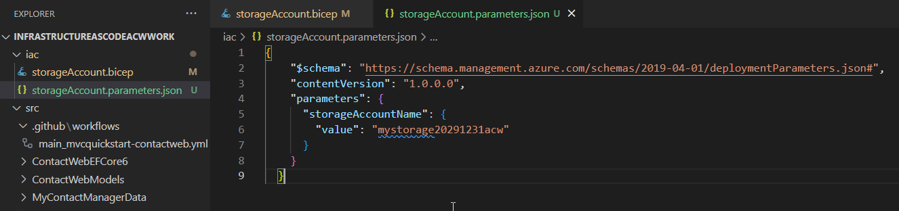

# Part 1 - Introduction to IaC (Bicep edition)

In these final steps of part 1, you will learn about Infrastructure as Code (IaC) and how to work with Bicep to create a simple storage account.  You'll also learn about things like:  

- running deployments from the command line
- group deployments
- subscription deployments

## Prerequisites

To complete this activity, you must have an editor like VSCode, an Azure Subscription with contributor access, and the Azure CLI installed, and you must also have installed the Azure bicep tools.

- [VSCode with bicep extension](https://learn.microsoft.com/en-us/azure/azure-resource-manager/bicep/install#visual-studio-code-and-bicep-extension)  
- [Azure CLI and Bicep tools](https://learn.microsoft.com/en-us/azure/azure-resource-manager/bicep/install#azure-cli)  

For this first activity, you'll be creating a simple storage account.  To do this easily, you'll want a couple of extensions for Bicep in place in VSCode:

- Bicep: 
  

- Azure Tools: 


>**Note:** We may not need Azure Tools, but it's a good idea to have it in place for other things you will do in the future.

It is also expected that you have completed the [Part1 - Introduction To IaC Common activity](Part1-IntroductionToIac.md) activity.  If you have not, please complete that activity first as you must be logged in to Azure and you must have an existing resource group to complete this activity.  

## Task 1 - Create your first bicep file to deploy a storage account to an existing resource group

In order to create a deployment, a bicep file is needed. The overall goal for this activity is to create a storage account using Bicep.  We'll do this in two steps by first creating a new bicep file. During this first deployment, we will use a resource-group level deployment. As we're going through this walkthrough, you'll learn about using parameters, variables, and outputs, as well as how to create and use separate files as modules.  You will also learn about the incremental nature of the deployment.

>**Note:** for this activity, I'm using VSCode with the Bicep extension.  Additionally, I've created a new repository at GitHub which has the starter web application code in it and will be where I'm generating screenshots.  For this reason, if you haven't already, you will want to have a GitHub repository where you can store your code and your bicep files (if you forked this repo you can leverage this repo but if you want it to be cleaner I would recommend your own repository with the source code only).

A good way to store your resources would be similar to the following:

  

>**Note:** If you are doing both bicep and terraform deployments you may wish to further nest your iac files appropriately.

### Step 1 - Create your file `storageAccount.bicep`

For bicep, the file you create is a simple file that ends with the *.bicep extension. This can be done in a bash terminal, in VSCode, or in PowerShell. Assuming you can make your way to the correct place and/or make your way to VSCode, create a folder if you don't have one for `iac`.  In that folder, create a file `storageAccount.bicep`.

Folder:  

```bash  
iac
```  

FileName:

```bash  
storageAccount.bicep
```  

VSCode:  

```text  
Right-click on the folder and select New File, name it `storageAccount.bicep`
```  

>**Note**: For bash and powershell, make sure you make directories `mkdir` and change directories `cd` to the correct location.

Bash:  

```bash  
touch storageAccount.bicep
```  

PowerShell:  

```PowerShell
"" > "storageAccount.bicep"
```  

### Completion Check

Before moving on, ensure that you have a file called `storageAccount.bicep` in a folder called `iac` at the root of your repository (or in an appropriate location).

  

### Step 2 - Create the bicep for a storage account

Using the `Bicep` extension is baked in with VSCode.  Open your `storageAccount.bicep` file and add the following code:

```bicep
sto
```  

You should see a dropdown with the following:
- res-storage
- res-vm-script-windows
- res-app-security-group
- ...


Select the `res-storage` option and you should see the following:

```bicep
resource storageaccount 'Microsoft.Storage/storageAccounts@2021-02-01' = {
  name: 'name'
  location: location
  kind: 'StorageV2'
  sku: {
    name: 'Premium_LRS'
  }
}
```  

>**Note**: If you are struggling just enter the code above into your file.

### Step 3 - Modify the file

As it stands, there are a couple of things that need to be modified in the file.  First, the name of the storage account needs to be unique, using 3-24 lowercase characters or numbers.  

Second, the location needs to be set to the location of the resource group.  Third, the sku needs to be changed to `Standard_LRS` to avoid paying for premium storage.

>**Important**: There will be requirements for a unique name. When this happens, use the YYYYMMDD of today along with your initials.  For example, if today is 2025-08-15 and your initials are `acw`, your unique identfier would be `20250815acw`.  Append your unique identifier to the end of variables like the storage account name.  This will ensure that you don't have naming conflicts with other people in the workshop.  For example, if the storage account is named `mystorage` then your actual storage account name should be `mystorage20250815acw`.

Change the code to the following (don't forget to change the YYYYMMDDabc to your unique identifier):

```bicep
resource storageaccount 'Microsoft.Storage/storageAccounts@2021-02-01' = {
  name: 'mystorageYYYYMMDDabc'
  location: 'eastus'
  kind: 'StorageV2'
  sku: {
    name: 'Standard_LRS'
  }
}
```

>**Note**: You will receive a warning about the location for the resource group.  We will fix that soon.

## Task 2 - Run the deployment

With the file in place, it's time to try to deploy the storage account.

You could do this with the VSCode extension, however we are going to be deploying via the CLI.

Ensure you are logged in to Azure via the CLI and that you have selected the correct subscription.  If you have not, please do so now (this should already be done from the common part of the activity).  

Additionally, ensure you have already set the variable for the resource group name to `$rg` (this should already be done from the common part of the activity).  IF not, please do so now.

Change directory to the `iac` folder where your file is located.

```bash
cd iac
```  

    


### Step 1 - Issue commands to run the deployment

When you are certain the file is saved and you are at the correct location, run the following command to create the deployment:  

```bash
az deployment group create --resource-group $rg --template-file storageAccount.bicep
```  

>**Note:** You will see the warning again but the deployment should still work.  Also I had an older version of Bicep so I got a warning about that as well.

  

In the output, there are a couple of things to call out.

First, you can see the name of the resource group and the name of the storage account as deployed.

Additionally, you can find the fact that the default mode for deployment is `incremental`.  The incremental mode is what you should use about 99.9% of the time as it will not destroy resources, only modify what exists in the template. 

The other mode is `complete` which will destroy resources that are not in the template.  This is useful for cleaning up resources that are no longer needed or preventing drift in production subscriptions.  We will not be doing any complete deployments in this workshop.

### Step 2 - Verify the deployment  

With the deployment complete, you can verify the deployment in the portal.  Navigate to the resource group and you should see the storage account that was created.

  

You can also verify the deployment via the CLI.  Run the following command:

```bash  
az storage account list --resource-group $rg
```  

### Completion Check

You have a storage account in your resource group that was named as you intended and deployed to the correct location.

## Task 3 - Use parameters

In this part you'll create parameters for the storage account name and location.  You'll also learn how to use the parameters in your deployment.

### Step 1 - Add parameters to the bicep file

To keep this simple, you will be parameterizing only the name and location of the storage account.  To do this, add the following code to the top of the file:

```bicep
param storageAccountName string = 'mystorage20291231acw'
param location string = 'eastus'
```

If you set the parameters as above, they will not need to be passed in and those default values would be used.  If you do not set the parameters as above, you will need to pass in the parameters when you run the deployment using a parameters file (shown in the next step).

To complete this first work, however, you need to leverage the parameters in the bicep deployment.  Change the name and location of the storage account resource to use the parameters as follows:

```bicep  
param storageAccountName string = 'mystorage20291231acw'
param location string = 'eastus'

resource storageaccount 'Microsoft.Storage/storageAccounts@2021-02-01' = {
  name: storageAccountName
  location: location
  kind: 'StorageV2'
  sku: {
    name: 'Standard_LRS'
  }
}
```

>**Note:** You can also parameterize the kind and sku name if you would like to do so.

With the parameters in place, run the deployment again (note that you will no longer receive the warning for the hard-coded location):

```bash
az deployment group create --resource-group $rg --template-file storageAccount.bicep  
```

Ensure that the deployment completes and that you still only have one resource group with one storage account.  As long as you didn't change the name, the incremental deployment should have worked as expected and would just update the existing storage account if any changes were needed.  

### Step 2 - Create a parameters file  

In order to deploy with various parameters, you can pass them in the command line as you run the deployment or you can create a template file that has the parameters in it.  For most IAC deployments you'll want the parameters file.

Additionally, running locally allows you to use the *.bicep parameters file, however running from GitHub actions requires a *.json parameters file.  For this reason, we will create a *.json parameters file and use it locally.  

Create a file called `storageAccount.parameters.json` and add the following code:

```json
{
    "$schema": "https://schema.management.azure.com/schemas/2019-04-01/deploymentParameters.json#",
    "contentVersion": "1.0.0.0",
    "parameters": {
        "storageAccountName": {
        "value": "mystorage20291231acw"
        }
    }
}
```   

  

### Step 3 - Deploy via parameters file

To ensure the file is used, remove the default value for the storage account name parameter in the bicep file.

```bicep
param storageAccountName string
param location string = 'eastus'

resource storageaccount 'Microsoft.Storage/storageAccounts@2021-02-01' = {
  name: storageAccountName
  location: location
  kind: 'StorageV2'
  sku: {
    name: 'Standard_LRS'
  }
}
```  

  

With the new parameters file in place, modify the command and run the deployment again:

```bash  
az deployment group create --resource-group $rg --template-file storageAccount.bicep --parameters storageAccount.parameters.json
```  


### Completion Check

You have a file that you can reuse in multiple resource groups with various storage account names (you would need to change the name in the parameter file at this point to ensure it is unique)

## Task 4 - Use variables and functions

In this task you will learn to use variables and functions to create a unique string name for the storage account name

### Step 1 - Create a variable for the storage account name

### Step 2 - Use the variable in the storage account name

### Step 3 - Add a unique string to the storage account name

### Step 4 - Deploy via parameters file

### Completion Check

You can now deploy the same file to different resource groups multiple times and it will create a unique storage account name per group

## Task 5 - Use modules and outputs

In part 2, we will be doing an entire subscription deployment.  For that reason, let's learn about it quickly here before diving deeper in part 2.

### Step 1 - Create an orchestrator file

Use subscription level

### Step 2 - Create a module for the storage account

call the storage deployment at the subscription scope for the correct resource group

### Step 3 - Create an output for the storage account 

Examine the output of the deployment in the portal

### Step 4 - Show how to leverage an output in another deployment

Add another file to create a container in the storage account
Deploy via a module
Explain that this could easily be done in one file.  The reason for doing it this way is to show how to use outputs in other deployments.

### Step 5 - Deploy via cli

Deploy the subscription level deployment to Azure

## Conclusion

In this first part, you learned how to work with Bicep to create a simple storage account in a resource group.  You also learned about things like:
- creating bicep files
- running deployments from the command line
- using parameters
- using variables
- using functions
- using modules
- using outputs


