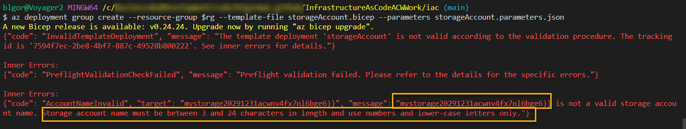

# Part 1 - Introduction to IaC (Bicep edition)

In these final steps of part 1, you will learn about Infrastructure as Code (IaC) and how to work with Bicep to create a simple storage account.  You'll also learn about things like:  

- running deployments from the command line
- group deployments
- subscription deployments

## Prerequisites

To complete this activity, you must have an editor like VSCode, an Azure Subscription with contributor access, and the Azure CLI installed, and you must also have installed the Azure bicep tools.

- [VSCode with bicep extension](https://learn.microsoft.com/en-us/azure/azure-resource-manager/bicep/install#visual-studio-code-and-bicep-extension)  
- [Azure CLI and Bicep tools](https://learn.microsoft.com/en-us/azure/azure-resource-manager/bicep/install#azure-cli)  

1. For this first activity, you'll be creating a simple storage account.  To do this easily, you'll want a couple of extensions for Bicep in place in VSCode:

    - Bicep: 
      

    - Azure Tools: 
    

    >**Note:** We may not need Azure Tools, but it's a good idea to have it in place for other things you will do in the future.

    It is also expected that you have completed the [Part1 - Introduction To IaC Common activity](Part1-IntroductionToIac.md) activity.  If you have not, please complete that activity first as you must be logged in to Azure and you must have an existing resource group to complete this activity.  

## Task 1 - Create your first bicep file to deploy a storage account to an existing resource group

In order to create a deployment, a bicep file is needed. The overall goal for this activity is to create a storage account using Bicep.  We'll do this in two steps by first creating a new bicep file. During this first deployment, we will use a resource-group level deployment. As we're going through this walkthrough, you'll learn about using parameters, variables, and outputs, as well as how to create and use separate files as modules.  You will also learn about the incremental nature of the deployment.

>**Note:** for this activity, I'm using VSCode with the Bicep extension.  Additionally, I've created a new repository at GitHub which has the starter web application code in it and will be where I'm generating screenshots.  For this reason, if you haven't already, you will want to have a GitHub repository where you can store your code and your bicep files. For simplicity, [fork this repo](https://github.com/AzureCloudWorkshops/ACW-InfrastructureAsCode_Workshop)

A good way to store your resources would be similar to the following:

  

>**Note:** If you are doing both bicep and terraform deployments you may wish to further nest your iac files appropriately.

### Step 1 - Create your file `storageAccount.bicep`

For bicep, the file you create is a simple file that ends with the *.bicep extension. This can be done in a bash terminal, in VSCode, or in PowerShell. Assuming you can make your way to the correct place and/or make your way to VSCode, create a folder if you don't have one for `iac`.  

1. Create the  `storageAccount.bicep` file.

    Folder:  

    ```bash  
    iac
    ```  

    FileName:

    ```bash  
    storageAccount.bicep
    ```  

    VSCode:  

    ```text  
    Right-click on the folder and select New File, name it `storageAccount.bicep`
    ```  

    >**Note**: For bash and powershell, make sure you make directories `mkdir` and change directories `cd` to the correct location.

    Bash:  

    ```bash  
    touch storageAccount.bicep
    ```  

    PowerShell:  

    ```PowerShell
    "" > "storageAccount.bicep"
    ```  

### Completion Check

Before moving on, ensure that you have a file called `storageAccount.bicep` in a folder called `iac` at the root of your repository (or in an appropriate location).

  

### Step 2 - Create the bicep for a storage account

Next, you need to add the code to create the storage account via bicep.

1. Using the `Bicep` extension is baked in with VSCode.  Open your `storageAccount.bicep` file and add the following code:

    ```bicep
    sto
    ```  

    You should see a dropdown with the following:
    - res-storage
    - res-vm-script-windows
    - res-app-security-group
    - ...

    

    Select the `res-storage` option and you should see the following:

    ```bicep
    resource storageaccount 'Microsoft.Storage/storageAccounts@2021-02-01' = {
      name: 'name'
      location: location
      kind: 'StorageV2'
      sku: {
        name: 'Premium_LRS'
      }
    }
    ```  

    >**Note**: If you are struggling just enter the code above into your file.

### Step 3 - Modify the file

As it stands, there are a couple of things that need to be modified in the file.  First, the name of the storage account needs to be unique, using 3-24 lowercase characters or numbers.  

Second, the location needs to be set to the location of the resource group.  Third, the sku needs to be changed to `Standard_LRS` to avoid paying for premium storage.

>**Important**: There will be requirements for a unique name. When this happens, use the YYYYMMDD of today along with your initials.  For example, if today is 2025-08-15 and your initials are `acw`, your unique identfier would be `20250815acw`.  Append your unique identifier to the end of variables like the storage account name.  This will ensure that you don't have naming conflicts with other people in the workshop.  For example, if the storage account is named `mystorage` then your actual storage account name should be `mystorage20250815acw`.

1. Change the code to the following (don't forget to change the YYYYMMDDabc to your unique identifier):

    ```bicep
    resource storageaccount 'Microsoft.Storage/storageAccounts@2021-02-01' = {
      name: 'mystorageYYYYMMDDabc'
      location: 'eastus'
      kind: 'StorageV2'
      sku: {
        name: 'Standard_LRS'
      }
    }
    ```

    >**Note**: You will receive a warning about the location for the resource group.  We will fix that soon.

## Task 2 - Run the deployment

With the file in place, it's time to try to deploy the storage account.

You could do this with the VSCode extension, however we are going to be deploying via the CLI.

Ensure you are logged in to Azure via the CLI and that you have selected the correct subscription.  If you have not, please do so now (this should already be done from the common part of the activity).  

Additionally, ensure you have already set the variable for the resource group name to `$rg` (this should already be done from the common part of the activity).  IF not, please do so now.

1. Change directory to the `iac` folder where your file is located.

    ```bash
    cd iac
    ```  

        


### Step 1 - Issue commands to run the deployment

Run the deployment via the CLI.

1. When you are certain the file is saved and you are at the correct location, run the following command to create the deployment:  

    ```bash
    az deployment group create --resource-group $rg --template-file storageAccount.bicep
    ```  

    >**Note:** You will see the warning again but the deployment should still work.  Also I had an older version of Bicep so I got a warning about that as well.

      

1. In the output, there are a couple of things to call out.

    First, you can see the name of the resource group and the name of the storage account as deployed.

    Additionally, you can find the fact that the default mode for deployment is `incremental`.  The incremental mode is what you should use about 99.9% of the time as it will not destroy resources, only modify what exists in the template. 

    The other mode is `complete` which will destroy resources that are not in the template.  This is useful for cleaning up resources that are no longer needed or preventing drift in production subscriptions.  We will not be doing any complete deployments in this workshop.

### Step 2 - Verify the deployment  

With the deployment complete, you can verify the deployment in the portal.  

1. Navigate to the resource group and you should see the storage account that was created.

      

    You can also verify the deployment via the CLI.  Run the following command:

    ```bash  
    az storage account list --resource-group $rg
    ```  

### Completion Check

You have a storage account in your resource group that was named as you intended and deployed to the correct location.

## Task 3 - Use parameters

In this part you'll create parameters for the storage account name and location.  You'll also learn how to use the parameters in your deployment.

### Step 1 - Add parameters to the bicep file

To keep this simple, you will be parameterizing only the name and location of the storage account.  

1. To do this, add the following code to the top of the file:

    ```bicep
    param storageAccountName string = 'mystorage20291231acw'
    param location string = 'eastus'
    ```

    If you set the parameters as above, they will not need to be passed in and those default values would be used.  If you do not set the parameters as above, you will need to pass in the parameters when you run the deployment using a parameters file (shown in the next step).

    To complete this first work, however, you need to leverage the parameters in the bicep deployment.  Change the name and location of the storage account resource to use the parameters as follows:

    ```bicep  
    param storageAccountName string = 'mystorage20291231acw'
    param location string = 'eastus'

    resource storageaccount 'Microsoft.Storage/storageAccounts@2021-02-01' = {
      name: storageAccountName
      location: location
      kind: 'StorageV2'
      sku: {
        name: 'Standard_LRS'
      }
    }
    ```

    >**Note:** You can also parameterize the kind and sku name if you would like to do so.

1. With the parameters in place, run the deployment again (note that you will no longer receive the warning for the hard-coded location):

    ```bash
    az deployment group create --resource-group $rg --template-file storageAccount.bicep  
    ```

    Ensure that the deployment completes and that you still only have one resource group with one storage account.  As long as you didn't change the name, the incremental deployment should have worked as expected and would just update the existing storage account if any changes were needed.  

### Step 2 - Create a parameters file  

In order to deploy with various parameters, you can pass them in the command line as you run the deployment or you can create a template file that has the parameters in it.  For most IAC deployments you'll want the parameters file.

Additionally, running locally allows you to use the *.bicep parameters file, however running from GitHub actions requires a *.json parameters file.  For this reason, we will create a *.json parameters file and use it locally.  

1. Create a file called `storageAccount.parameters.json` and add the following code:

    ```json
    {
        "$schema": "https://schema.management.azure.com/schemas/2019-04-01/deploymentParameters.json#",
        "contentVersion": "1.0.0.0",
        "parameters": {
            "storageAccountName": {
            "value": "mystorage20291231acw"
            }
        }
    }
    ```   

      

### Step 3 - Deploy via parameters file

To ensure the file is used, remove the default value for the storage account name parameter in the bicep file.

1. Modify your bicep as follows:  
    ```bicep
    param storageAccountName string
    param location string = 'eastus'

    resource storageaccount 'Microsoft.Storage/storageAccounts@2021-02-01' = {
      name: storageAccountName
      location: location
      kind: 'StorageV2'
      sku: {
        name: 'Standard_LRS'
      }
    }
    ```  

      

1. With the new parameters file in place, modify the command and run the deployment again:

    ```bash  
    az deployment group create --resource-group $rg --template-file storageAccount.bicep --parameters storageAccount.parameters.json
    ```  

    

### Completion Check

You have a file that you can reuse in multiple resource groups with various storage account names (you would need to change the name in the parameter file at this point to ensure it is unique).

## Task 4 - Use variables and functions

In this task you will learn to use variables and functions to create a unique string name for the storage account name

### Step 1 - Modify the location to pull from the resource group location  

There are a number of functions that are built-in with bicep that you can use.  Later in this task you'll use some string functions.  To get started, however, you'll use the `resourceGroup()` function to pull the location from the resource group. 

1. To do this, modify the location parameter to the following:

    ```bicep
    param storageAccountName string
    param location string = resourceGroup().location

    //...
    ```

      

    Additional functions of interest are:
    - `subscription().subscriptionId` - returns the subscription id
    - `tenant().tenantId` - returns the tenant id
    - `resourceGroup().id` - returns the resource group id, plus you can do the `*.id` function with any resource (you'll learn more in the outputs later)

### Step 2 - Parameterize your unique identifier  

To make the unique identifier more flexible, you can parameterize it.  


1. To do this, add a parameter for the unique identifier to the top of the file, and do not give it a default value.  For example:

    ```bicep
    param storageAccountName string
    param location string = resourceGroup().location
    param uniqueIdentifier string

    //...
    ```  

    Add the value to your parameters file (also remove it from the storage account name):

    ```json
    {
        "$schema": "https://schema.management.azure.com/schemas/2019-04-01/deploymentParameters.json#",
        "contentVersion": "1.0.0.0",
        "parameters": {
            "storageAccountName": {
                "value": "mystorage"
            },
            "uniqueIdentifier": {
                "value": "20291231acw"
            }
        }
    }
    ```  

    With these two values separated, you can now utilize them appropriately in your deployment.

### Step 3 - Create a variable for the storage account name

There are a couple of possibilities on how you can combine parameters, but the easiest is to use a variable.  To do this, add the following variable to the top of the file (typically, I like to put my variables after any parameters just for readability):

1. Add the `storageAccountNameFull` variable to the bicep file:
    ```bicep
    param storageAccountName string
    param location string = resourceGroup().location
    param uniqueIdentifier string

    var storageAccountNameFull = '${storageAccountName}${uniqueIdentifier}'

    //...
    ```    

1. Next, make sure to update the `name` value in the `storageaccount` resource to use the new variable:

    ```bicep
    param storageAccountName string
    param location string = resourceGroup().location
    param uniqueIdentifier string

    var storageAccountNameFull = '${storageAccountName}${uniqueIdentifier}'

    resource storageaccount 'Microsoft.Storage/storageAccounts@2021-02-01' = {
      name: storageAccountNameFull
      location: location
      kind: 'StorageV2'
      sku: {
        name: 'Standard_LRS'
      }
    }
    ```

1. To ensure that everything is still working as expected, this would be a great time to redeploy the file:

    ```bash  
    az deployment group create --resource-group $rg --template-file storageAccount.bicep --parameters storageAccount.parameters.json
    ```  

### Completion Check

At this point you have split the parameters for the name and unique identifier and you are using the resourceGroup().location function to set the location for deployment based on the group where the storage account will be housed.

### Step 4 - Add a unique string to the storage account name

As it stands, the storage account name is not unique.  To make it unique, you can add a unique string to the end of the storage account name.  To do this, you can use the `uniqueString()` function.  Typically, this is done with the resource group id, however, you can use any string.  

```bash
uniqueString(resourceGroup().id)
```

1. To make this work, add the unique string to the end of the storage account name variable:

    ```bicep
    param storageAccountName string
    param location string = resourceGroup().location
    param uniqueIdentifier string

    var storageAccountNameFull = '${storageAccountName}${uniqueIdentifier}${uniqueString(resourceGroup().id)})}'

    resource storageaccount 'Microsoft.Storage/storageAccounts@2021-02-01' = {
      name: storageAccountNameFull
      location: location
      kind: 'StorageV2'
      sku: {
        name: 'Standard_LRS'
      }
    }
    ```  

1. Run the deployment again.  

    If this works, you will now have two storage accounts, one with the original name and one with the unique string at the end.  Let's find out if it will work:

    ```bash  
    az deployment group create --resource-group $rg --template-file storageAccount.bicep --parameters storageAccount.parameters.json
    ```  

      

    >**ERROR:** Uh-oh! You should have received an error.  The reason for this is that the storage account name is too long.  The minimum length for a storage account name is 3 characters, and the maximum is 24.  To fix this, you can use the `length()` function to ensure that the storage account name is at least 3 characters long.  

    As you can see, the unique string appended to the end of the storage account name makes the account name too long.  

1. To fix this, you can also use a substring function to truncate the unique string:

    ```bicep
    var storageAccountNameFull = substring('${storageAccountName}${uniqueIdentifier}${uniqueString(resourceGroup().id)})}', 0, 24)
    ```  

    Note the positioning of each function, where the string begins and ends, and the length start at 0 and end at 24.  This will ensure that the storage account name is never longer than the 24 characters.  Can you see that there may still be a problem?  If not, try to figure it out before moving on.

    >**Hint:** What do you think will happen if the name of the storage account with all the appended text is less than 24 characters?

    We know for sure this one will be long enough so let's deploy again and make sure it works as-is when the name is long enough (i.e. 24 or more characters):

    ```bicep
    param storageAccountName string
    param location string = resourceGroup().location
    param uniqueIdentifier string

    var storageAccountNameFull = substring('${storageAccountName}${uniqueIdentifier}${uniqueString(resourceGroup().id)})}', 0, 24)

    resource storageaccount 'Microsoft.Storage/storageAccounts@2021-02-01' = {
      name: storageAccountNameFull
      location: location
      kind: 'StorageV2'
      sku: {
        name: 'Standard_LRS'
      }
    }
    ```  

    ```bash  
    az deployment group create --resource-group $rg --template-file storageAccount.bicep --parameters storageAccount.parameters.json
    ```  

    As expected, this time it did work and did deploy a second storage account as per the naming convention with the appended partial unique string:

      

### Step 5 - Use decorators to ensure storage account name is unique and is long enough

As mentioned above, everything is great when the string for the storage account name is at least 24 characters long.  However, the parameterization makes is possible in the current state that this would not be the case.

1. Modify the storage account name to `sa` and uniqueIdentifier parameters to just your initials in the `parameters.json` file:

    ```json
    {
        "$schema": "https://schema.management.azure.com/schemas/2019-04-01/deploymentParameters.json#",
        "contentVersion": "1.0.0.0",
        "parameters": {
            "storageAccountName": {
                "value": "sa"
            },
            "uniqueIdentifier": {
                "value": "acw"
            }
        }
    }
    ```

1. Run the deployment again, what happens?

      

    The name is too short.  To fix this, you can use a decorator to ensure that the parameters are a certain length.  
    
1. To fix the short name problem, add the following decorators to the `storageAccountName` and the `uniqueIdentifier` parameters:

    ```bicep
    @minLength(3)
    param storageAccountName string
    param location string = resourceGroup().location
    @minLength(11)
    @maxLength(11)
    param uniqueIdentifier string

    var storageAccountNameFull = substring('${storageAccountName}${uniqueIdentifier}${uniqueString(resourceGroup().id)})}', 0, 24)

    //...
    ```

    The min/max length decorators will ensure your bicep won't deploy unless the minimum and/or maximum lengths are correct.  By doing this, you can ensure that your storage account name will never be too short and will always be unique at 24 characters.

    Try running the deployment with the bad parameters again, what happens?

      

1. Change the parameters back to the original values in the `parameters.json` file and run the deployment again.  This time it should work as expected.


1. Time permitting, another parameter decorator that you should be aware of is the `@allowed` parameter decorator.  This decorator allows you to specify a list of allowed values for a parameter.  For example, if you wanted to ensure that the location was only ever `eastus` or `westus`, you could use the following decorator:

    ```bicep
    @allowed([
      'eastus'
      'eastus2'
      'westus'
      'westus2'
    ])
    param location string 
    ```  

    However, this will not work with the `resourceGroup().location` function.  

1. For that reason, assume you need to name the storage account based on the environment.  Add a new parameter for the environment and append it into the string for the storage account name:

    ```bicep
    @minLength(3)
    param storageAccountName string
    param location string = resourceGroup().location
    @minLength(11)
    @maxLength(11)
    param uniqueIdentifier string
    @minLength(3)
    @maxLength(4)
    @allowed([
      'dev'
      'prod'
    ])
    param environment string = 'dev'

    var storageAccountNameFull = substring('${storageAccountName}${uniqueIdentifier}${environment}${uniqueString(resourceGroup().id)})}', 0, 24)

    resource storageaccount 'Microsoft.Storage/storageAccounts@2021-02-01' = {
      name: storageAccountNameFull
      location: location
      kind: 'StorageV2'
      sku: {
        name: 'Standard_LRS'
      }
    }
    ```  

1. Run the deployment again.  

    Now you have three storage accounts, the original, the one with the truncated unique id, and the new one with `dev`.

      

    You now have a very powerful template that can deploy a storage account with a unique name to any resource group in any location and can be toggled for the environment to `dev` or `prod`.

1. Add the parameter to the `parameters.json` file, and set the value to `prod` then run again.  

    You should now have four storage accounts, the original, the one with the truncated unique id, the one with `dev`, and the one with `prod`:

    ```json
    {
        "$schema": "https://schema.management.azure.com/schemas/2019-04-01/deploymentParameters.json#",
        "contentVersion": "1.0.0.0",
        "parameters": {
            "storageAccountName": {
                "value": "mystorage"
            },
            "uniqueIdentifier": {
                "value": "20291231acw"
            },
            "environment": {
                "value": "prod"
            }
        }
    }
    ```

    ```bash
    az deployment group create --resource-group $rg --template-file storageAccount.bicep --parameters storageAccount.parameters.json
    ```  

    

1. Question: What do you think will happen if you run the deployment again?  If you are unsure, try it again and see what happens.

1. Question: What do you think will happen if you change the value of the parameter in the json file to `uat`?  Try it and see what happens.

    

>**Note:** The final files generated to this point can be found in the parent repository under the `src/iac/bicep/Part1/ResourceGroupLevelDeployment` folder.  You will need working files in the next part of the activity, so if yours are not working, make sure to leverage the source to see where you may have gone wrong.  The final files from this module are also in the ``src/iac/bicep/Part1` folder but they contain all the changes about to be made for the next steps.

### Completion Check

You can now deploy the same file to different resource groups multiple times and it will create a unique storage account name per group and per environment by changing a couple of simple parameters and using built-in functions.  While we are not doing this in this activity, you could do so on your own for practice if you would like (you'll need another resource group to deploy to, and you could try both dev and prod deployments).  

## Task 5 - Use modules and outputs

In part 2, we will be doing an entire subscription deployment.  For that reason, let's learn about it quickly here before diving deeper in part 2, using the same storage account deployment we've successfully created above.

### Step 1 - Create an orchestrator file

For this part of the deployment, we'll start using a subscription-level deployment.  To do this with your user account, you must be a contributor on the subscription.

1. To begin, we need a new file to orchestrate the whole process, including the creation of the resource group.

    Remember that these deployments are incremental (in fact at the subscription level they **must** be incremental [why do you think that is?]).  For that reason, even recreating the resource group won't hurt anything if the group already exists, and it will not delete anything in the group that is not in the template.  The only changes would be modifications to existing resources named in the template.

1. Create a new file called `deployAll.bicep` at the root of your `iac` folder.  

    ```bicep
    deployAll.bicep
    ```  

    Begin by typing `target` and you should see the `targetScope` option.  Select it, then add an `=` to reveal your four choices:  

      

    Select `subscription` since this will be a subscription-level deployment.

    Next, you will need to make sure the resource group is  created.  To do this, make your bicep file look as follows:

    ```bicep
    targetScope = 'subscription'

    resource iacTrainingResourceGroup 'Microsoft.Resources/resourceGroups@2018-05-01' = {
      name: 'myResourceGroup'
      location: 'eastus'
    }
    ```  

1. Of course we don't want to have that name and location, so it's time to parameterize them.  Do you remember how to do that?

    ```bicep
    targetScope = 'subscription'

    param rgName string
    param location string

    resource iacTrainingResourceGroup 'Microsoft.Resources/resourceGroups@2018-05-01' = {
      name: rgName
      location: location
    }
    ```  

    Next, we need to create the parameters file to pass in the name and location for the group:

    ```json  
    {
        "$schema": "https://schema.management.azure.com/schemas/2019-04-01/deploymentParameters.json#",
        "contentVersion": "1.0.0.0",
        "parameters": {
            "rgName": {
                "value": "iac-training-rg"
            },
            "location": {
                "value": "eastus"
            }
        }
    }
    ```

    >**Note:** again it's important to call out that the *.bicep template type would work locally but with a GitHub action you'll need to use the *.json parameters file, so that's why I recommend just using JSON files for now for parameters.


1. Ensure you are logged in and have set the location.  

    In order to deploy, you'll need a location variable only this time.  Ensure you are logged in and that you have the location in a variable `$loc` as in previous steps.  

1. Run the command to do a subscription-level deployment.

    ```bash  
    az deployment sub create --location $loc --template-file deployAll.bicep --parameters deployAll.parameters.json
    ```    
    
    You should see the resource group created in the portal, or at least still existing assuming you already had the resource group.
    
    >**Note:** If you have done previous deployments with a file named `DeployAll.bicep` that are not the same as this file, you may see an error similar to the following:

       

1. Name the deployment.

    Most everyone probably succeeded on the first step, but my deployment failed. This is because the name of the deployment was not unique and it broke on my subscription.  For this reason, let's explicitly name our deployments.  This will be helpful and important when it is time to troubleshoot deployments in the future.

    Run the deployment by creating a variable and running the command as follows:  

    ```bash
    deploymentName='introToIacPart1'
    az deployment sub create --name $deploymentName --location $loc --template-file deployAll.bicep --parameters deployAll.parameters.json  
    ```

      

    This will force the deployment to be named differently than the file name (which is the default name of the deployment when a name is not specified).  

1. Review your deployments in the portal.

    You can then review your deployments in the portal under your subscription (note that you may have others here as well, and you may not see deployAll if you deleted it or didn't run the first part, and you likely don't have conflicts if you are on a new subscription):

      
    
    You can drill into the deployment to see what all was deployed (useful when you have multiple deployments in a single file as we will do in part 2)

     


1. Validate resources were not harmed in the deployment.

    Validate that your resource group exists and that you didn't delete any of the existing storage accounts with this deployment even though it "re-created" the resource group (it's incremental so it just made sure the group existed as per the template).   

      

### Step 2 - Create a module for the storage account

In this next step, you'll see how to create a module that runs an existing bicep file - the one that you already know works from the previous steps to create your storage account.


1. Add the module to create the storage account.

    In the `deployAll.bicep` file, add the following module to the bottom of the file:

    ```bicep
    module iacTrainingModuleStorage 'storageAccount.bicep' = {
      name: 'iacTrainingStorage'
      scope: iacTrainingResourceGroup
      params: {
        storageAccountName: storageAccountName
        uniqueIdentifier: uniqueIdentifier
        environment: deploymentEnvironment
        location: iacTrainingResourceGroup.location
      }
    }
    ```

    You need to note a couple of things here.
    - The name of the module is `iacTrainingModuleStorage` and the file is `storageAccount.bicep`.  You can name this module whatever you want to name it but you must correctly leverage the bicep file to deploy by path.  Since the files are in the same folder, you can call the file directly.  
    - The `scope` is the resource group that was created in the previous step.  This is important because the storage account must be created in the resource group (and this is a subscription-level deployment).  If you do not specify the scope, the storage account will not be able to be created correctly (it relies on the resourceGroup().location). 
    - The `params` are the parameters that are needed for the storage account deployment.  Notice how the location also leverages the resource group location from the first part of the deployment.  Because the storage account is dependent for the scope and the location, there is no need to worry about dependency ordering because bicep is smart enough to know that you can't do the storage account without the resource group here.

1. Add the parameters for the storage account deployment to the `deployAll.bicep` template

    To make this work, you'll need the three parameters that the storage account module requires.  Don't forget to bring the decorators along for the ride as well.

    >**Note:** `environment` is a reserved word.  For that reason, I've changed the parameter here to `deploymentEnvironment` to avoid any issues.

    ```bicep
    targetScope = 'subscription'

    param rgName string
    param location string

    @minLength(3)
    param storageAccountName string
    @minLength(11)
    @maxLength(11)
    param uniqueIdentifier string
    @minLength(3)
    @maxLength(4)
    @allowed([
      'dev'
      'prod'
    ])
    param deploymentEnvironment string = 'dev'

    //...
    ```

    The current bicep file should look as follows:

    ```bicep
    targetScope = 'subscription'

    param rgName string
    param location string

    @minLength(3)
    param storageAccountName string
    @minLength(11)
    @maxLength(11)
    param uniqueIdentifier string
    @minLength(3)
    @maxLength(4)
    @allowed([
      'dev'
      'prod'
    ])
    param deploymentEnvironment string = 'dev'

    resource iacTrainingResourceGroup 'Microsoft.Resources/resourceGroups@2018-05-01' = {
      name: rgName
      location: location
    }

    module iacTrainingModuleStorage 'storageAccount.bicep' = {
      name: 'iacTrainingStorage'
      scope: iacTrainingResourceGroup
      params: {
        storageAccountName: storageAccountName
        uniqueIdentifier: uniqueIdentifier
        environment: deploymentEnvironment
        location: iacTrainingResourceGroup.location
      }
    }
    ```

1. Add the parameters to your `deployAll.parameters.json` file

    Copy the three parameters from the `storageAccount.parameters.json` file and put them in the `deployAll.parameters.json` file.  Change the `environment` parameter to `deploymentEnvironment` in the json file:

    ```json
    {
        "$schema": "https://schema.management.azure.com/schemas/2019-04-01/deploymentParameters.json#",
        "contentVersion": "1.0.0.0",
        "parameters": {
            "rgName": {
                "value": "iac-training-rg"
            },
            "location": {
                "value": "eastus"
            },
            "storageAccountName": {
                "value": "mystorage"
            },
            "uniqueIdentifier": {
                "value": "20291231acw"
            },
            "deploymentEnvironment": {
                "value": "dev"
            }
        }
    }
    ```  

1. Run the deployment again.

    ```bash  
    az deployment sub create --name $deploymentName --location $loc --template-file deployAll.bicep --parameters deployAll.parameters.json 
    ```  

    Make sure the deployment works as expected and drill in to see that you have both the resource group and the storage account listed as deployment steps in the portal.

      


### Step 3 - Create an output for the storage account 

Now that the storage account and resource group can be run from the subscription level, you may have a need to work with one resource in another module for the deployment.  To show what this would look like, first we need an output from the original resource.

>**Note**: This next part is contrived for learning purposes only.  In the real world you would likely include the container as part of the storage deployment.  In part 2, you'll get a chance to repeat this learning in a more intense deployment.  Please note that you would not typically do this for a storage account/container in a real-world scenario.

1. Get the storage account id as an output from the storage deployment module.

    To create an output you just add an output, which is typically positioned at the bottom of the deployment file.

    Modify the `storageAccount.bicep` file to include the following outputs (we will not need them all but we want to learn)

    ```bicep
    output storageAccountName string = storageaccount.name
    output storageAccountId string = storageaccount.id
    output storageAccountLocation string = storageaccount.location
    ```  

1. Save the file and run the subscription-level deployment again. 

    Save the changes above and hit the "up" arrow to re-run the subscription-level deployment.

      

    Open the deployment and drill into the storage account deployment.  You should see the outputs as listed at the bottom of the deployment:

       


### Step 4 - Show how to leverage an output in another deployment

To complete this first part, the final thing we need to cover is leveraging the outputs from the previous module in the next modules.  To do this, we will create a new module that will create a container in the storage account.

>**Note**: Again, I can't stress this enough but you would not do this in the real world.  In the real world you would put your container along with the storage account in most scenarios.  This is contrived for learning purposes and you'll get a chance to do more advanced things in part 2 which will require this concept to be completed successfully (i.e. KeyVault Secrets in an App Service and Managed Identities in KeyVault policies).

In this last step you'll learn how to reference an existing resource.

1. Create the `storageAccountContainer.bicep` file.  

    >**Note:** You will not need a parameters file for this one since you'll just leverage it from the top-down but you could create one if you thought you might deploy just this module at some point.

    ```bicep
    param storageAccountFullName string
    @minLength(3)
    @maxLength(63)
    param containerName string
    param allowBlobPublicAccess bool = false

    resource storageAccount 'Microsoft.Storage/storageAccounts@2023-01-01' existing = {
      name: storageAccountFullName
    }

    resource blobServices 'Microsoft.Storage/storageAccounts/blobServices@2021-04-01' = {
      parent: storageAccount
      name: 'default'
      properties: {
        deleteRetentionPolicy: {
        enabled: false
        days: 7
        }
      }
    }

    resource blobContainer 'Microsoft.Storage/storageAccounts/blobServices/containers@2023-01-01' = {
      name: containerName
      parent: blobServices
      properties: {
        metadata: {}
        publicAccess: 'None'
      }
    }
    ```    

    Note that this file relies on first getting the existing storage account with the keyword `existing`.  Next, the blob services is added to that existing resource, with the `parent` set so that the service knows where to be attached.  Finally, the blob container is created using the parent `blobServices` resource.  Because they all have parents, there is no concern about dependency conflicts in this file.

1. Add a call to the file as a module in the `deployAll.bicep` file

    ```bicep
    module iacTrainingModuleStorageContainer 'storageAccountContainer.bicep' = {
      name: 'iacTrainingStorageContainer-${containerName}'
      scope: iacTrainingResourceGroup
      params: {
        storageAccountFullName: iacTrainingModuleStorage.outputs.storageAccountName
        containerName: containerName
      }
    }
    ```  

1. Add the `containerName` parameter to the `deployAll.bicep` file.

    ```bicep
    targetScope = 'subscription'

    param rgName string
    param location string

    @minLength(3)
    param storageAccountName string
    @minLength(11)
    @maxLength(11)
    param uniqueIdentifier string
    @minLength(3)
    @maxLength(4)
    @allowed([
      'dev'
      'prod'
    ])
    param deploymentEnvironment string
    param containerName string
    ```  

1. Add the value for the container name to the `deployAll.parameters.json` file.

    ```json
    {
        "$schema": "https://schema.management.azure.com/schemas/2019-04-01/deploymentParameters.json#",
        "contentVersion": "1.0.0.0",
        "parameters": {
            "rgName": {
                "value": "iac-training-rg"
            },
            "location": {
                "value": "eastus"
            },
            "storageAccountName": {
                "value": "mystorage"
            },
            "uniqueIdentifier": {
                "value": "20291231acw"
            },
            "deploymentEnvironment": {
                "value": "dev"
            },
            "containerName": {
                "value": "iac-training-storage-container"
            }
        }
    }
    ```  
    
1. Deploy the subscription-level deployment and validate that the container is created.

    Make sure all files are saved, then use the "up" arrow to re-deploy your subscription-level deployment.

      

## Completion Check

At this point you have learned most of the basic things you will need to work with Bicep for subscription-level infrastructure deployments.  Make sure that you have the following created successfully and that you can re-run your deployments at will.  Can you feel the peace of knowing you can't screw up the architecture now?  You can just re-run the deployment and it will fix itself.  This is one of the powerful things about IAC.

## Conclusion

In this first part, you learned how to work with Bicep to create a simple storage account in a resource group.  You also learned about things like:
- creating bicep files
- running deployments from the command line for resource group and subscription-level deployments
- using parameters
- using variables
- using functions
- using modules
- getting existing resources for use in your deployment
- creating and leveraging outputs
