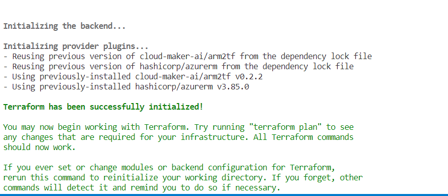
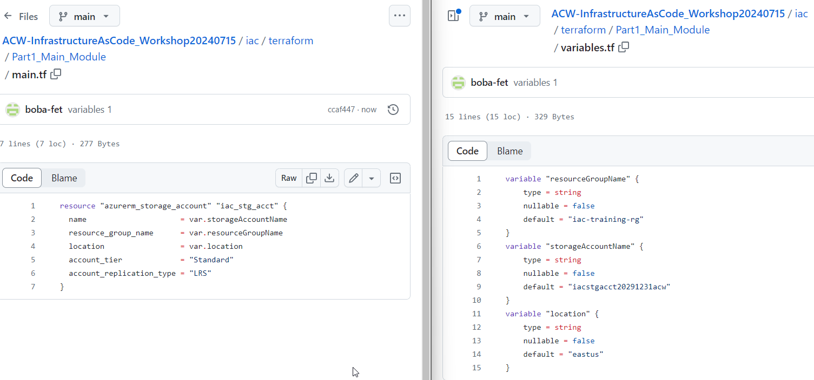
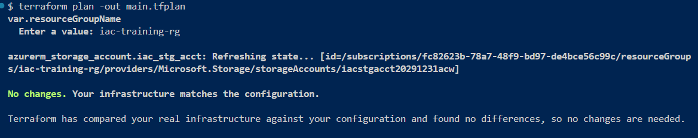

# Part 1 - Introduction to IaC

In this first part, you will learn about Infrastructure as Code (IaC) and how to work with Bicep or Terraform to create a simple resource group and storage account.  You'll also learn about things like:
- running deployments from the command line
- running deployments from GitHub Actions
- building service principals with federated credentials

## Prerequisites

To complete this activity, you must have an editor like VSCode, an Azure Subscription with contributor access, and the Azure CLI installed.

## Part 1: Introduction to IaC with Terraform

Apart from the common concepts of deployment scopes and resource groups there are Terraform specific features that are key to deploying resources. We will explore those in this section:

### Providers

A provider is a plugin that allows Terraform to interact with cloud, SaaS providers and other APIs. Custom terraform providers can be created if needed. Example of providers are: 

- Azure, Google and AWS providers.
- MongoDB, Pager Duty.
- Random, arm2tf.

### Basic file structure

This is the recommended file structure for a working directory:

- **providers.tf:** Specifies the providers used in the deployment as well as any configuration for each of them.
- **main.tf:** Specified the resources being deployed. 
- **variables.tf:** Specifies the variables that will be used to parameterize the deployment.
- **outputs.tf** Specified any values that will be availabe as an output of the deployment.

You can also use the main.tf file to define all the elements mentioned above, however, that will make your deployments harder to read and maintain. 

### Commands

There are 3 main commands that we will explore in this section:

- **terraform init:** Initialized the working directory.
- **terraform plan:** Creates a plan based on the resources specified in your deployment and the resources currently deployed. 
- **terraform apply:** Applies the plan generated by the `plan` command.

## Task 1 - Create your first Terraform file to deploy a storage account to an existing resource group

To get started, let's create our first Terraform file. The overall goal for this activity is to create the files needed to deploy a storage account. During this activity we will create the recommended file structure mentioned above while learning about using variables and outputs, as well as how to create and use additional files as modules.

>**Note:** for this activity, I'm using VSCode with the Terraform extension.  Additionally, I've created a new repository at GitHub which has the starter web application code in it and will be where I'm generating screenshots.  For this reason, if you haven't already, you need a GitHub repository where you can store your code and your Terraform files.  For simplicity, you can fork this repo: [https://github.com/AzureCloudWorkshops/ACW-InfrastructureAsCode_Workshop](https://github.com/AzureCloudWorkshops/ACW-InfrastructureAsCode_Workshop/blob/main/README.md).

A good way to store this would be similar to the following:

  

### Step 1 - Create your file `main.tf`

Start by creating a main.tf file.  This can be done in a bash terminal, in VSCode, or in PowerShell. 

1. Create a folder if you don't have one for `iac` and a subfolder `Terraform`. In the terraform subfolder, create a file `main.tf`.

    >**Note:** If you forked the repo above, you will already have an `iac` folder in that repo.

    Folder:  

    ```bash  
    mkdir terraform
    cd terraform
    mkdir Part1_Main_Module
    cd iac\terraform\Part1_Main_Module
    ```

1. Copy or create the `main.tf` file in the `Part1_Main_Module` folder:  

    Create the file `Bash`:

    ```bash  
    touch main.tf
    ```  

    or `PowerShell`:
    
    ```PowerShell
    "" > "main.tf"
    ```  

    or use VSCode:  

    ```text  
    Right-click on the folder and select New File, name it `main.tf`
    ```  

    >**Note**: For Bash and PowerShell, make sure you make directories `mkdir` and change directories `cd` to the correct location.  For VSCode, you can right-click on the folder and select New File, name it `main.tf`.

### Step 1 Completion Check

Before moving on, ensure that you have a file called `main.tf` in a folder called `iac\terraform\Part1_Main_Module` at the root of your repository (the _workshop repo has starter files and/or you should have made a folder with the `main.tf` file as shown above). 

### Step 2 - Create the terraform code to create a storage account

For this first activity, you'll be creating a simple storage account.  To do this easily, you'll want a couple of extensions for Terraform in place in VSCode:

1. Get the Hashicorp Terraform Extension

    Terraform: 
    

1. Get the Azure Tools Extension (optional/recommended)  

    Azure Tools: 
    

    >**Note:** Azure Tools may not be needed, but it's a good idea to have it in place for other things you will do in the future.

1. Specify the providers that we will use in the deployment. 

    Add the following code to your main.tf file:

    ```text 
    terraform {
      required_version = ">=1.6.6"

      required_providers {
        azurerm = {
          source  = "hashicorp/azurerm"
          version = "~>3.0"      
        }    
      }
    }

    provider "azurerm" {
      features {    
      }
    }
    ```

### Step 2 Completion Check

Before moving on, ensure that you have the `main.tf` file in the correct folder with the settings as above.

### Step 3 - Create the storage account resource

In this step you'll create the storage account resource

1. Add a `resource` block to create the storage account:

    Using the text below, change the name of the storage account to something that is unique, such as `iacstgacctYYYYMMDDxzy`.

    Replace `YYYYMMDD` with today's date.

    Replace `xyz` with your initials.

    >**Note:** Storage account names must be unique to the world, must be between 3-24 characters, and must be only lowercase characters and numbers.

    ```text 
    resource "azurerm_storage_account" "iac_stg_acct" {
      name                     = "iacstgacctYYYYMMDDxzy"
      resource_group_name      = "{YOUR RESOURCE GROUP NAME}"
      location                 = "{YOUR RESOURCE GROUP LOCATION}"
      account_tier             = "Standard"
      account_replication_type = "LRS"
    }
    ```

    >**Note:** The resource group name and location must match the values you provided [here](Part1-IntroductionToIaC.md#step-2---create-the-resource-group).

### Step 3 Completion Check

Before moving on, make sure you have the file in place for the storage account creation.  

  

## Task 2 - Run the deployment

As mentioned in part 1, there are 3 commands that make up the basic Terraform workflow:

- terraform init
- terraform plan
- terraform apply

The first command only needs to be executed when creating a new configuration or updating an existing one. However, running the command multiple times should not cause any issues.

### Step 1 - Issue commands to run the deployment

In this step, you'll deploy the storage account using Terraform.

1. Ensure you are in the correct directory

    Before you execute any commands, make sure that you are in the `iac\terraform\Part1_Main_Module`folder

       

1. Terraform Init Command [terraform init]

    Execute the `terraform init` command.

    ```bash
    terraform init
    ```  
    
    After the command completes you should see the following:

    

1. Terraform Plan Command [terraform plan]

    Execute the `terraform plan` command:

    ```text  
    terraform plan -out main.tfplan
    ```

    >**Note:** the command creates a `main.tfplan` file.

    You should see the following output (some details are omitted):

    

    

1. Terraform Apply Command [terraform apply]  

    Finally, apply the plan by executing the following command:

    ```text  
    terraform apply main.tfplan
    ```  

    You should see the following output:

    

### Step 2 - Verify the deployment

Before moving on, ensure that you have a storage account in your resource group with a name that matches the value provided in the main.tf file.

  

## Task 3 - Create providers file

As mentioned in part 1, when working with Terraform it is recommended to create separate files to keep everything organized. In this step, you will create a separate `providers.tf` file. 

### Step 1 - Create `providers.tf` file

For the first step, you'll just create a file.

1. Create a new file in the `iac\terraform\Part1_Main_Module` folder

    ```text
    providers.tf
    ```  

1. Move `terraform` and `providers` blocks to providers.tf file

    Cut the `terraform` and `providers` blocks from the `main.tf` file, and past to the `providers.tf` file, this should have no impact on your deployment.

      
    
### Step 2 - Confirm there has been no impact on your deployment

As moving the location of the `terraform` and `providers` section should have no impact, it's important to verify this is the case.

1. Confirm there is no impact on your deployment 

    To confirm execute the `terraform plan` command, 
    
    ```bash
    terraform plan -out main.tfplan
    ```  

    You should see the following messages:

    ```text
    No changes. Your infrastructure matches the configuration.

    Terraform has compared your real infrastructure against your configuration and found no differences, so no changes are needed.
    ```

## Task 4 - Use input variables

In Terraform module parameters are referred to as `input variables` or simply `variables`, in this part of the workshop you'll create input variables for the storage account name and location.  You'll also learn how to use the variables in your deployment.

### Step 1 - Add input variables to the terraform file

For starters, we will only add input variables for the resource group name, storage account name and location of the storage account.

1. Add variables for resource group name, storage account name, and location.

    Add the following code to the top of the main.tf file:

    ```text
    variable "resourceGroupName" {
        type = string
        nullable = false
        default = "{YOUR RESOURCE GROUP NAME}"
    }

    variable "storageAccountName" {
        type = string
        nullable = false
        default = "{YOUR STORAGE ACCOUNT NAME}"
    }

    variable "location" {
        type = string
        nullable = false
        default = "{YOUR RESOURCE GROUP LOCATION}"
    }
    ```

1. Leverage the variables with `var.<variablename>` in the `main.tf` file

    Use the variables to populate the storage account values. Terraform references input values using the `var` object. Modify the storage account resource block should to use the variables created above as follows:

    ```text
    resource "azurerm_storage_account" "iac_stg_acct" {
      name                     = var.storageAccountName
      resource_group_name      = var.resourceGroupName
      location                 = var.location
      account_tier             = "Standard"
      account_replication_type = "LRS"
    }
    ```  

      

1. Validate everything is still the same on the plan and state

    Execute the `terraform plan` command again, since there were no infrastructure changes you should see this message again:

    ```text
    No changes. Your infrastructure matches the configuration.

    Terraform has compared your real infrastructure against your configuration and found no differences, so no changes are needed.
    ```

### Step 2 - Create a variables file

In the previous step you added the ability to use input variables (or parameters) in the terraform template, in this step you will continue with the best practices mentioned above by moving those variable definitions to a separate file.

1. Create a `variables.tf` file for variables

    Add a new file `variables.tf` to your working directory
    
    ```bash
    touch variables.tf
    ```  

    >**please note:** this filename is just a suggested name and that as long as a file is in the same directory, Terraform will automatically make those variables available in the main module.  

1. Put the variables into the `variables.tf` file

    Cut the variables from the `main.tf` file and paste the variable declarations from the to the `variables.tf` file, after the change, the only thing left in the `main.tf` file should once again be your resource block.

      


### Step 3 - Validate No changes with variables file in place

Validate there are still no changes even with the new file structure

1. Execute the `terraform plan` command again

    Since nothing has changed to update the infrastructure you should again see no changes in the plan.

### Step 4 - Deployments without default/provided values

You might have noticed that so far you haven't been asked to provide a value for the variables during deployment. This is because of the default values that have been put in place in the files. 

In this step, you'll see what happens if you try to do a deployment without default/provided values.

1. Remove the default value for the resourceGroupName variable.

    In the `variables.tf` file, delete the line `default = "{YOUR RESOURCE GROUP NAME}"`, but leave everything else in place.

      

2. Execute the `terraform plan` command

    With the change, run the plan again:
    
    ```bash
    terraform plan -out main.tfplan
    ```  
    
    you should see this prompt:

    

    This is obviously not the most efficient deployment strategy and is also error prone, we will look at a better deployment option in the next step.

    Enter your resource group name to save the plan.  

      

### Step 5 - Use a variable definitions file

In this step, you will use a special file called a variable definitions file to specify the values you want to use in the deployment.

1. Add a file called terraform.tfvars to your working directory.

    Create the file:

    ```bash
    touch terraform.tfvars
    ```  

    Terraform automatically scans for this specific file when deploying resources. 
    
    >**Note:** If you want to use a different file name you would need to also use the `-var-file` parameter when executing the `plan` command.

1. Move variables to the new file

    Type the name of any of the variables declared in the `variables` file, if you are using the Terraform extension for Visual studio code you should see something like this:

    

    Provide a value for all the variables.

      

1. Execute the `terraform plan` command again.

    With all of the variables defined and then given a value, you have seen how to separate the variable definitions from the values for powerful template deployment configurations.

    To be clear, you should not be prompted to provide a value for and variables and you should still see no changes to your deployment in the plan since no infrastructure changes are taking place.

#### Completion Check

You now have a file that you can reuse in multiple resource groups with various storage account names (you would need to change the name in the parameter file at this point to ensure it is unique).

## Task 5 - Use data sources

Up until now, you have used variables to provide the name and location of the resource group that contains the storage account. However, Terraform has another way to access information defined outside of Terraform or that is part of a different deployment using `data sources`. 

In this step, you will modify the files you currently have to use a data source to access the resource group information instead of providing the values through variables.

### Step 1 - Add data source to configuration

In this first step, you'll add a data source for the resource group

1. Add the `data_rg` resource group declaration

    Go to the top of the main.tf file and type `da`, if you are using the Terraform extension for VS code you should see the following:

    

    Hit the tab key, a data block will be created automatically:

    

1. Change the type to `azurerm_resource_group`  

    Type `azurerm_resource_group`, 
    
    ```bash
    azurerm_resource_group
    ```  

    At this point, autocomplete should display the option after you type a few characters:

    

1. Set the name of the resource group and location for the resource group

    The resource group data source requires the name of the resource group. You can use the resourceGroupName variable to populate the parameter on this data source. The new data block should look like this:

    ```text
    data "azurerm_resource_group" "data_rg" {
      name = var.resourceGroupName
    } 
    ```

### Step 2 - Use data source values in storage account configuration

In this step, you'll update the declaration in the storage account to leverage the resource group data source.

1. Replace the `resource_group_name` and `location`

    You can now replace the `resource_group_name` and `location` parameters in the storage account block with the values from the data source using the following syntax:

    ```text  
    data.{RESOURCE_TYPE}.{DATA_SOURCE_NAME}.{DATA_SOURCE_PROPERTY}
    ```  

    For example, to access the name of a resource group with a data source:

    ```text  
    data.azurerm_resource_group.data_rg.name
    ```  

    and

    ```text
    data.azurerm_resource_group.data_rg.location
    ```  

1. Validate the file text before proceeding  

    After replacing the name and location of the resource group the storage account block should look something like this:

    ```text
    resource "azurerm_storage_account" "cm_stg_acct" {
      name                     = var.storageAccountName
      resource_group_name      = data.azurerm_resource_group.data_rg.name
      location                 = data.azurerm_resource_group.data_rg.location
      account_tier             = "Standard"
      account_replication_type = "LRS"
    }
    ```  

### Step 3 - Remove location variable and execute deployment.

In this step you'll remove the location variable and execute the deployment

1. Remove the `location` variable

    Since we are now getting the resource group information from the data source we can now remove the `location` variable from the `variables.tf` and the value assignment from the `terraform.tfvars` file.

    >**Note:** the state of the system already knows the resource group exists.  In this template, the resource group would not be created since no location is provided if there were not currently a state that holds the value of the current existing resource group.

      

1. Execute the plan and validate there are no changes

    You can now execute the `terraform plan` command again, since we are not adding or removing any resources you should see a message saying that no changes were detected.

## Task 6 - Use local variables and functions

In this module you will learn to use local variables and functions to create a unique string name for the storage account name. The term `local variable` in terraform refers to any variable used inside a module.

### Step 1 - Add a unique identifier input variable to the storage account

Since the storage account name needs to be unique across all resources in Azure you will now add a unique identifier section to the storage account name to comply with this requirement.

1. Add a `uniqueIdentifier` variable to your variables file.

    In the `variables.tf` file, add a new variable as follows:

    ```text
    variable "uniqueIdentifier" {
        type = string
        nullable = false
        default = "20291231acw"
    }
    ```  

1. Add the value in the `terraform.tfvars` file.

    Based on the value you used earlier, add the variable in the `terraform.tfvars` file with the following format: YYYYMMDDabc.  However, for this exercise you want a second storage account so change the date by one day to make it unique from the other storage account.

    For example, if the value was `20291231acw` for the first one, creat the second one as follows:  

    ```text
    uniqueIdentifier: 20291230acw
    ```  

1. Repeat the previous two steps to create the base storage account name as a varaiable.

    In the `variables.tf` file, add the following code:

    ```text
    variable "storageAccountBase" { 
        type = string 
        nullable = false 
        default = "iacstgacct" 
    } 
    ``` 

    Then add the value to the `terraform.tfvars` file:

    ```text
    storageAccountBase = "iacstgacct"  
    ```  

### Step 2 - Add a local variable for the full storage account name

Local variables in Terraform are declared using a `locals` block. In this step, you'll add a local variable for the full name of the storage account.  

1. Add a locals block to your `main.tf` file

    At the top of the `main.tf` file, add a variable called `storageAccountNameFull`. Assign a value by concatenating the `storageAccountName` and `uniqueIdentifier` variables using interpolation:

    ```text
    locals {
        storageAccountNameFull = "${var.storageAccountBase}${var.uniqueIdentifier}"
    }
    ```

1. Define the second storage account

    Add another storage account resource block by copying the existing one and replacing the `name` parameter with the local variable you just created, the following syntax is used to access local variables:

    ```text
    local.{YOUR VARIABLE NAME}
    ```  

    So the overall block should be similar to this (Note the resource declaration uses `iac_stg_acct_full` here as well):

    ```text
    resource "azurerm_storage_account" "iac_stg_acct_full" { 
      name                     = local.storageAccountNameFull
      resource_group_name      = data.azurerm_resource_group.data_rg.name
      location                 = data.azurerm_resource_group.data_rg.location
      account_tier             = "Standard" 
      account_replication_type = "LRS" 
    }
    ```  

1. Execute the plan to validate you will be creating a new storage account

  Execute the `terraform plan` command again, you should see a message saying that 1 resource will be added.

  ```text
  terraform plan -out main.tfplan
  ```  

1. Execute the apply command to create the storage account

  Execute the `terraform apply` command

  ```text
  terraform apply main.tfplan
  ```  

  Once the command is completed you should see the new storage account in your resource group. 

     

### Step 3 - Use a provider to add a unique string to the storage account name

If you completed the Bicep section of this workshop, you will recall that the `uniquestring` function allows you to generate a string that can help make resource names unique. 

In this step, you will use a provider to access create a unique variable string in Terraform. 

1. Create a random object

    Add the following after the `azurerm` element in the `required providers` portion of the `providers.tf` file:

    ```text
    random = {
      source = "hashicorp/random"
      version = "3.6.2"
    }
    ```  

    >**Reminder:** if at any point you get lost, don't forget to check the solution files for help in locating where something should go 

1. Modify the `main.tf` file to generate a unique string

    Generate a unique id by adding the following block to your `main.tf` file:

    ```text
    resource "random_string" "random" {
      length           = 10
      special          = false
      lower            = true
      upper            = false 
    }
    ```  

    >**Note:** The name for storage accounts does not allow any special characters so we are forcing the generated string to comply to this. You can check the [documentation](https://registry.terraform.io/providers/hashicorp/random/latest/docs) for the random provider for additional configuration options. 

1. Add a new local variable called `storageAccountNameUnique` 

    In the `main.tf` file, in the `locals` block, under the current `storageAccountNameFull`, add a new local variable `storageAccountNameUnique`, and assign the following value:

    ```text  
    storageAccountNameUnique = "${var.storageAccountName}${var.uniqueIdentifier}${random_string.random.result}"
    ```  

1. Create the resource for a third storage account. 

    Add a new storage account resource block and assign the name using the new variable created.  Use the new local variable for the storage account name.

    ```text
    resource "azurerm_storage_account" "iac_stg_acct_unique" { 
      name                     = local.storageAccountNameUnique
      resource_group_name      = data.azurerm_resource_group.data_rg.name
      location                 = data.azurerm_resource_group.data_rg.location
      account_tier             = "Standard" 
      account_replication_type = "LRS" 
    }
    ```  

1.  Re-initialize Terraform with the `terraform init` command

    Since we added a provider to our deployment, we need to run the `terraform init` command before we can create a new plan, otherwise you'll see the following message:

      

    Make sure all your files are saved, then run the command:

    ```bash
    terraform init
    ```  

1.  Deploy using the `plan` and `apply` commands.

    Deploy the new resource by executing the `plan` and `apply` command, you should see 2 resources being created in the plan: one for the uniqueid and one for the new storage account.

    ```bash
    terraform plan -out main.tfplan
    terraform apploy main.tfplan
    ```  

    >**Important:** - **This deployment will fail (and that's expected)**  

    Your deployment should fail due to the length of the new storage account name being over 24 characters, in the next step we will use one of the built-in functions in Terraform to solve the problem.  

      

### Step 4 - Use a function to truncate the resource name

Terraform has multiple built-in functions that can be used to transform and combine values, you can find a full list here: https://developer.hashicorp.com/terraform/language/functions. 

In this step, you will use the `substr` function to truncate the length of the storage account name:

1. Leverage the `substr` function

  The substring function has the following format:

  ```text
  substr(string, offset, length)
  ```   


1. Use the `substr` function to ensure the value of the `storageAccountNameFullUnique` variable is a maximum of 24 characters.

    Change the declaration in the `locals` section of `main.tf` to the following for the `storageAccountNameUnique`:

    ```text
    storageAccountNameUnique = substr("${var.storageAccountName}${var.uniqueIdentifier}${random_string.random.id}",0,24)
    ```  

1. Run the `plan` and `apply` commands again as above.

    Run the commands:

    ```bash
    terraform plan -out main.tfplan
    terraform apploy main.tfplan
    ```  

    This time, you should see your storage account created as expected in the portal:

      

### Step 5 - Use a validator to ensure the storage account name is unique and long enough

Input variables allow your Terraform files to be dynamic but without any validations there is also the risk that the values provided will result in invalid properties for your resources.  For this reason, Terraform provides different ways to validate your configuration. 

In this step, you will add validations to a couple of input variables to prevent any issues with planning and/or deployment.  

Variable validations are added using the `validation` property of a variable. 

For example:  

```text
variable "image_id" {
  type        = string
  description = "The id of the machine image (AMI) to use for the server."

  validation {
    condition     = length(var.image_id) > 4 && substr(var.image_id, 0, 4) == "ami-"
    error_message = "The image_id value must be a valid AMI id, starting with \"ami-\"."
  }
}
```

1. Validate the `storageAccountName` variable

    Add the following validation block to the `storageAccountName` variable in the `variables.tf` file:

    ```text
    validation {
      condition = length(var.storageAccountName) > 3
      error_message = "The storage account name should be at least 3 characters"
    }
    ```  

    For a resulting block of:

    ```text
    variable "storageAccountName" { 
        type = string 
        nullable = false 
        default = "iacstgacct20291231acw" 

        validation {
          condition = length(var.storageAccountName) > 3
          error_message = "The storage account name should be at least 3 characters"
        }
    }  
    ```  

1.  Prove that the validation is working as expected. 

    In the `terraform.tfvars` file, assign the value `c` to the `storageAccountName` variable.

    Try to execute the plan.

    ```bash
    terraform plan -out main.tfplan
    ```  
    
    You should see the following message:

    

1. If time permits, add 2 more validations:

    - Validate that the `uniqueIdentifier` variable is `11` characters long.
    - Add an `environment` input variable that will allow only two (2) values (hint: look at the [contains](https://developer.hashicorp.com/terraform/language/functions/contains) function): `dev` and `prod` and use that to create a new storage account resource.

    >**Reminder:** You can also review the solution files for additional help.

### Completion Check

You can now deploy the same file to different resource groups multiple times and it will create a unique storage account name per resource group (and per environment if needed) using local variables, built-in functions and validations.  

If time permits, you can try creating a different resource group and use what you have built so far to deploy these resources there.  

## Task 7 - Use modules and outputs

So far, we have been working out of our main module. In application deployments like the one we will do in part 2, we want to be able to have our resources distributed in modules. Lets look at the concept of modules using a similar deployment to the one we have so far.

### Step 1 - Create a resource group

In our previous deployment we were using information from an existing resource group, however, in a real world scenario we might have to create the entire infrastructure including the resource group. In this step we will create a new template that deploys a new resource group, lets see how much you remember!

1. Create a new folder under the `terraform` folder and add the following files:
  - providers.tf
  - variables.tf
  - main.tf
  - terraform.tfvars

2. Add the `azurerm` and `random` providers to the providers.tf file.

3. Add the following variables:
  - resourceGroupName: string type, not nullable.
  - location: string type, not nullable, validation to only allow `East US` as a value (optional).

4. Assign values to the variables in the terraform.tfvars file.

5. Add a resource group block to the main.tf file, the resource type needed is `azurerm_resource_group`.

6. Deploy the resource group, don't forget to initialize Terraform!

### Step 2 - Create a module for the storage account

Now that we have our resource group, lets create a module for the storage account. In Terraform, you can create your own modules locally or you can get modules from the [Terraform registry](https://registry.terraform.io/), you can even publish your own modules for other people to use. For this exercise, we will focus on local modules:

1. Add a modules folder in your working directory and add a storageAccount inside of it.

2. Create a main.tf and variables.tf files in the storageAccount folder.

3. Copy any of the storage account resource blocks from the root module created in the previous exercise and replace the values assigned to the `name`, `resource_group_name` and `location` with variables.

4. Add the variables specified in the previous step to the variables.tf file.

5. Add a reference to the storage account module by adding the following block:

```text
module "storageAccount" {
  source = "./modules/storageAccount"

  storageAccountNameEnv = local.storageAccountNameEnv
  resourceGroupName     = var.resourceGroupName
  location              = var.location
}
```

The main parameter you need to supply when using modules is the `source`, for local modules it should be populated with the folder location. You also need to pass values for any variables that the module is expecting. 

6. Deploy the resources, you should see the storage account created in the resource group.

### Step 3 - Create an output for the storage account 

There is one more Terraform element that we have not worked with yet: outputs. When creating resources, some of the properties of those resources are exported so you can use them as parameters for other steps in your deployment. In this step, we will export some of the storage account properties as outputs.

1. Create an `outputs.tf` file in the storage account module directory.

2. Add 3 output blocks to the newly created file: account name, id and location. This is an example of the output block for the account name:

```text
output "{OUTPUT_VARIABLE_NAME}" {
  value = azurerm_storage_account.{YOUR_STORAGE_ACCOUNT_RESOURCE}.name
}
```
Since we are not updating the infrastructure executing the `plan` and `apply` commands will have no effect, we will do that in the next step.

### Step 4 - Leverage an output in another deployment

We will now use the outputs generated by the storage account resource to create a storage container resource, please note that we are creating these resources separately just for purposes of this workshop. In a real world scenario you would most likely deploy all these resources in the same module.

1. Create a new folder inside the `modules` folder called `storageContainer`.

2. Add a `main.tf` and a `variables.tf` file.

3. Add 2 variables: `storageAccountName` and `containerName`.

4. Add an `azurerm_storage_container` resource block and populate its properties with the variables you created.

5. Add a `containerName` variable to the input variables of the root module.

6. Add a `storageContainer` module block to the root module and populate the `storageAccountName` with the output value from the `storageAccount` module:

```text
module "storageContainer" {
  source = "./modules/storageContainer"

  containerName      = var.containerName
  storageAccountName = module.storageAccount.stg_acct_name
}
```

## Task 8 - Use azurerm backend

As you already know, the state file is key for Terraform to know what changes need to be done to the infrastructure; this file can be saved in different locations. So far, we have been using the local backend but in this step we will add a remote backend which will be needed for automated deployments.

### Step 1 - Create infrastructure for state file

Go to the Azure Portal and create the following resources:

- RG: `rg-terraform-github-actions-state`
- Storage Account: `tfghactionsYYYYMMDDxxx`
- container: `tfstatepart1`

### Step 2 - Copy state file to storage container

Go to your storage container and upload your terraform.tfstate file:


### Step 3 - Add a backend block to the providers.tf file

Open the providers.tf file and add this block after the `required_providers`:

```terraform
backend "azurerm" {
    resource_group_name  = "rg-terraform-github-actions-state"
    storage_account_name = "{YOUR_STORAGE_ACCOUNT_NAME}"
    container_name       = "tfstatepart1"
    key                  = "terraform.tfstate"
    use_oidc             = true
  }
```

### Step 4 - Create a deployment plan

Since we updated the backend configuration we need to execute the `terraform init` command and then execute the `terraform plan` command, since the state is the same as the last time you should see the message of no changes needed for the configuration.

## Completion check

At this point you have learned most of the basic concepts you will need to work with Terraform for infrastructure deployments. Make sure that all the files were created successfully and that you can re-run your deployments at will. The repetitive and consistent nature of the deployments are some of the main reasons you want to use Infrastructure as Code.

## Conclusion

In this first part, you learned how to work with Terraform to create storage account resources in a resource group.  Along the way you learned the following concepts:
- creating terraform files
- running deployments from the command line
- using input and local variables
- using data sources
- using functions
- using modules
- using outputs

