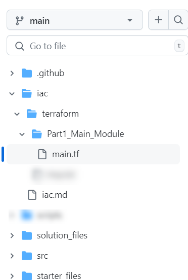

# Part 1 - Introduction to IaC

In this first part, you will learn about Infrastructure as Code (IaC) and how to work with Bicep or Terraform to create a simple resource group and storage account.  You'll also learn about things like:
- running deployments from the command line
- running deployments from GitHub Actions
- building service principals with federated credentials

## Prerequisites

To complete this activity, you must have an editor like VSCode, an Azure Subscription with contributor access, and the Azure CLI installed.

## Part 1: Introduction to IaC with Terraform

Apart from the common concepts of deployment scopes and resource groups there are Terraform specific features that are key to deploying resources. We will explore those in this section:

### Providers

A provider is a plugin that allows Terraform to interact with cloud, SaaS providers and other APIs. Custom terraform providers can be created if needed. Example of providers are: 

- Azure, Google and AWS providers.
- MongoDB, Pager Duty.
- Random, arm2tf.

### Basic file structure

This is the recommended file structure for a working directory:

- **providers.tf:** Specifies the providers used in the deployment as well as any configuration for each of them.
- **main.tf:** Specified the resources being deployed. 
- **variables.tf:** Specifies the variables that will be used to parameterize the deployment.
- **outputs.tf** Specified any values that will be availabe as an output of the deployment.

You can also use the main.tf file to define all the elements mentioned above, however, that will make your deployments harder to read and maintain. 

### Commands

There are 3 main commands that we will explore in this section:

- **terraform init:** Initialized the working directory.
- **terraform plan:** Creates a plan based on the resources specified in your deployment and the resources currenrly deployed. 
- **terraform apply:** Applies the plan generated by the `plan` command.

## Task 1 - Create your first Terraform file to deploy a storage account to an existing resource group

To get started, let's create our first Terraform file. The overall goal for this activity is to create a resource group and a storage account.  We'll do this in two steps.  First, we'll create a resource group, then we'll create a storage account. As we're going, we will create the recommended file structure mentioned above while learning about using variables and outputs, as well as how to create and use additional files as modules.

>**Note:** for this activity, I'm using VSCode with the Terraform extension.  Additionally, I've created a new repository at GitHub which has the starter web application code in it and will be where I'm generating screenshots.  For this reason, if you haven't already, you need a GitHub repository where you can store your code and your Terraform files.

A good way to store this would be similar to the following:

  

### Step 1 - Create your file `main.tf`

For Terraform, we will start by creating a main.tf file.  This can be done in a bash terminal, in VSCode, or in PowerShell. Assuming you can make your way to the correct place and/or make your way to VSCode, create a folder if you don't have one for `iac` and a subfolder `Terraform`. In the terraform subfolder, create a file `main.tf`.

Folder:  

```bash  
iac
```  

FileName:

```bash  
main.tf
```  

VSCode:  

```text  
Right-click on the folder and select New File, name it `main.tf`
```  

>**Note**: For bash and powershell, make sure you make directories `mkdir` and change directories `cd` to the correct location.

Bash:  

```bash  
touch main.tf
```  

PowerShell:  

```PowerShell
"" > "main.tf"
```  

### Completion Check

Before moving on, ensure that you have a file called `main.tf` in a folder called `iac\terraform` at the root of your repository.

  

### Step 2 - Create the terraform code to create a storage account

For this first activity, you'll be creating a simple storage account.  To do this easily, you'll want a couple of extensions for Terraform in place in VSCode:

- Terraform: 
  

- Azure Tools: 


>**Note:** We may not need Azure Tools, but it's a good idea to have it in place for other things you will do in the future.


...WIP..

## Task 2 - Create a resource group

You can create a resource group in the portal or via command line commands with the azure CLI. If you are struggling with the CLI, just pivot and go create a resource group in the portal (or switch to run the commands in the Azure Cloud Shell rather than from your local machine).

Assuming that creating a resource group is straight forward in the portal, let's do it via the CLI.

### Step 1 - Get Logged in

```text  
Enter the command az login
```

  

A browser window will open, enter login credentials or select an account that you are already logged in to.

  

A confirmation window will appear.

  

>**Note:** If you are using the Azure Cloud Shell, you can skip to step 3 and just use the cloud shell.

### Step 2 - Ensure your subscription


### Step 3 - Create the resource group via CLI commands

...WIP...

### Completion Check

You have a resource group named as you intended in your Azure subscription in the region of your choice.

## Task 3 - Run the deployment

...WIP...

### Step 1 - Issue commands to run the deployment

### Step 2 - Verify the deployment

### Completion Check

You have a storage account in your resource group that was named as you intended.

## Task 4 - Use parameters

In this part you'll create parameters for the storage account name and location.  You'll also learn how to use the parameters in your deployment.

### Step 1 - Add parameters to the terraform file

### Step 2 - Create a parameters file

### Step 3 - Deploy via parameters file

### Completion Check

You have a file that you can reuse in multiple resource groups with various storage account names

## Task 5 - Use variables and functions

In this module you will learn to use variables and functions to create a unique string name for the storage account name

### Step 1 - Create a variable for the storage account name

### Step 2 - Use the variable in the storage account name

### Step 3 - Add a unique string to the storage account name

### Step 4 - Deploy via parameters file

### Completion Check

You can now deploy the same file to different resource groups multiple times and it will create a unique storage account name per group

## Task 6 - Use modules and outputs

In part 2, we will be doing an entire subscription deployment.  For that reason, let's learn about it quickly here before diving deeper in part 2.

### Step 1 - Create an orchestrator file

Use subscription level

### Step 2 - Create a module for the storage account

call the storage deployment at the subscription scope for the correct resource group

### Step 3 - Create an output for the storage account 

Examine the output of the deployment in the portal

### Step 4 - Show how to leverage an output in another deployment

Add another file to create a container in the storage account
Deploy via a module
Explain that this could easily be done in one file.  The reason for doing it this way is to show how to use outputs in other deployments.

### Step 4 - Deploy via cli

Deploy the subscription level deployment to Azure

## Conclusion

In this first part, you learned how to work with Terraform to create a simple storage account in a resource group.  You also learned about things like:
- creating terraform files
- running deployments from the command line
- using parameters
- using variables
- using functions
- using modules
- using outputs

