# Part 2- Building the Infrastructure

Part 2 of this workshop will teach you how to leverage permissions and GitHub actions to complete a fully automated IaC Pipeline in your azure subscription to host your web solution in an Azure App Service.


## Overall Goals of Part 2

In part 2 of this workshop, we're going to get the entire infrastructure deployed to host a web application in Azure. This will include the following resources:

- Resource Group
- App Service Plan
- App Service
    - settings/configurations
    - leverage KeyVault for secrets
    - managed identity
    - application Insights
    - log analytics workspace
- Key Vault
    - secret for database connection string
- Azure SQL Server
- Azure SQL Database
- Azure App Configuration (time permitting)

All of this will be done from GitHub Actions, not from the command line.  You can still test from the command line but the best solution will be to ensure that everything is working from GitHub Actions.

## Deployment Credentials

In order to deploy to the solution, you'll need to have the correct credentials in place on your subscription.  You will do this by creating a service principal and assigning it the correct permissions. 

You will then need to leverage the secrets from the service principal in GitHub Actions to deploy the infrastructure. (you will not be doing this part from the command line - but you can still deploy from the command line to test things as needed).  The end goal will be a full, working IAC pipeline that deploys the infrastructure.  

It will be incredibly important to manage the order of deployments for this infrastructure, because you need a Key Vault to have secrets, but you can't set the secret until you have the value for the connection string and the app service needs to have a principal that can connect to Key Vault and get the secrets.  All of this to say that when building your pipeline architecture, you have to do a lot of planning and you may need to do things in parts - i.e. deploy one resource, deploy a second resource, then come back to the first and update it with the second resource's information.

## Task 1 - Create a service principal

To get started, in order to deploy to Azure you will need to create a service principal/app registration.  This can be accomplished via the command line, however it is incredibly easy to do in the portal.  For that reason, this workshop will show how to do this in the portal in order to limit/minimize the number of problems that could result from doing it incorrectly via the command line.

1. Navigate to the Azure Portal and login with your credentials.

    Get logged in to the Azure portal.

1. Navigate to the App Registrations blade.

    Type `App Registrations` in the search bar and select the `App Registrations` blade.

    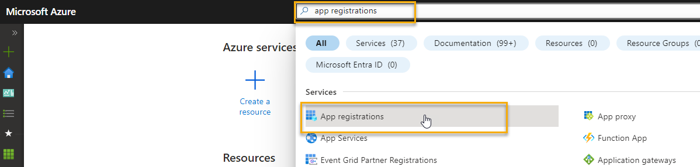  

1. Select `+ New Registration` at the top of the `App Registrations` blade.

    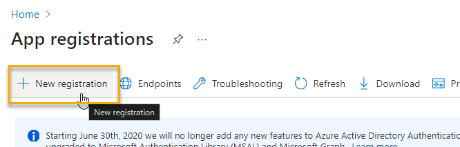  

1. Enter a name such as `iac-workshop-contactweb-dev` and select `Register`.

    Enter a name that makes sense for your service principal.  For this you are automating your IAC.  You would likely create one per environment (per subscription).  For this workshop, you can use `iac-workshop-contactweb-dev` as the name so you can remember what it is for.  For this workshop we will proceed as if all of this is being done in a development environment.  To add a production environment, you would repeat this process and create a new service principal for production, and you could leverage the same GitHub actions to deploy to production as a second task in just one overall pipeline.

    ```bash
    iac-workshop-contactweb-dev
    ```  

    Leave all of the other settings as their defaults - do not modify anything else on this screen.  Hit `Register` at the bottom of the screen.

    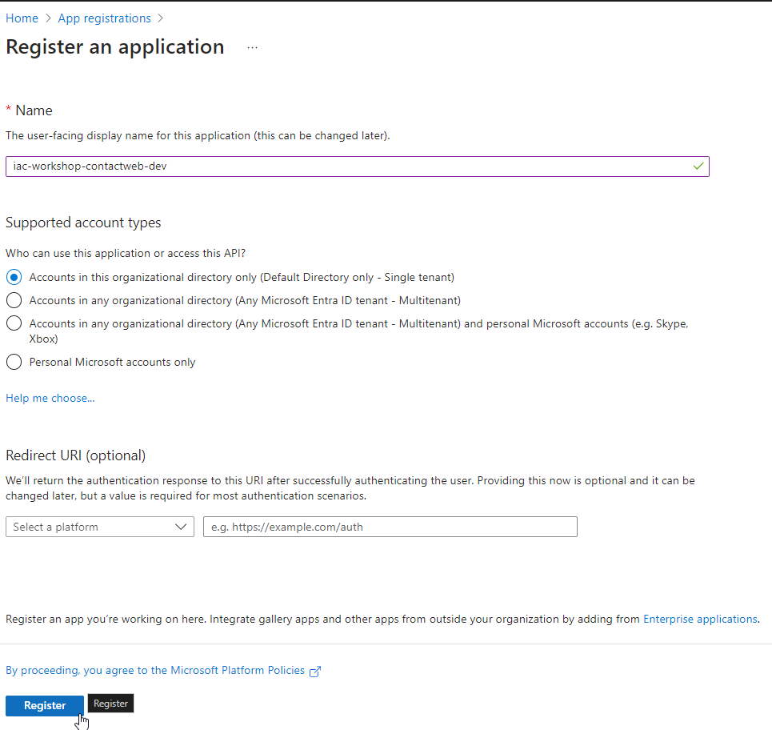  

1. Gather the important id's for later use

    For GitHub Actions, you will need the following information from the overview screen:

    - Application (client) ID
    - Directory (tenant) ID

    Make sure to capture these somewhere so you can use them later.  Of course you can always come back here to get these values later if necessary.  

    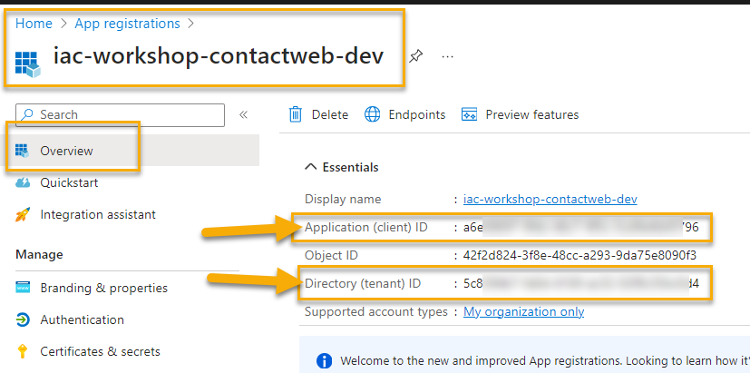  

1. Create Federated Credentials

    To allow GitHub Actions to execute against this service principal, you will need to create federated credentials.

    Click on the `Certificates & secrets` blade on the left side of the screen.

    Then select `Federated credentials` at the middle of the screen.

    Then select `Add credential`.

    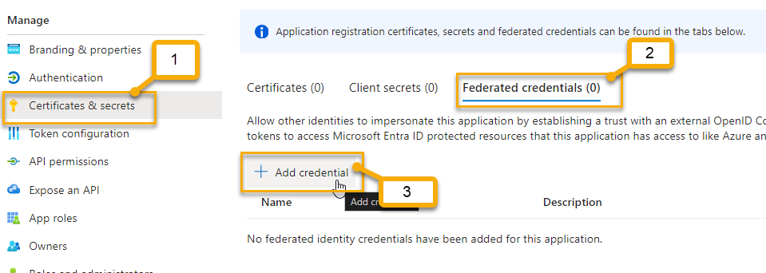  

1. Create the scenario for GitHub Actions

    For the `Federeated credential scenario` select `GitHub Actions deploying Azure Resources`.

    For the Connect your GitHub account section, you will need to authorize your Azure Subscription and GitHub to talk to one another.

    Once you have done this, enter the organization name where your code for the contact web application is located.

    >**Note:** The organization is typically your github user account name (in the URL of your github account, the part right after `https://www.github.com/`).  For example, my repo is here: `https://github.com/blgorman/InfrastructureAsCodeACWWork`, so my organization name is `blgorman`. 

    Then enter the repository name where your code for the contact web application is located.  My repository is `InfrastructureAsCodeACWWork`.

    Select entity type: `Branch`  

    Then enter the branch name for deployment which is likely `main` or possibly `master`. My branch is `main`

    Then name the credential:

    ```bash
    iac-workshop-contactweb-dev-github-main
    ```  

    With description:
    
    ```bash
    GitHub Actions deploying Azure Resources
    ```

    Then select `Add`.
    
    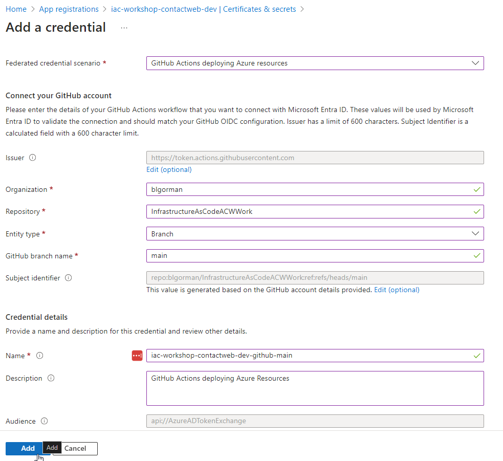  
            
1. Once the add is completed, you will see the credential in the list of federated credentials.

    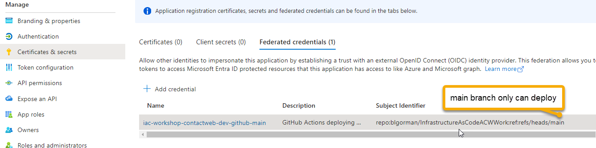

1. Additional credentials

    I like to add an environment credential that allows me to run the workflow from any branch.  Currently the only branch that can deploy is the `main` branch of my repo.  If you want to allow other branches to deploy, you will want a second federated credential that uses the `Environments` option.  This is also nice because it can ensure that only dev resources are deployed in the dev subscription.

    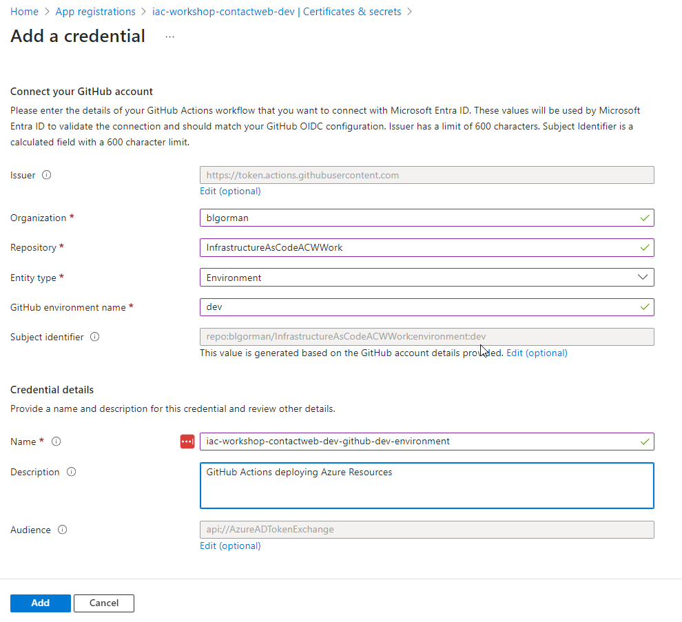  

    In the end, I have two. You need at least one (branch and/or environment) to deploy from GitHub Actions.

    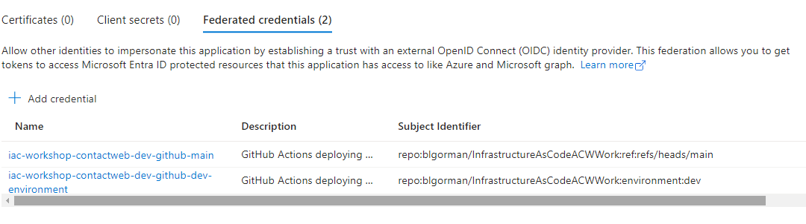  


## Task 2 - Give the principal permissions to deploy

In order for the principal to deploy to Azure, it needs to have the correct permissions.  This is done via the `Access Control (IAM)` blade in the portal.

1. Navigate to the `Access Control (IAM)` blade for the subscription.

    If you are going to deploy a resource group in the subscription level, then you will need to be a contributor on the subscription.  This is done via the `Access Control (IAM)` blade in the portal for the subscription.

    Type `Subscriptions` in the search bar and select the `Subscriptions` blade. Then navigate to your subscription.

    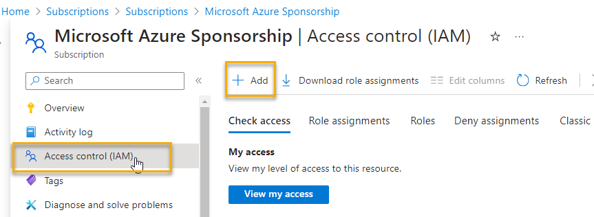  

1. Select +Add then `Add role assignment` at the top of the `Access Control (IAM)` blade.

    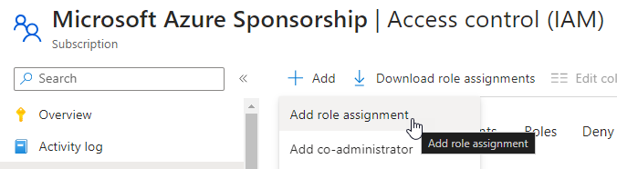  

1. Add `Contributor`

    Select the `Privileged administrator roles` tab and then select `Contributor` from the list of roles.

    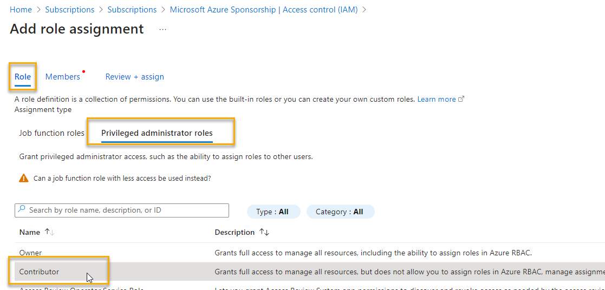  

1. Add `Members`

    Select `Members` -> leave the default of `User, group, or service principal` and hit the `+ Select members` button.

    Find the service principal you created in the previous task and select it.  Then hit `Select`.

    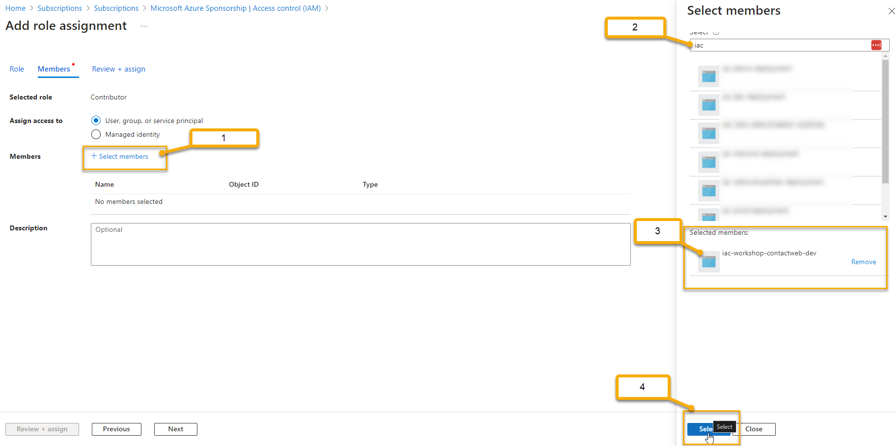  

1. Hit `Review + assign`

    Validate that you have the correct principal and role and then hit `Review + assign`.

    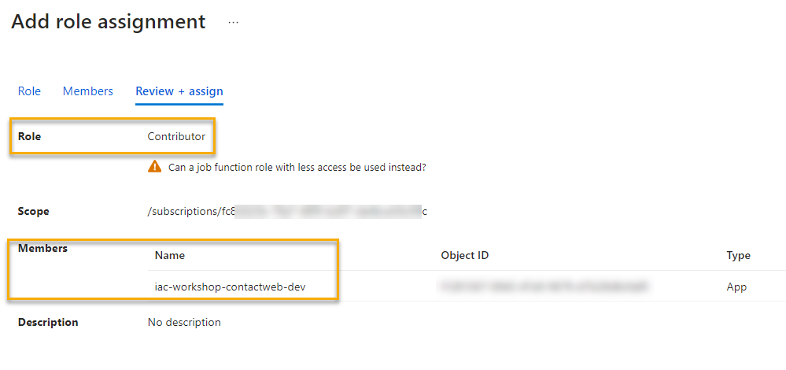  

    Hit `Assign` to complete the assignment.

    Validate the role is shown in the `Role assignments` tab.

    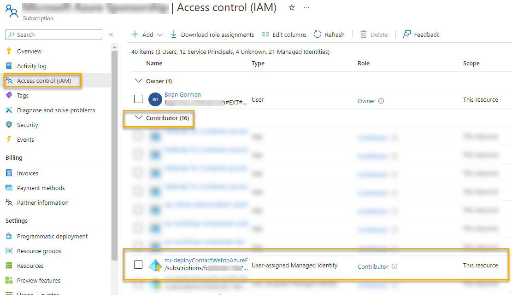  


## Task 2 - Set the GitHub Secrets

With the Azure credentials in place, it's time to get the GitHub Actions set up to log in and run deployments against your Azure subscription.

Once this is completed, you will be able to check in code changes and rely on the automation to run your templates (no longer needing to be logged in and run from your command line).  

1. Navigate to your GitHub repository

    Navigate to your GitHub repository where you have your code for the contact web application.

1. Select `Settings` at the top of the repository.

    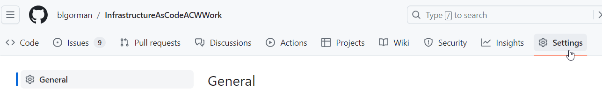

1. Select `Secrets and variables`, then `Actions`, then hit the `New Repository secret` on the left side of the screen.

    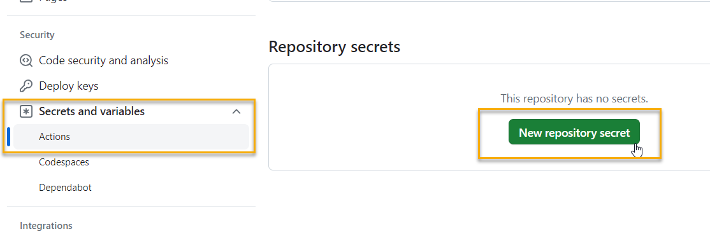  

1. Enter three secrets

    Secret one:  

    - Secret name: `AZURE_SUBSCRIPTION_ID`
    - Value: `<your azure subscription id>`  

    Secret two:

    - Secret name: `AZURE_CLIENT_ID_CONTACTWEB_DEV`
    - Value: `<your service client id>`    

    Secret three:

    - Secret name: `AZURE_TENANT_ID`
    - Value: `<your tenant id>`

    >**Note:** Your subscription ID can be easily obtained from almost any resource or by running the cli command `az account show` (field: `id`) If you run `az account show` you will also get your Tenant Id (field: `tenantId` not `homeTenantId` which could be different).  Your tenant and client id's can be obtained from the overview screen of your app registration in the portal and you likely copied them earlier in this workshop.  You can also get your subscription ID from the portal -> Subscriptions -> overview blade.

    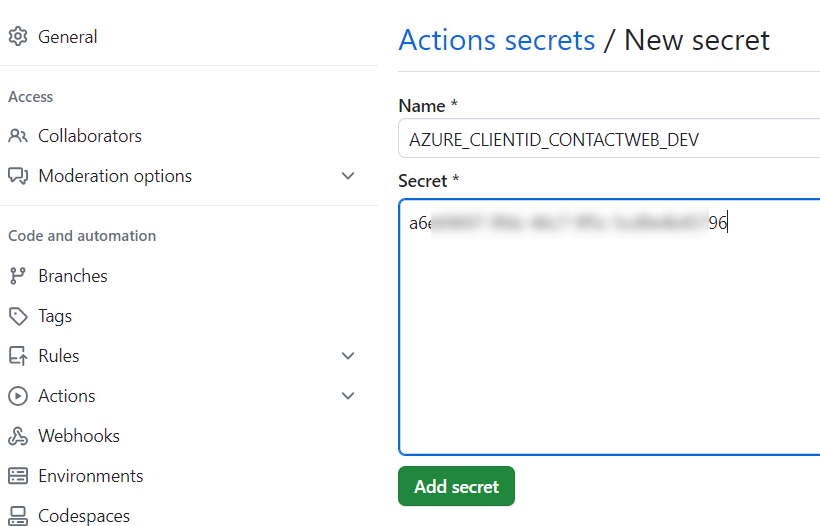

    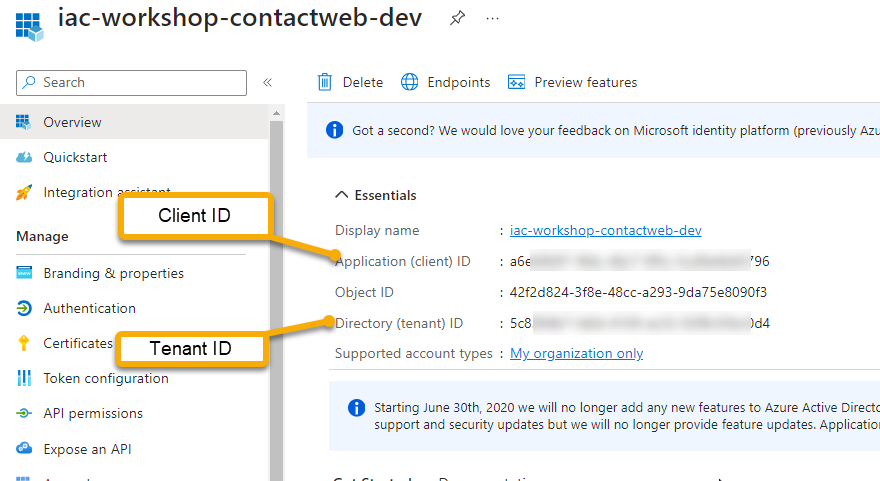  

    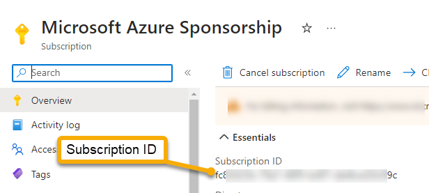  

1. Validate that you have the three secrets ready to go.

    You won't be able to see the values so if you have problems you may just need to come back here later and update the values in case something didn't copy/paste correctly.

    You can validate that the three secrets are in place, however:

    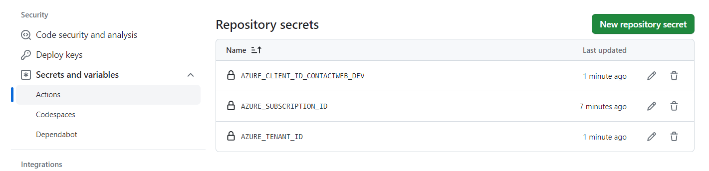  


## Task 3 - Create the automation action to execute the deployment

## Completion check

Do not move forward if you do not have a working IaC pipeline that executes a subscription-level deployment using your service principal credentials in your Azure subscription.

## Breakouts

Complete the following part of the workshop that you would like to learn (or do both):

1. Complete [Building the Infrastructure - Bicep](Part2-BuildingTheInfrastructure_bicep.md)

- or -

1. Complete [Building the Infrastructure - Terraform](Part2-BuildingTheInfrastructure_terraform.md)
