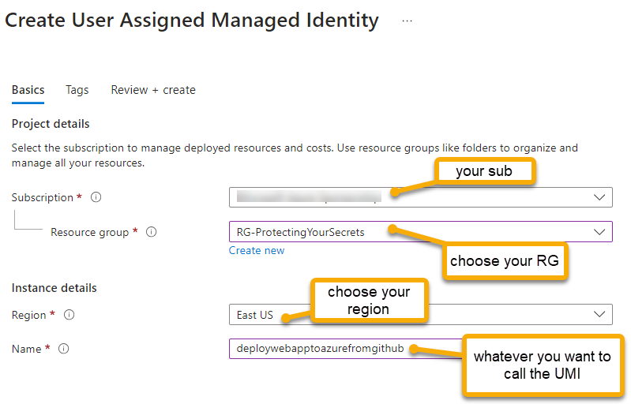
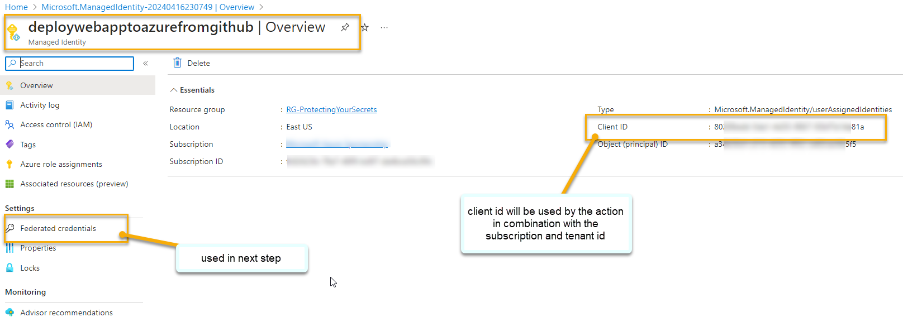

# Part 2- Building the Infrastructure

Part 2 of this workshop will teach you how to leverage permissions and GitHub actions to complete a fully automated IaC Pipeline in your azure subscription to host your web solution in an Azure App Service.

## Overall Goals of Part 2

In part 2 of this workshop, we're going to get the entire infrastructure deployed to host a web application in Azure. This will include the following resources:

- Resource Group
- App Service Plan
- App Service
    - settings/configurations
    - leverage KeyVault for secrets
    - managed identity
    - application Insights
    - log analytics workspace
- Key Vault
    - secret for database connection string
- Azure SQL Server
- Azure SQL Database

All of this will be done from GitHub Actions, not from the command line.  You can still test from the command line but the best solution will be to ensure that everything is working from GitHub Actions.

## Deployment Credentials

In order to deploy to the solution, you'll need to have the correct credentials in place on your subscription.  You will do this by creating a user-managed identity at Azure and assigning it the correct permissions on the subscription (or group if doing a deployment to a specific resource group instead of a subscription-level deployment). 

You will then need to leverage the secrets from the managed identity in GitHub Actions to deploy the infrastructure.  The end goal will be a full, working IAC pipeline that deploys the infrastructure.  For the rest of the workshop, deployments should mainly run from actions, however you can still run the CLI commands if you need to test something out or if you can't get the action to deploy with credentials based on limitations in your subscription/azure rights.

It will be incredibly important to manage the order of deployments for this infrastructure, because you need a Key Vault to have secrets, but you can't set the secret until you have the value for the connection string and the app service needs to have a principal that can connect to Key Vault and get the secrets.  All of this to say that when building your pipeline architecture, you have to do a lot of planning and you may need to do things in parts - i.e. deploy one resource, deploy a second resource, then come back to the first and update it with the second resource's information.

That being said, what is presented for deployment in this workshop is only one of a few possible solutions, and differs between the deployment using bicep and the deployment using terraform for practical reasons and to show the variety of ways that you can deploy resources in Azure, even when dependencies are present.

## Task 1 - Create a user-managed identity and federated credentials for deployment 

In this first task, you will create a user-managed identity that will be used to deploy the architecture and application.   

>**Consider:** Before moving on, consider what you might do to be more secure than just using a user-managed identity with contributor access on the subscription.

Assuming you would have a subscription per environment in real-world projects, you would duplicate the efforts on the production subscription and the development subscription.  

>**Note:** For more information on how you can be environment specific and use GitHub actions for secure architecture deployments, see the workshop [Azure Cloud Workshops: Github Actions Architecture And Application CI/CD](https://github.com/AzureCloudWorkshops/ACW-GithubActionsArchitectureAndApplicationCICD)  

### Step 1: Create a user-managed identity in Azure for deployment

To begin, you will need to create a user-managed identity in Azure. This identity will be used to authenticate to Azure from GitHub Actions.

The UMI can be created in any resource group. For simplicity, you can use the same group you are currently working with for this workshop.  In the real world you might put these identities in their own group somewhere to keep track of all of them and easily manage RBAC around the identities. 

>**Note:** you could approach the deployments in multiple ways (i.e. App Registration - the old way, or via the cli to create resources) but the easiest, most secure, and preferred way with all the credentials and permissions in one place is to use a user-managed identity created in the portal, wired directly to your GitHub repo.  

1. Create a new managed identity

    Log in to the azure portal, navigate to Managed Identities, and create a new user-managed identity.  Give it a name that makes sense for the app service you are deploying to, and make sure it is in the same subscription as the app service you are deploying to. 

    >**NOTE:** The names and locations of these sample resources are placeholders.  You should use your own names and locations, and you should be doing something unique for the workshop.  For example, I'm creating `mi-deployContactWebtoAzureFromGitHubActions` in the `deploymentcommon` resource group in my own subscription and deployment region.  You should replace these important values with your own values to map to this workshop.

    - Name: `mi-deployContactWebtoAzureFromGitHubActions` [or some name that makes sense to you]
    - Resource Group: `your-resource-group`
    - Subscription: `your-subscription`
    - Region: `your-region`

       

1. Validate that you have the UMI created in the portal.

    Make sure you have the credential created:  

    

    >**Important:** Make sure to make note of the `Client ID` and `Subscription ID` of the identity, as this will be used later. This `Client ID` and `Subscription ID` in combination with the `Tenant ID` will be used to validate the federated credentials, log in to azure, and authorize from GitHub Actions secrets.

    If you need to find your tenant ID, you can get it from the `subscriptions` blade by navigating to `subscriptions` and selecting subscription, then getting the `Parent Management Group` value:

    

### Step 2: Create Federated Credentials

To allow GitHub Actions to execute against this service principal, you will need to create federated credentials.  

1. Click on the `Federated Credentials` blade on the left side of the screen of the User-Managed identity.

    Then select `Add credential`.

      

1. Create the scenario for GitHub Actions

    For the `Federated credential scenario` select `GitHub Actions deploying Azure Resources`.

    For the `Connect your GitHub account` section, you will need to authorize your Azure Subscription and GitHub to talk to one another.

    First, you will need your organization name and your repository name.  Please note that in the images below the values for the repository name and organization are placeholders.  You will need to replace them with your own values based on your account information and whatever you named the repo where you will be coding your IaC files. The repo I used in these images for creating the credential is `InfrastructureAsCodeACWWork` and my organization is `blgorman`.

    >**Note:** The organization is typically your github user account name (in the URL of your github account, the part right after `https://www.github.com/`). The repo name follows that user name. 

    Then enter the repository name where your code for the contact web application is located.  You need to put the **EXACT** name of your repository here or it will not work.

    Select entity type: `Branch`  

    Enter the branch name: `main`

    Make sure your subject identifier has the exact path:

    ```text
    repo:yourorg/yourrepo/heads/main
    ```  

    >**Important**: `yourorg` should be your github username and `yourrepo` should be the name of the repository where you are storing your IaC files.  The `main` branch is the default branch for the repository.  This path should be generated for you.

      

    Name the credential something that makes sense to you

    ```text
    iac-workshop-contactweb-dev-github-main
    ```  

      

            
1. Once the add is completed, you will see the credential in the list of federated credentials.

    

1. Additional credentials

    You don't need to do this today, but if you want an additional trigger, you could add a second federated credential for a different branch.  

    I like to use an environment credential that allows me to run the workflow from any branch.  Currently the only branch that can deploy is the `main` branch of my repo based on the credential above.  If you want to allow other branches to deploy, or if you want to limit the environment where code can be deployed by a credential (very useful), you will want a second federated credential that uses the `Environments` option (in fact, you may choose to only use environment in the real world).  
    
    Using environments is very important because it can ensure that only dev resources are deployed in the dev subscription, and allows you to configure environments in GitHub Actions to deploy to different subscriptions based on the environment. 

      

    >**Note:** Refer to our GitHub actions for CI/CD workshop for more information on working with [GitHub Actions for CI/CD](https://github.com/AzureCloudWorkshops/ACW-GithubActionsArchitectureAndApplicationCICD)  

    In the end, I have two credentials. You need at least one (branch and/or environment) to deploy from GitHub Actions.  If you only use the environment, then your deployment action will need to name the environment in the workflow file.  If you use the branch, then you don't need to do anything special on the deployment action, it just needs to run from that branch.

      

## Task 2 - Give the managed identity permissions to deploy

In order for the identity to deploy to Azure, it needs to have the correct permissions.  This is done via the `Access Control (IAM)` blade in the portal.

1. Navigate to the subscription, then select the `Access Control (IAM)` blade.

    If you are going to deploy a resource group in the subscription level, then you will need to be a contributor on the subscription.  This is done via the `Access Control (IAM)` blade in the portal for the subscription.

    Type `Subscriptions` in the search bar and select the `Subscriptions` blade. Then navigate to your subscription.

      

1. Select +Add then `Add role assignment` at the top of the `Access Control (IAM)` blade.

      

1. Add `Contributor`

    Select the `Privileged administrator roles` tab and then select `Contributor` from the list of roles.

      

1. Add `Members`

    Select `Managed Identity` and hit the `+ Select members` button right under the radio button for access selection.

    Find the managed identity you created in the previous task and select it.  Then hit `Select`.

      

1. Hit `Review + assign`

    Validate that you have the correct principal and role and then hit `Review + assign`.

1. Ensure the role is assigned

    Validate the role is shown in the `Role assignments` tab.

      

## Task 3 - Set the GitHub Secrets

With the Azure credentials in place, it's time to get the GitHub Actions set up to log in and run deployments against your Azure subscription.

Once this is completed, you will be able to check in code changes and rely on the automation to run your templates (no longer needing to be logged in and run from your command line).  

1. Navigate to your GitHub repository

    Navigate to your GitHub repository where you have your code for the contact web application.

1. Select `Settings` at the top of the repository.

    

1. Select `Secrets and variables`, then `Actions`, then hit the `New Repository secret` on the left side of the screen.

      

1. Enter three secrets

    Secret one:  

    - Secret name: `AZURE_SUBSCRIPTION_ID`
    - Value: `<your azure subscription id>`  

    Secret two:

    - Secret name: `AZURE_CLIENT_ID_CONTACTWEB_DEV`
    - Value: `<your service client id>`    

    Secret three:

    - Secret name: `AZURE_TENANT_ID`
    - Value: `<your tenant id>`

    >**Note:** Your subscription ID can be easily obtained from almost any resource or by running the cli command `az account show` (field: `id`) If you run `az account show` you will also get your Tenant Id (field: `tenantId` not `homeTenantId` which could be different).  Your tenant and client id's can be obtained from the overview screen of your user managed identity (shown earlier) in the portal - you likely already copied them earlier in this workshop. 

    

    Make sure to add all three secrets.

1. Validate that you have the three secrets ready to go.

    You won't be able to see the values so if you have problems you may just need to come back here later and update the values in case something didn't copy/paste correctly.

    You can validate that the three secrets are in place, however:

      

## Completion check

Do not move forward until you have a managed identity with the correct permissions to deploy to your subscription and you have the three secrets in place in your GitHub repository as you will not be able to complete the rest of this workshop/walkthrough without these in place.

Additionally, for your managed identity, you should have set at least one federated credential (branch) so that you can trigger the deployment from the `main` branch of your repository.  If you want to deploy from other branches, you will want to set up an environment credential as well.

## Task 4 - Create the automation action to execute the deployment

With everything in place to deploy, it's time to get the automation in place to execute the deployment.  This will be done via GitHub Actions.  Since the choice exists to do this with either bicep or terraform, this walkthrough will show how to do this with both.  The only part that will be different is the deployment action and the actual files used for deployment.  The rest of the workflow will generally be the same.

### Step 1: Terrform only (bicep skip this step): Create starter files 

In order to test the automation for Terraform you first need to create a couple files to get you started:

- Create a folder called `Part2` inside the terraform folder you created in part 1 of this workshop.
- Create a `deployContactWebArchitecture.tf` and `providers.tf` file in the `Part2` folder as well.
- Push the files to your repo. 

### Step 2: (Everyone) Create GitHub Action to deploy resources  

1. Navigate to the `Actions` tab of your repository and select `set up a workflow yourself`.

      

1. Use the appropriate following yaml file for your deployment type (Bicep: 2a, Terraform 2b).

#### Step 2a - Bicep:  

```yaml
name: "Bicep Deploy Resources"

on:
  push:
    branches: [ main ]
  workflow_dispatch:

env: 
  CURRENT_BRANCH: ${{ github.head_ref || github.ref_name }} 
  AZURE_TENANT_ID:  ${{ secrets.AZURE_TENANT_ID }}
  AZURE_SUBSCRIPTION_ID: ${{ secrets.AZURE_SUBSCRIPTION_ID }}
  AZURE_CLIENT_ID_CONTACTWEB_DEV: '${{ secrets.AZURE_CLIENT_ID_CONTACTWEB_DEV }}'
  TEMPLATE: 'iac/deployContactWebArchitecture.bicep'
  PARAMETERS: 'iac/deployContactWebArchitecture.parameters.json'  
  DEPLOYMENT_NAME: 'BicepDeployResources'
  REGION: 'eastus'
  
permissions:
  id-token: write
  contents: read

jobs:
  dev-deploy:
    name: Dev Deploy
    runs-on: ubuntu-latest
    environment:
      name: 'dev'

    steps:
      - name: Checkout Code
        uses: actions/checkout@v4

      - name: Log in to Azure
        uses: azure/login@v2.1.1
        with:
          client-id: ${{ env.AZURE_CLIENT_ID_CONTACTWEB_DEV }}
          tenant-id: ${{ env.AZURE_TENANT_ID }}
          subscription-id: ${{ env.AZURE_SUBSCRIPTION_ID }}

      - name: Deploy Resources
        uses: Azure/arm-deploy@v2.0.0
        with:
          scope: subscription
          subscriptionId: ${{ env.AZURE_SUBSCRIPTION_ID }}
          region: ${{ env.REGION }}
          template: '${{ env.TEMPLATE }}'
          parameters: '${{ env.PARAMETERS }}'
          deploymentName: '${{env.DEPLOYMENT_NAME}}-${{github.run_number}}'
          failOnStdErr: true
```

#### Step 2b - Terraform:  

```yaml
name: "Terraform Deploy Resources"

on:
  push:
    branches: [ main ]
  workflow_dispatch:

env: 
  ARM_CLIENT_ID: "${{ secrets.AZURE_CLIENT_ID_CONTACTWEB_DEV }}"
  ARM_SUBSCRIPTION_ID: "${{ secrets.AZURE_SUBSCRIPTION_ID }}"
  ARM_TENANT_ID: "${{ secrets.AZURE_TENANT_ID }}"
  CURRENT_BRANCH: ${{ github.head_ref || github.ref_name }} 
  DEPLOYMENT_NAME: 'TerraformDeployResources'
  REGION: 'eastus'
  
permissions:
  id-token: write
  contents: read

jobs:
  terraform-plan:
    name: 'Terraform Plan'
    runs-on: ubuntu-latest
    env:
      #this is needed since we are running terraform with read-only permissions
      ARM_SKIP_PROVIDER_REGISTRATION: true
    outputs:
      tfplanExitCode: ${{ steps.tf-plan.outputs.exitcode }}

    steps:
    # Checkout the repository to the GitHub Actions runner
    - name: Checkout
      uses: actions/checkout@v4

    # Install the latest version of the Terraform CLI
    - name: Setup Terraform
      uses: hashicorp/setup-terraform@v2
      with:
        terraform_wrapper: false

    # Initialize a new or existing Terraform working directory by creating initial files, loading any remote state, downloading modules, etc.
    - name: Terraform Init
      working-directory: ${{ github.workspace }}/iac/terraform/Part2
      run: terraform init

    # Checks that all Terraform configuration files adhere to a canonical format
    # Will fail the build if not
    - name: Terraform Format
      run: terraform fmt -check

    # Generates an execution plan for Terraform
    # An exit code of 0 indicated no changes, 1 a terraform failure, 2 there are pending changes.
    - name: Terraform Plan
      id: tf-plan
      working-directory: ${{ github.workspace }}/iac/terraform/Part2
      run: |
        export exitcode=0
        terraform plan -detailed-exitcode -no-color -out tfplan || export exitcode=$?

        echo "exitcode=$exitcode" >> $GITHUB_OUTPUT
        
        if [ $exitcode -eq 1 ]; then
          echo Terraform Plan Failed!
          exit 1
        else 
          exit 0
        fi
        
    # Save plan to artifacts  
    - name: Publish Terraform Plan
      uses: actions/upload-artifact@v3
      with:
        name: tfplan
        path: ${{ github.workspace }}/iac/terraform/Part2/tfplan
        
    # Create string output of Terraform Plan
    - name: Create String Output
      id: tf-plan-string
      working-directory: ${{ github.workspace }}/iac/terraform/Part2
      run: |
        TERRAFORM_PLAN=$(terraform show -no-color tfplan)
        
        delimiter="$(openssl rand -hex 8)"
        echo "summary<<${delimiter}" >> $GITHUB_OUTPUT
        echo "## Terraform Plan Output" >> $GITHUB_OUTPUT
        echo "<details><summary>Click to expand</summary>" >> $GITHUB_OUTPUT
        echo "" >> $GITHUB_OUTPUT
        echo '```terraform' >> $GITHUB_OUTPUT
        echo "$TERRAFORM_PLAN" >> $GITHUB_OUTPUT
        echo '```' >> $GITHUB_OUTPUT
        echo "</details>" >> $GITHUB_OUTPUT
        echo "${delimiter}" >> $GITHUB_OUTPUT
        
    # Publish Terraform Plan as task summary
    - name: Publish Terraform Plan to Task Summary
      env:
        SUMMARY: ${{ steps.tf-plan-string.outputs.summary }}
      run: |
        echo "$SUMMARY" >> $GITHUB_STEP_SUMMARY
        
    # Terraform Apply
    - name: Terraform Apply
      working-directory: ${{ github.workspace }}/iac/terraform/Part2
      run: terraform apply -auto-approve ${{ github.workspace }}/iac/terraform/Part2/tfplan      

```

>**Note:** If doing bicep, you don't currently have a `deployContactWebArchitecture.bicep` file so you'll get a failure.  For Terraform you should see a plan with no changes being generated.

#### Step 3: Additional steps

Go to the appropriate step (3a for bicep, 3b for terraform) based on the deployment type you are using.

##### Step 3a: Bicep only  

Even though the run failed, validate login was successful

Before moving forward, you should have a successful login in your workflow.  If that did not work, then you need to make sure the three secrets are correct and that you ran from the main branch or with the `dev` environment credential (both should have been the case - you were likely on your main branch and you put the `dev` environment variable in if you copied the code above).

  

1. Add appropriate infrastructure file(s) to your repo.

    - Create a file called `deployContactWebArchitecture.bicep` in the `iac` folder of your repo.
    - Create a file called `deployContactWebArchitecture.parameters.json` in the `iac` folder of your repo.

    Add the following code to your `deployContactWebArchitecture.bicep` file:

    ```bicep
    targetScope = 'subscription'

    param rgName string
    param location string

    resource contactWebResourceGroup 'Microsoft.Resources/resourceGroups@2018-05-01' = {
      name: rgName
      location: location
    }
    ```

    Add the following to your `deployContactWebArchitecture.parameters.json` file:

    ```json
    {
        "$schema": "https://schema.management.azure.com/schemas/2019-04-01/deploymentParameters.json#",
        "contentVersion": "1.0.0.0",
        "parameters": {
            "rgName": {
                "value": "ContactWebApplicationRG"
            },
            "location": {
                "value": "eastus"
            }
        }
    }
    ```  

    >**Note:** The bicep files above can be found in the `iac/bicep/Part2/starter` folder of this repo.

##### Step 3b: Terraform only  

1. Complete the work for Terraform to run successfully.

- Create a file called `terraform.tfvars` in the `Part2` folder of your repo.
- Create a file called `variables.tf` in the `Part2` folder of your repo.
- Ensure you have a resource group and container for the state file in your subscription as follows:

    - RG: `rg-terraform-github-actions-state`
    - Storage Account: `tfghactionsYYYYMMDDxxx`
    - container: `tfstatepart2`

1. Add the following code to your `deployContactWebArchitecture.tf` file:

```terraform  
terraform {
  required_providers {
    azurerm = {
      source  = "hashicorp/azurerm"
      version = ">= 3.7.0"
    }
  }

  # Update this block with the location of your terraform state file (you should have created this resource group in part 1)
  backend "azurerm" {
    resource_group_name  = "rg-terraform-github-actions-state"
    storage_account_name = "tfghactions20291231acw"
    container_name       = "tfstatepart2"
    key                  = "terraform.tfstate"
    use_oidc             = true
  }
}

provider "azurerm" {
  features {}
  use_oidc = true
}

# Define any Azure resources to be created here. A simple resource group is shown here as a minimal example.
resource "azurerm_resource_group" "rg-contact-web-application" {
  name     = var.resource_group_name
  location = var.location
}
```  

1. Add the following to your `terraform.tfvars` file:

```terraform  
resource_group_name = "ContactWebApplicationRG"
location            = "eastus"
```   

1. Add the following to your `variables.tf` file:

```terraform
variable "resource_group_name" {
    type = string
    nullable = false
}

variable "location" {
    type = string
    nullable = false
}
```

### Step 4: Commit and push the changes

1. Check in your changes and ensure automation deployment completes successfully

    You should now see the deployment work as expected, and your action should run to completion and create/ensure the resource group exists as expected.

      

1. Validate the run in the portal (optional)

    You can also see that the run completed in the portal as expected by going to the `Subscription` -> `Deployments` blade and looking for the deployment name you specified in the workflow.

      

1. Validate the resource group exists in the portal (optional)

    You should also now see the rg existing in the portal.

      

## Completion check

Do not move forward if you do not have a working IaC pipeline that executes a subscription-level deployment using your service principal credentials in your Azure subscription.  You should have a main file for deployment orchestration and it should ensure that the resource group exists in your subscription.  If you do not have this, you will not be able to complete the rest of this workshop/walkthrough.

## Additional Information

### Convert Arm to Bicep  

There is a trick that you can use when trying to deploy resources to Azure that you need to be aware of.  For example, suppose that you want to deploy an app service with a bunch of configuration settings.  If you are unsure how to get started, go to the portal and actually deploy the app service.  Once you have it deployed, on the left-hand side of the app service, click `Export Template`

  

Download and save the template

  

Then use the Azure tools to convert it to bicep.  You can also use this to get the parameters file as well.  This is a great way to get started with a resource that you are unsure how to deploy.

To convert to bicep

```bash
az bicep decompile --file template.json
```

### Use Bicep Tools in VSCode to generate bicep from an existing resource

In the azure portal, find the resource you want to deploy and then find the resource ID for the resource (typically under `properties` except in storage accounts where it is harder to find).

The resource ID is the unique identifier for the resource in Azure.  You can use this to generate a bicep file in Visual Studio Code.  The ID should be in the pattern:

```bash
/subscriptions/<subscriptionId>/resourceGroups/<resourceGroupName>/providers/<providerName>/<resourceType>/<resourceName>
```

  

Or something very similar.  

Create a file in your folder called `yourresourcename.bicep`.  Replace `yourresourcename` with something useful like `mystorage` or `mywebapp`, etc. In VSCode, you can then hit `F1` and bring up the bicep tools by typing Bicep (you must be focused on the new, empty bicep file).  Select `Bicep: Insert Resource` and then paste in the resource ID. Hit `Enter` and this will generate the bicep for you.

  


Original Blog:   
- [VS Code Resource to Bicep](https://msftplayground.com/2021/12/export-existing-azure-resources-to-bicep/)

### NubesGen.com

Another great tool that can help you get started is [NubesGen.com](https://nubesgen.com/) which is a resource that lets you quickly generate terraform files for an Azure Deployment.

## Breakouts

With the deployment pipeline in place, complete the following part(s) of the workshop that you would like to learn about:

1. Complete [Building the Infrastructure - Bicep](Part2-BuildingTheInfrastructure_bicep.md)

- or -

1. Complete [Building the Infrastructure - Terraform](Part2-BuildingTheInfrastructure_terraform.md)
