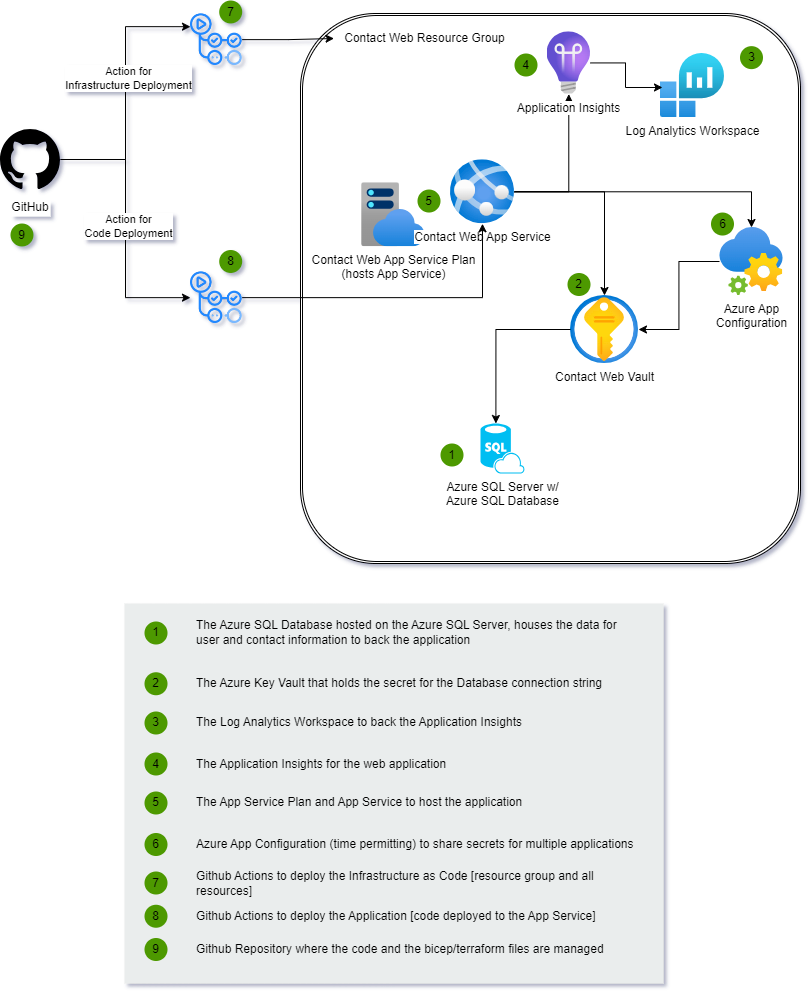

# Part 2 - Building the Infrastructure

In this part you will build all the resources for implementation into Azure to host the application.  You will use Bicep or Terraform to build the infrastructure.

As a reminder, this is the architecture we are building.  By completing the `Part2-BuildingTheInfrastructure` walkthrough, you should already have the resource group for the application built.

>*Note*: The Azure App Configuration will be added in Part 4 if there is enough time to complete the activities.

## Prerequisites

You will need to have completed both Part 1 of this walkthrough and also the common [Building The Infrastructure](Part2-BuildingTheInfrastructure.md) walkthrough before starting this walkthrough.  If you do not already have a GitHub action that is deploying to Azure at the subscription level and creating a resource group, you will not be able to complete this walkthrough.

## Task 1 - Deploy Azure SQL Server

1. create the server and database
    - contactwebdb on contactwebdbserver

## Task 2 - Log analytics workspace

1. create the log analytics workspace

## Take 3 - Application Insights

1. Leverage log analytics workspace

1. create app insights

## Task 4 - Create App Service Plan and App service

1. leverage application insights (which leverages log analytics workspace)

1. App service
    - create the app service plan (`F1` tier)
    - create the app service (`dotnetcore 6` runtime)
    - create a managed identity for the app service
    - add a secret reference for the database connection string that will be added in key vault

## Task 5 - Key vault

1. Get the managed identity from app service into policy
1. Get the connection string from the database as a secret
1. Create the vault with the secret and permissions

## Completion Check

Make sure that the following resources and connections are created:

At the end of this step, you should have the following resources:
- Resource Group
- Log Analytics Workspace
- Application Insights
- App Service Plan
    - F1 Tier for free deployment
- App Service
    - leverages application insights instrumanation key/connection string
- Azure SQL Server
    - basic tier ($5/month)
- Key Vault
    - secret for database connection string
    - permission for app service to get/list secrets

