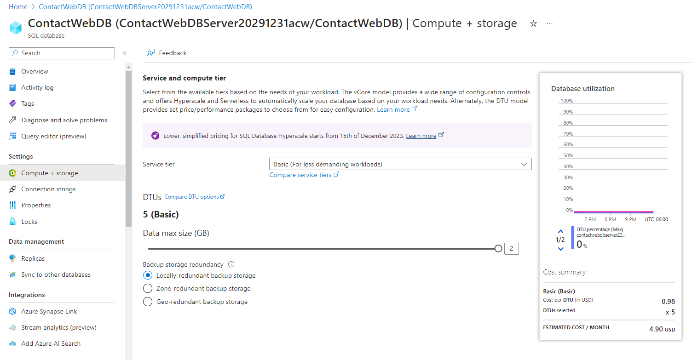
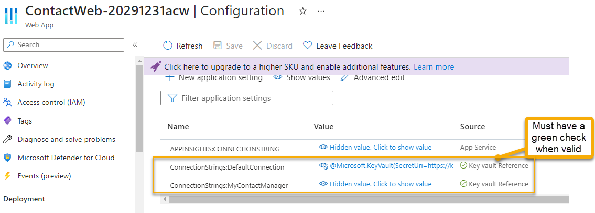
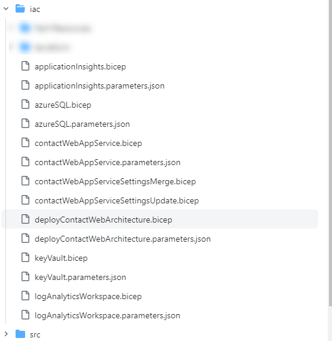

# Part 2 - Building the Infrastructure

In this part you will build all the resources for implementation into Azure to host the application.  You will use Bicep or Terraform to build the infrastructure.

As a reminder, this is the architecture we are building.  By completing the `Part2-BuildingTheInfrastructure` walkthrough, you should already have the resource group for the application built.


>*Note*: The Azure App Configuration will be added in Part 4 if there is enough time to complete the activities.

## Prerequisites

You will need to have completed both Part 1 of this walkthrough and also the common [Building The Infrastructure](Part2-BuildingTheInfrastructure.md) walkthrough before starting this walkthrough.  If you do not already have a GitHub action that is deploying to Azure at the subscription level and creating a resource group, you will not be able to complete this walkthrough.

## Other information

For simplicity, I have moved all the files except the `deployContactWebArchitecture.bicep` and `deployContactWebArchitecture.parameters.json` in my `iac` folder into subfolders to get them out of the way.  You can do the same or just put all your files in the `iac` folder.

## Task 1 - Deploy Azure SQL Server

In this task you will get a your Azure SQL Server with a SQL database deployed.  The SQL Server and the database will be a basic tier ($5/month) so even on the free account you shouldn't have to pay anything.  

The database will be named `contactwebdb` and the server will be named `contactwebdbserver`.  

The server will be created with a firewall rule to allow all Azure services to access the server.

### Step 1 - Create the Bicep For the SQL Server

In this step you'll create the bicep for the SQL Server and database

1. Add a new bicep file to deploy the database.

    Create a new file in the `iac` folder called 

    ```bash
    azureSQL.bicep
    ```  

1. Add the following text to the bicep file.

```bicep
@description('Location for all resources.')
param location string = resourceGroup().location

@description('Provide a unique datetime and initials string to make your instances unique. Use only lower case letters and numbers')
@minLength(11)
@maxLength(11)
param uniqueIdentifier string

@description('Name of the SQL Db Server')
param sqlServerName string

@description('Name of the Sql Database')
param sqlDatabaseName string

@description('Admin UserName for the SQL Server')
param sqlServerAdminLogin string

@description('Admin Password for the SQL Server')
@secure()
param sqlServerAdminPassword string

@description('Your Client IP Address to allow access to the SQL Server')
param clientIPAddress string

var sqlDBServerName = '${sqlServerName}${uniqueIdentifier}'
var dbSKU = 'Basic'
var dbCapacity = 5

resource sqlServer 'Microsoft.Sql/servers@2022-05-01-preview' = {
  name: sqlDBServerName
  location: location
  properties: {
    administratorLogin: sqlServerAdminLogin
    administratorLoginPassword: sqlServerAdminPassword
    minimalTlsVersion: '1.2'
    publicNetworkAccess: 'Enabled'
    restrictOutboundNetworkAccess: 'Disabled'
  }
}

resource sqlServerFirewallRuleAllAzureServices 'Microsoft.Sql/servers/firewallRules@2022-05-01-preview' = {
  parent: sqlServer
  name: 'AllowAllWindowsAzureIps'
  properties: {
    startIpAddress: '0.0.0.0'
    endIpAddress: '0.0.0.0'
  }
}

resource sqlServerFirewallRuleClientIP 'Microsoft.Sql/servers/firewallRules@2022-05-01-preview' = {
  parent: sqlServer
  name: 'MyIPCanAccessServer'
  properties: {
    startIpAddress: clientIPAddress
    endIpAddress: clientIPAddress
  }
}

resource sqlDB 'Microsoft.Sql/servers/databases@2022-05-01-preview' = {
  parent: sqlServer
  name: sqlDatabaseName
  location: location
  sku: {
    name: dbSKU
    capacity: dbCapacity
  }
  properties: {
    requestedBackupStorageRedundancy: 'local'
  }
}

output sqlServerName string = sqlServer.name
```  

>**Note**: As a reminder, all source files can be found in the `src/iac/bicep/Part2` folder from this repo case something is not working as expected from this walkthrough.
    
1. Review the file to see what is happening

    - Creating the SQL Server
    - Adding firewall rules for Azure services and your client IP address
    - Creating the database
    - Parameters for the SQL Server and database name as well as the admin username and password

### Step 2 - Create the parameters file

In this step you'll create the parameters file for the SQL Server and database

1. Create a new file for the azureSQL parameters

    Create a new file in the `iac` folder called 

    ```bash
    azureSQL.parameters.json
    ```  

1. Add the following text to the parameters file.

```json
{
    "$schema": "https://schema.management.azure.com/schemas/2019-04-01/deploymentParameters.json#",
    "contentVersion": "1.0.0.0",
    "parameters": {
        "location": {
            "value": "eastus"
        },
        "uniqueIdentifier": {
            "value": "20291231acw"
        },
        "sqlServerName": {
            "value": "ContactWebDBServer"
        },
        "sqlDatabaseName": {
            "value": "ContactWebDB"
        },
        "sqlServerAdminLogin": {
            "value": "contactwebdbuser"
        },
        "sqlServerAdminPassword": {
            "value": "workshopDbPwd#54321!"
        },
        "clientIPAddress": {
            "value": "10.10.10.10"
        }
    }
}
```  

    This file is not actually necessary but will allow you to manually run a single deployment of just the database if you want to test it.  Additionally, I like to keep these around so that I can see what parameters each one adds to the main deployment.

1. Copy the parameters for the sql server into the main `deployContactWebArchitecture.parameters.json` file.

    Ensure that your parameters file looks like the following:

```json
{
    "$schema": "https://schema.management.azure.com/schemas/2019-04-01/deploymentParameters.json#",
    "contentVersion": "1.0.0.0",
    "parameters": {
        "rgName": {
            "value": "ContactWebApplicationRG"
        },
        "location": {
            "value": "eastus"
        },
        "uniqueIdentifier": {
            "value": "20291231acw"
        },
        "sqlServerName": {
            "value": "ContactWebDBServer"
        },
        "sqlDatabaseName": {
            "value": "ContactWebDB"
        },
        "sqlServerAdminLogin": {
            "value": "contactwebdbuser"
        },
        "sqlServerAdminPassword": {
            "value": "workshopDbPwd#54321!"
        },
        "clientIPAddress": {
            "value": "10.10.10.10"
        }
    }
}
```

>**Note:** Replace `10.10.10.10` with your actual public IP address so you can access the server from the portal or from SSMS if you need to.  In the real world you would likely not include this firewall rule.

### Step 3 - Check in and deploy

Check in the changes and the deployment should run automatically.  

1. Deploy by checking in and pushing your changes.

      

1. Validate Server

    Navigate to the resource group. You should see something like the following:

      

    Open the `SQL Server` and click on `Networking`.  You should see something like the following:

     

1. Validate Database

    Return to the request group and click on the `SQL Database`, or go to the database from the server. 
    
      
    
1. Note Connection string  

    On the database connection string info, validate that you have a database with the name you specified and that you can see the connection string with all the info except the password:

      

1. Validate Database SKU

    Make sure that you didn't accidentally create a database with a higher SKU than you wanted.  You should see something like the following:

        

>**Note:** we will use IAC to get and set the connection string information into the Key Vault in a future step, so you don't need to copy it or save it anywhere.

## Task 2 - Log analytics/Application Insights

In order to log analytics for the web application, we need to create application insights backed by log analytics workspace.  We will create the log analytics workspace first and then create the application insights, then finally create the app service.

### Step 1 - Create Log Analytics Workspace 

1. Add a file for the analyticsWorkspace

    Create a new file in the `iac` folder called 

    ```bash
    logAnalyticsWorkspace.bicep
    ```  

1. Add the following text to the bicep file.

```bicep
resource logAnalyticsWorkspace 'Microsoft.OperationalInsights/workspaces@2020-08-01' = {
  name: logAnalyticsWorkspaceName
  location: location
  properties: {
    sku: {
      name: 'PerGB2018'
    }
    retentionInDays: 30
    features: {
      searchVersion: 1
      legacy: 0
      enableLogAccessUsingOnlyResourcePermissions: true
    }
  }
}

output logAnalyticsWorkspaceId string = logAnalyticsWorkspace.id
```

### Step 2 - Create the parameters file  

Create the parameters file.

1. Add a parameters file for the loganalytics workspace

    Create a new file in the `iac` folder called 

    ```bash
    logAnalyticsWorkspace.parameters.json
    ```  

1. Add the following text to the parameters file.  

```json
{
    "$schema": "https://schema.management.azure.com/schemas/2019-04-01/deploymentParameters.json#",
    "contentVersion": "1.0.0.0",
    "parameters": {
        "location": {
            "value": "eastus"
        },
        "logAnalyticsWorkspaceName": {
            "value": "contactWebAnalytics"
        }
    }
}
```  

### Step 3 - Deploy Log Analytics for the Web Application's Application Insights

Deploy the log analytics workspace.

1. Add the deployment to the main deployment file

    Add the following to the main deployment file:

```bicep
module contactWebAnalyticsWorkspace 'logAnalyticsWorkspace.bicep' = {
  name: '${logAnalyticsWorkspaceName}-deployment'
  scope: contactWebResourceGroup
  params: {
    location: contactWebResourceGroup.location
    logAnalyticsWorkspaceName: logAnalyticsWorkspaceName
  }
}
```  

    Also add the parameter to the top of the file after the sql server parameters:

```bicep
param logAnalyticsWorkspaceName string
```

1. Add the parameters to the deployment parameters file

    Add the following to the `deployContactWebArchitecture.parameters.json` file after the clientIPAddress parameter (don't forget the comma):

```json
        "logAnalyticsWorkspaceName": {
            "value": "contactWebAnalytics"
        }
```

1. Check in and let the deployment run to validate your log analytics workspace (you can start creating the next one while it builds).

        

### Step 4 - Create Application Insights

In this step you'll build the application insights resource that will be backed by the log analytics workspace built in the previous step.

1. Create a new file for the application insights

    Create a new file in the `iac` folder called 

    ```bash
    applicationInsights.bicep
    ```  

1. Add the following text to the bicep file.

```bicep
param location string
param appInsightsName string
param logAnalyticsWorkspaceId string

resource applicationInsights 'Microsoft.Insights/components@2020-02-02' = {
  name: appInsightsName
  location: location
  kind: 'web'
  properties: {
    Application_Type: 'web'
    WorkspaceResourceId: logAnalyticsWorkspaceId
  }
}

output applicationInsightsId string = applicationInsights.id
output applicationInsightsName string = applicationInsights.name
```

### Step 5 - Create the parameters file  

Create the parameters file.

1. Add a parameters file for the application insights

    Create a new file in the `iac` folder called 

    ```bash
    applicationInsights.parameters.json
    ```  

1. Add the following text to the parameters file.  

```json
{
    "$schema": "https://schema.management.azure.com/schemas/2019-04-01/deploymentParameters.json#",
    "contentVersion": "1.0.0.0",
    "parameters": {
        "location": {
            "value": "eastus"
        },
        "appInsightsName": {
            "value": "contactWebAppInsights"
        },
        "logAnalyticsWorkspaceId": {
            "value": "/subscriptions/${subscription().subscriptionId}/resourceGroups/${rgname}/providers/Microsoft.OperationalInsights/workspaces/${laWorkspaceName}"
        }   
    }
}
```

>**NOTE:** You won't be able to run this one individually without first composing a valid workspace id.  You could pass the name in and get the existing resource if you wanted to do it that way.

### Step 6: Deploy  

Deploy the application insights.

1. Add the deployment to the main deployment file

    Add the following to the main deployment file:

```bicep
module contactWebApplicationInsights 'applicationInsights.bicep' = {
  name: '${appInsightsName}-deployment'
  scope: contactWebResourceGroup
  params: {
    location: contactWebResourceGroup.location
    appInsightsName: appInsightsName
    logAnalyticsWorkspaceId: contactWebAnalyticsWorkspace.outputs.logAnalyticsWorkspaceId
  }
}
```

>**Note:** Notice the dependency on the log analytics workspace.  This is how you can ensure that the log analytics workspace is created before the application insights.

    Also add the parameter to the top of the file after the sql server parameters:

```bicep
param appInsightsName string
```  

1. Add the parameters to the deployment parameters file

    Add the following to the `deployContactWebArchitecture.parameters.json` file after the logAnalyticsWorkspaceName parameter (don't forget the comma):

```json
        "appInsightsName": {
            "value": "contactWebAppInsights"
        }
```

1. Check in and deploy changes

    Navigate back to the resource group and review the resources.

       

1. Validate that the Application Insights is correctly leveraging the workspace

    Open the Application Insights and review the `overview` blade.

    

## Task 3 - Create App Service Plan and App service

At this point, the backing database and log analytics/application insights are in place.  We will need to leverage them in the App Service for the two database connections and the log analytics connection string/instrumentation key.

### Step 1 - Create the App Service Plan and Site

1. Review necessary information

    In order for this to work, we need to set the following values in the configuration for the app service:
    - `ConnectionStrings:DefaultConnection` - this will be the connection string for the identity database
    - `ConnectionStrings:MyContactManager` - this will be the connection string for the database
    - `APPINSIGHTS:CONNECTIONSTRING` - this will be the instrumentation key for the application insights

    These database values will be leveraged a couple of other times and it's important not to make a *typo* on these so they will need to be parameterized.

1. Create the bicep for the app service and app service plan

    Create a new file in the `iac` folder called 

    ```bash
    contactWebAppService.bicep
    ```  

1. Add the following text to the bicep file.


```bicep
param location string
param uniqueIdentifier string 
param appServicePlanName string
param appServicePlanSku string = 'F1'
param webAppName string 
param appInsightsName string
param identityDBConnectionStringKey string = 'ConnectionStrings:DefaultConnection'
param managerDBConnectionStringKey string = 'ConnectionStrings:MyContactManager'
param appInsightsConnectionStringKey string = 'APPINSIGHTS:CONNECTIONSTRING'

var workerRuntime = 'dotnet'
var webAppFullName = '${webAppName}-${uniqueIdentifier}'
var identityDBConnectionStringValue = 'ContactWebIdentityDBConnectionString'
var managerDBConnectionStringValue = 'ContactWebDBConnectionString'

resource applicationInsights 'Microsoft.Insights/components@2020-02-02' existing = {
  name: appInsightsName
}

resource hostingPlan 'Microsoft.Web/serverfarms@2023-01-01' = {
  name: '${appServicePlanName}-${uniqueIdentifier}'
  location: location
  sku: {
    name: appServicePlanSku
  }
}

resource webApp 'Microsoft.Web/sites@2023-01-01' = {
  name: webAppFullName
  location: location
  identity: {
    type: 'SystemAssigned'
  }
  properties: {
    serverFarmId: hostingPlan.id
    siteConfig: {
      metadata :[
        {
          name:'CURRENT_STACK'
          value:workerRuntime
        }
      ]
      netFrameworkVersion:'v6.0'
      appSettings: [
          {
            name: appInsightsConnectionStringKey
            value: applicationInsights.properties.ConnectionString
          }
          {
            name: identityDBConnectionStringKey
            value: identityDBConnectionStringValue
          }
          {
            name: managerDBConnectionStringKey
            value: managerDBConnectionStringValue
          }
        ]
        ftpsState: 'FtpsOnly'
        minTlsVersion: '1.2'
    }
    httpsOnly: true
  }
}

output webAppFullName string = webApp.name
```

### Step 2 - Create the parameters file

1. Add a parameters file for the app service and app service plan

    Create a new file in the `iac` folder called 

    ```bash
    contactWebAppService.parameters.json
    ```

1. Add the following text to the parameters file.  

```json
{
    "$schema": "https://schema.management.azure.com/schemas/2019-04-01/deploymentParameters.json#",
    "contentVersion": "1.0.0.0",
    "parameters": {
        "location": {
            "value": "eastus"
        },
        "uniqueIdentifier": {
            "value": "20291231acw"
        },
        "appServicePlanName": {
            "value": "contactWebASP"
        },
        "appServicePlanSku": {
            "value": "F1"
        },
        "webAppName": {
            "value": "ContactWeb"
        },
        "appInsightsName": {
            "value": "contactWebAppInsights"
        },
        "identityDBConnectionStringKey": {
            "value": "ConnectionStrings:DefaultConnection"
        },
        "managerDBConnectionStringKey": {
            "value": "ConnectionStrings:MyContactManager"
        },
        "appInsightsConnectionStringKey": { 
            "value": "APPINSIGHTS:CONNECTIONSTRING"
        }
    }
}
```

### Step 3 - Deploy

Add the parameters and bicep module to the main deployment files

1. Add the deployment to the main deployment file

    Add the following to the main deployment file:

```bicep
module contactWebApplicationPlanAndSite 'contactWebAppService.bicep' = {
  name: '${webAppName}-deployment'
  scope: contactWebResourceGroup
  params: {
    location: contactWebResourceGroup.location
    uniqueIdentifier: uniqueIdentifier
    appInsightsName: contactWebApplicationInsights.outputs.applicationInsightsName
    appServicePlanName: appServicePlanName
    appServicePlanSku: appServicePlanSku
    webAppName: webAppName
    identityDBConnectionStringKey: identityDBConnectionStringKey
    managerDBConnectionStringKey: managerDBConnectionStringKey
    appInsightsConnectionStringKey: appInsightsConnectionStringKey
  }
}
```  

And add the missing parameters to the top of the file:

```bicep
param webAppName string
param appServicePlanName string
param appServicePlanSku string
param identityDBConnectionStringKey string
param managerDBConnectionStringKey string
param appInsightsConnectionStringKey string
```

1. Add the parameters to the parameters file (don't forget the comma before the first setting):

```json
        "appServicePlanName": {
            "value": "contactWebASP"
        },
        "appServicePlanSku": {
            "value": "F1"
        },
        "webAppName": {
            "value": "ContactWeb"
        },
        "identityDBConnectionStringKey": {
            "value": "ConnectionStrings:DefaultConnection"
        },
        "managerDBConnectionStringKey": {
            "value": "ConnectionStrings:MyContactManager"
        },
        "appInsightsConnectionStringKey": { 
            "value": "APPINSIGHTS:CONNECTIONSTRING"
        }
```  

1. Check in and deploy

    Navigate back to the resource group and review the resources.

      

1. Ensure the web app is created:

    Review the App Service Plan for free tier:

      

    Review the App Service for settings:

        

## Task 4 - Key vault

In this task you will create the key vault and add the secrets for the database connection strings.  Additionally, you will add the identity from the web app to the key vault so that it can access the secrets.

When that is completed, you need to update the web application to use the key vault for the connection strings by updating the configuration value for the KeyVault Secret Uri.

### Step 1 - Create the Key Vault  

Create the Key Vault.  You need to get the following accomplished with the deployment:  

- Get the managed identity from app service into policy for get secrets (need list if using code access)
- Get the connection string from the database as a secret
- Create the vault with the two secrets and identity permission for the web app

1. Create a new file for the key vault

    Create a new file in the `iac` folder called 

    ```bash
    keyVault.bicep
    ```  

1. Add the following to the file:

```bicep 
param location string
@description('Provide a unique datetime and initials string to make your instances unique. Use only lower case letters and numbers')
@minLength(11)
@maxLength(11)
param uniqueIdentifier string 

@minLength(10)
@maxLength(13)
param keyVaultName string

param webAppFullName string
param databaseServerName string
param sqlDatabaseName string
@secure()
param sqlServerAdminPassword string

var vaultName = '${keyVaultName}${uniqueIdentifier}'
var skuName = 'standard'
var softDeleteRetentionInDays = 7

resource webApp 'Microsoft.Web/sites@2023-01-01' existing = {
  name: webAppFullName
}

resource databaseServer 'Microsoft.Sql/servers@2023-05-01-preview' existing = {
  name: databaseServerName
}

resource keyVault 'Microsoft.KeyVault/vaults@2022-07-01' = {
  name: vaultName
  location: location
  properties: {
    enabledForDeployment: true
    enabledForDiskEncryption: false
    enabledForTemplateDeployment: true
    tenantId: subscription().tenantId
    enableSoftDelete: true
    softDeleteRetentionInDays: softDeleteRetentionInDays
    sku: {
      name: skuName
      family: 'A'
    }
    accessPolicies: [
      {
        tenantId: subscription().tenantId
        objectId: webApp.identity.principalId
        permissions: {
          keys: []
          secrets: ['Get']
          certificates: []
        }
      }
    ]
    networkAcls: {
      defaultAction: 'Allow'
      bypass: 'AzureServices'
    }
  }
}

resource identityDBConnectionSecret 'Microsoft.KeyVault/vaults/secrets@2022-11-01' = {
  name: 'IdentityDbConnectionSecret'
  parent: keyVault
  properties: {
    value: 'Server=tcp:${databaseServer.name}${environment().suffixes.sqlServerHostname},1433;Initial Catalog=${sqlDatabaseName};Persist Security Info=False;User ID=${databaseServer.properties.administratorLogin};Password=${sqlServerAdminPassword};MultipleActiveResultSets=False;Encrypt=True;TrustServerCertificate=False;Connection Timeout=30;'
  }
}

resource contactManagerDBConnectionSecret 'Microsoft.KeyVault/vaults/secrets@2022-11-01' = {
  name: 'ContactManagerDbConnectionSecret'
  parent: keyVault
  properties: {
    value: 'Server=tcp:${databaseServer.name}${environment().suffixes.sqlServerHostname},1433;Initial Catalog=${sqlDatabaseName};Persist Security Info=False;User ID=${databaseServer.properties.administratorLogin};Password=${sqlServerAdminPassword};MultipleActiveResultSets=False;Encrypt=True;TrustServerCertificate=False;Connection Timeout=30;'
  }
}

output keyVaultName string = keyVault.name
output identityDBConnectionSecretURI string = identityDBConnectionSecret.properties.secretUri
output managerDBConnectionSecretURI string = contactManagerDBConnectionSecret.properties.secretUri
```

### Step 2 - Create the parameters file

Create the parameters file.

1. Add a parameters file for the key vault

    Create a new file in the `iac` folder called 

    ```bash
    keyVault.parameters.json
    ```

1. Add the following text to the parameters file.   
    
```json
{
    "$schema": "https://schema.management.azure.com/schemas/2019-04-01/deploymentParameters.json#",
    "contentVersion": "1.0.0.0",
    "parameters": {
        "location": {
            "value": "eastus"
        },
        "uniqueIdentifier": {
            "value": "20291231acw"
        },
        "keyVaultName": {
            "value": "KV-ContactWeb"
        },
        "databaseServerName": {
            "value": "ContactWebDBServer20291231acw"
        },
        "webAppName": {
            "value": "ContactWeb-20291231acw"
        },
        "sqlDatabaseName": {
            "value": "ContactWebDB"
        },
        "sqlServerAdminPassword": {
            "value": "workshopDbPwd#54321!"
        }
    }
}
```

### Step 3 - Deploy 

Add the parameters and bicep module to the main deployment files

1. Add the deployment to the main deployment file

    Add the following to the main deployment file:

```bicep
module contactWebVault 'keyVault.bicep' = {
  name: '${keyVaultName}-deployment'
  scope: contactWebResourceGroup
  params: {
    location: contactWebResourceGroup.location
    uniqueIdentifier: uniqueIdentifier
    webAppFullName: contactWebApplicationPlanAndSite.outputs.webAppFullName
    databaseServerName: contactWebDatabase.outputs.sqlServerName
    keyVaultName: keyVaultName
    sqlDatabaseName: sqlDatabaseName
    sqlServerAdminPassword: sqlServerAdminPassword
  }
}
```

And add the missing parameters to the top of the file:

```bicep
param keyVaultName string
```

1. Add the parameters to the parameters file (don't forget the comma):

```json
        "keyVaultName": {
            "value": "KV-ContactWeb"
        }
```

1. Validate the deployment of the vault

    The vault should deploy as required.

      

1. Verify access policies (make sure web app is authorized)

    Validate that the Web App has access to get secrets from the Key Vault

      

1. Verify secrets (need to add your credential)

    Modify the access policies to allow your user to view the secrets.  You can do this by adding your user to the access policies and giving it the `Get` and `List` permission (or just check them all since it's you).  Then you can view the secrets.

      
      
      

    Open the secrets and validate they have the correct value as expected.

      

## Task 5: Update the web app to use the key vault for the connection strings

With the vault deployed and the secrets in place, you need to complete the deployment by updating the web app to use the key vault for the connection strings.

### Step 1 - Create the bicep file to merge the settings

This first file will take parameters of two app settings objects and merge them together.  This will allow us to merge the current app settings that already exist with the new app settings/values we want to modify or add based on KeyVault secrets that were created.

1. Create a new file to merge the web app settings

    Create a new file in the `iac` folder called 

    ```bash
    contactWebAppServiceSettingsMerge.bicep
    ```

1. Add the following text to the bicep file.

```bicep
param webAppName string
param appSettings object
param currentAppSettings object

resource webApp 'Microsoft.Web/sites@2023-01-01' existing = {
  name: webAppName
}

//merge the current app settings with the new app settings
resource siteconfig 'Microsoft.Web/sites/config@2023-01-01' = {
  parent: webApp
  name: 'appsettings'
  properties: union(currentAppSettings, appSettings)
}
```

### Step 2 - Create the bicep file to update the app settings   

This file will create new values for existing app settings (could add new ones if desired as well).  The file will then pass the new values and the existing values to the merge file to be combined via a `union` operation.

1. Create a new file in the `iac` folder to update/add new settings for merge with existing settings 

    ```bash
    contactWebAppServiceSettingsUpdate.bicep
    ```  

1. Add the following text to the bicep file.

```bicep
param webAppName string 
param defaultDBSecretURI string
param managerDBSecretURI string
param identityDBConnectionStringKey string
param managerDBConnectionStringKey string 

resource webApp 'Microsoft.Web/sites@2023-01-01' existing = {
  name: webAppName
}

module updateAndMergeWebAppConfig 'contactWebAppServiceSettingsMerge.bicep' = {
  name: 'webAppSettings-${webAppName}'
  params: {
    currentAppSettings: list('${webApp.id}/config/appsettings', '2023-01-01').properties
    appSettings: {
      '${identityDBConnectionStringKey}' : '@Microsoft.KeyVault(SecretUri=${defaultDBSecretURI})'
      '${managerDBConnectionStringKey}': '@Microsoft.KeyVault(SecretUri=${managerDBSecretURI})'
    }
    webAppName: webApp.name
  }
}
```  

    Note that this file will set the value of the connection strings to the secret uri for the key vault secret using the latest/current version.  This will allow us to merge the current app settings with the new app settings/values. 

    This does rely on baked-in KeyVault from the app service and does not leverage code.  However, with the code from this application looking for specific configuration values this is easier than modifying the code to look for the key vault secret by name (which is also possible and may be more reliable in production scenarios). 

### Step 3 - Deploy the App Settings Update Files

1. Add the call to the update file to the main deployment file

    Add the following to the main deployment file:

```bicep
module updateContactWebAppSettings 'contactWebAppServiceSettingsUpdate.bicep' = {
  name: '${webAppName}-updatingAppSettings'
  scope: contactWebResourceGroup
  params: {
    webAppName: contactWebApplicationPlanAndSite.outputs.webAppFullName
    defaultDBSecretURI: contactWebVault.outputs.identityDBConnectionSecretURI
    managerDBSecretURI: contactWebVault.outputs.managerDBConnectionSecretURI
    identityDBConnectionStringKey: identityDBConnectionStringKey
    managerDBConnectionStringKey: managerDBConnectionStringKey
  }
}
```  

>**Note:** the parameters and values should already be in place from earlier in this part.  

1. Deploy the solution

    Check in your changes to deploy the solution.  Once the deployment is complete, you can validate the settings in the app service by clicking in the portal.

      

1. Validation and Troubleshooting 

    >**IMPORTANT**: You must see the green check mark with the `Key Vault Reference` for each of the connection string settings or the value is not actually working from Key Vault.  If you see a red `x` you likely didn't get your permission for the app registration set correctly.  Make sure the web app has a system managed identity and that the system managed identity is authorized to `Get` secrets in the Key Vault access policies.  

    Additional troubleshooting steps:
    - validate you don't have any typos
        - `@Microsoft.KeyVault(SecretUri=...)` is case sensitive so don't miss the capital `S` in `SecretUri` and the small 'ri' in Uri, as well as `Microsoft` and `KeyVault`.
    - validate that the secret is in the key vault with the correct name and value is set to a connection string
    - validate that the secret URI is actually the correct URI of the secret in the key vault

## Completion Check

Make sure that the following resources and connections are created:

At the end of this step, you should have the following resources:
- Resource Group
- Log Analytics Workspace
- Application Insights
- App Service Plan
    - F1 Tier for free deployment
- App Service
    - leverages application insights instrumentation key/connection string
- Azure SQL Server
    - basic tier ($5/month)
- Key Vault
    - secret for database connection string
    - permission for app service to get/list secrets

The files as they exist in the repository should look similar to this:

  

- applicationInsights.bicep
- applicationInsights.parameters.json
- azureSQL.bicep
- azureSQL.parameters.json
- contactWebAppService.bicep
- contactWebAppService.parameters.json
- contactWebAppServiceSettingsMerge.bicep
- contactWebAppServiceSettingsUpdate.bicep
- deployContactWebArchitecture.bicep
- deployContactWebArchitecture.parameters.json
- keyVault.bicep
- keyVault.parameters.json
- logAnalyticsWorkspace.bicep
- logAnalyticsWorkspace.parameters.json

**Congratulations!** You have completed the infrastructure deployment for the application.  You can now move on to the next part of the walkthrough to deploy the application code into the App Service.
