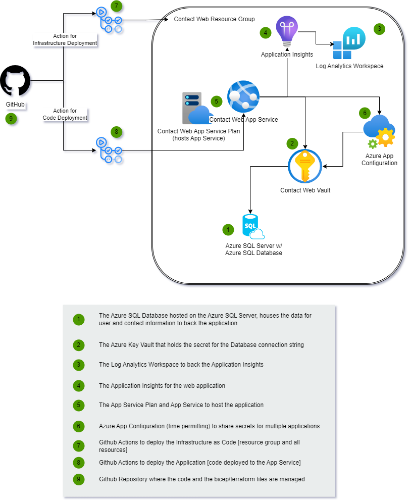
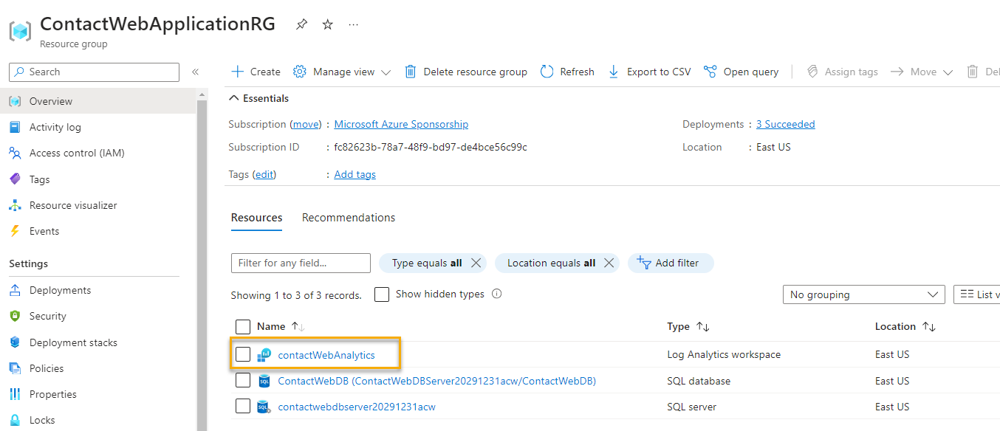
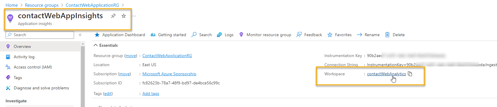

# Part 2 - Building the Infrastructure

In this part you will build all the resources for implementation into Azure to host the application.  You will use Bicep or Terraform to build the infrastructure.

As a reminder, this is the architecture we are building.  By completing the `Part2-BuildingTheInfrastructure` walkthrough, you should already have the resource group for the application built.



>*Note*: The Azure App Configuration will be added in Part 4 if there is enough time to complete the activities.

## Prerequisites

You will need to have completed both Part 1 of this walkthrough and also the common [Building The Infrastructure](Part2-BuildingTheInfrastructure.md) walkthrough before starting this walkthrough.  If you do not already have a GitHub action that is deploying to Azure at the subscription level and creating a resource group, you will not be able to complete this walkthrough.

## Other information

We will use the `deployContactWebArchitecture.tf` created in the common walkthrough as the main module for this deployment, all the other resources that we will deploy in the next steps will be added as modules. Lets see if you remember how we created modules in part 1!

## Task 1 - Deploy Azure SQL Server

In this task you will get a your Azure SQL Server with a SQL database deployed.  The SQL Server and the database will be a basic tier ($5/month) so even on the free account you shouldn't have to pay anything.  

The database will be named `contactwebdb` and the server will be named `contactwebdbserverterraform`.  

The server will be created with a firewall rule to allow all Azure services to access the server.

### Step 1 - Create the Terraform module For the SQL Server

In this step you'll create the Terraform module for the SQL Server and database

1. Add a `sqlServer` folder inside the `modules` folder (create one if you don't have one already) and add the terraform files needed to deploy the database (main and variables).

1. Add the following text to the main module.

```terraform
locals {
  sqlServerUniqueName   = "${var.sqlServerName}${var.uniqueIdentifier}"
}

# Azure SQL Server
resource "azurerm_mssql_server" cm_sql_server {
  name                                  = local.sqlServerUniqueName
  resource_group_name                   = var.resourceGroupName
  location                              = var.location
  version                               = "12.0"
  administrator_login                   = var.sqlServerAdmin
  administrator_login_password          = var.sqlServerPwd
  outbound_network_restriction_enabled  = false
  minimum_tls_version                   = "1.2"
  public_network_access_enabled         = true
}

resource "azurerm_mssql_firewall_rule" "allowAzureServices" {
  name             = "AllowAzureServices"
  server_id        = azurerm_mssql_server.cm_sql_server.id
  start_ip_address = "0.0.0.0"
  end_ip_address   = "0.0.0.0"
}

resource "azurerm_mssql_firewall_rule" "allowClientMachine" {
  name             = "AllowClientMachine"
  server_id        = azurerm_mssql_server.cm_sql_server.id
  start_ip_address = var.clientIpAddress
  end_ip_address   = var.clientIpAddress
}

resource "azurerm_mssql_database" "cm_db" {
  name                        = var.sqlDatabaseName
  server_id                   = azurerm_mssql_server.cm_sql_server.id
  collation                   = "SQL_Latin1_General_CP1_CI_AS"
  max_size_gb                 = 2
  read_scale                  = false
  sku_name                    = var.sqlDbSkuName
  zone_redundant              = false
  auto_pause_delay_in_minutes = 60
  ledger_enabled              = false
  min_capacity                = 0.5
}
```

>**Note**: As a reminder, all source files can be found in the `src/iac/terraform/Part2` folder from this repo in case something is not working as expected from this walkthrough.
    
1. Review the file to see what is happening

    - Creating the SQL Server
    - Adding firewall rules for Azure services and your client IP address
    - Creating the database
    - Parameters for the SQL Server and database name as well as the admin username and password

### Step 2 - Create the variables file

In this step you'll create the variables file for the SQL Server and database

1. Create a `variables.tf` file in the `sqlServer` folder inside `modules`.

1. Add the following text to the parameters file:

```terraform
variable "resourceGroupName" {
    type     = string
    nullable = false
}

variable "location" {
    type     = string
    nullable = false
}

variable "sqlServerName" {
    type     = string
    nullable = false
}

variable "sqlServerAdmin" {
    type     = string
    nullable = false
}

variable "sqlServerPwd" {
    type     = string
    nullable = false
}

variable "sqlDatabaseName" {
    type     = string
    nullable = false
}

variable "uniqueIdentifier" {
    type     = string
    nullable = false
}

variable "clientIpAddress" {
    type     = string
    nullable = false
}

variable "sqlDbSkuName" {
    type     = string
    nullable = false

    validation {
      condition     = contains(["Basic"], var.sqlDbSkuName)
      error_message = "Only SKU allowed for DB is 'Basic'"
    }
}
```

Note that we are adding a validation rule for the DB SKU name to avoid using any expensive tiers by accident.

1. Copy the parameters above into the `variables.tf` file for the main module and assign values using the `terraform.tfvars` file.

### Step 3 - Create outputs file

1. Add an `outputs.tf` file to your module with the following content:

```terraform
output "sqlServerName" {
  value = azurerm_mssql_server.cm_sql_server.name
}
```

### Step 4 - Call SQL server module from main module.

Now that we have our SQL server module ready, we need to call it from the main module.

1. Add the following block to your `deployContactWebArchitecture.tf` file:

```terraform
module "sqlServer" {
  source = "./modules/sqlServer"

  resourceGroupName = azurerm_resource_group.rg-contact-web-application.name
  location          = azurerm_resource_group.rg-contact-web-application.location
  clientIpAddress   = var.clientIpAddress
  sqlServerName     = var.sqlServerName
  sqlServerAdmin    = var.sqlServerAdmin 
  sqlServerPwd      = var.sqlServerPwd
  sqlDatabaseName   = var.sqlDatabaseName
  sqlDbSkuName      = var.sqlDbSkuName
  uniqueIdentifier  = var.uniqueIdentifier
}
```

As you can see, we are using the resource group name and location from the existing resource group block.

### Step 4 - Check in and deploy

Check in all the files you just created and the deployment should run automatically.  

1. Deploy by checking in and pushing your changes.

1. Validate Server

    Navigate to the resource group. You should see something like the following:

      

    Open the `SQL Server` and click on `Networking`.  You should see something like the following:

     

1. Validate Database

    Return to the request group and click on the `SQL Database`, or go to the database from the server. 
    
      
    
1. Note Connection string  

    On the database connection string info, validate that you have a database with the name you specified and that you can see the connection string with all the info except the password:

      

1. Validate Database SKU

    Make sure that you didn't accidentally create a database with a higher SKU than you wanted.  You should see something like the following:

        

>**Note:** we will use IAC to get and set the connection string information into the Key Vault in a future step, so you don't need to copy it or save it anywhere.

## Task 2 - Log analytics/Application Insights

In order to log analytics for the web application, we need to create application insights backed by log analytics workspace.  We will create the log analytics workspace first and then create the application insights, then finally create the app service.

### Step 1 - Create Log Analytics Workspace 

1. Add a new module (folder and files) for the analytics workspace, you will need the following files:

- Main file (logAnalytics.tf)
- Variables file.
- Outputs file.

1. Add the following text to the `logAnalytics.tf` file.

```terraform
resource "azurerm_log_analytics_workspace" "cm_analytics_workspace" {
  name                            = var.logAnalyticsWorkSpaceName
  location                        = var.location
  resource_group_name             = var.resourceGroupName
  sku                             = "PerGB2018"
  retention_in_days               = 30
  allow_resource_only_permissions = true  
}
```

### Step 2 - Update variables file  

1. Add the resource group name, location and log analytics name as variables for the module. 

### Step 3 - Add outputs to file  

1. Add the following to the outputs.tf file to output the workspace Id:

```terraform
output "logAnalyticsWorkspaceId" {
  value = azurerm_log_analytics_workspace.cm_analytics_workspace.id
}
```

### Step 4 - Deploy Log Analytics for the Web Application's Application Insights

Deploy the log analytics workspace.

1. Add the analytics module to the root module in your deployment (use the SQL server block as an example).

1. Add the analytics workspace name to the `variables.tf` of the root module

1. Check in and let the deployment run to validate your log analytics workspace (you can start creating the next one while it builds).

        

### Step 4 - Create Application Insights

In this step you'll build the application insights resource that will be backed by the log analytics workspace built in the previous step.

1. Create a new module for the application insights with the following file:

- Main file (applicationInsights.tf).
- Variables file.
- Outputs file.

1. Add the following text to the main file.

```terraform
resource "azurerm_application_insights" "cm_app_insights" {
  name                = var.appInsightsName
  location            = var.location
  resource_group_name = var.resourceGroupName
  workspace_id        = var.logAnalyticsWorkspaceId
  application_type    = "web"
}
```

### Step 5 - Create the parameters file  

Create the parameters file.

1. Add the resource group name, location, application insights resource name and workspaceId as variables for the module. 

### Step 6: Deploy  

Deploy the application insights.

1. Add the deployment to the main deployment file

    Add the following to the main deployment file:

```terraform
module "applicationInsights" {
  source = "./modules/appInsights"

  resourceGroupName         = azurerm_resource_group.rg-contact-web-application.name
  location                  = azurerm_resource_group.rg-contact-web-application.location
  logAnalyticsWorkspaceId   = module.logAnalyticsWorkspace.logAnalyticsWorkspaceId
  appInsightsName           = var.appInsightsName 
}
```

>**Note:** Notice the dependency on the log analytics workspace.  This is how you can ensure that the log analytics workspace is created before the application insights.

Don't forget to add the new variable for the application insights resource to the main module!

1. Check in and deploy changes

    Navigate back to the resource group and review the resources.

       

1. Validate that the Application Insights is correctly leveraging the workspace

    Open the Application Insights and review the `overview` blade.

    

## Task 3 - Key vault

In this task you will create the key vault and add the secrets for the database connection strings, if you already went through the Bicep walkthrough you'll notice that we are doing it before the web app to show that there are different ways to deploy your resources. We will also use RBAC instead of policies to give access to the vault.

### Step 1 - Create the Key Vault  

Create the Key Vault.  You need to get the following accomplished with the deployment:  

- Get the connection string from the database as a secret
- Create the vault with the two secrets and identity permission for the web app
- Give restricted key vault access to the identity running the deployment.

1. Create a new module for the key vault:

- Main file (keyvault.tf).
- Variables file.
- Outputs file.

1. Add the following to the file:

```terraform 
data "azurerm_client_config" "current" {}

data "azurerm_mssql_server" "cm_sql_server" {
  resource_group_name = var.resourceGroupName
  name                = "${var.sqlServerName}${var.uniqueIdentifier}"
}

locals {
  dbConnectionString = "Server=tcp:${data.azurerm_mssql_server.cm_sql_server.fully_qualified_domain_name},1433;Initial Catalog=${var.sqlDatabaseName};Persist Security Info=False;User ID=${data.azurerm_mssql_server.cm_sql_server.administrator_login};Password=${var.sqlServerPwd};MultipleActiveResultSets=False;Encrypt=True;TrustServerCertificate=False;Connection Timeout=30;"  
}

resource "azurerm_key_vault" "cm_kv" {
  name                            = "${var.keyVaultName}${var.uniqueIdentifier}"
  location                        = var.location
  resource_group_name             = var.resourceGroupName
  tenant_id                       = data.azurerm_client_config.current.tenant_id
  sku_name                        = "standard"
  soft_delete_retention_days      = 7
  purge_protection_enabled        = true  
  enable_rbac_authorization       = true
  enabled_for_template_deployment = true
}

resource "azurerm_key_vault_secret" "kv_secret_identity" {
  name         = "IdentityDbConnectionSecret"
  value        = local.dbConnectionString
  key_vault_id = azurerm_key_vault.cm_kv.id

  depends_on = [ azurerm_role_assignment.kv_access_current_user ]
}

resource "azurerm_key_vault_secret" "kv_secret_cm" {
  name         = "ContactManagerDbConnectionSecret"
  value        = local.dbConnectionString
  key_vault_id = azurerm_key_vault.cm_kv.id

  depends_on = [ azurerm_role_assignment.kv_access_current_user ]
}

resource "azurerm_role_assignment" "kv_access_current_user" {
  scope                = azurerm_key_vault.cm_kv.id
  role_definition_name = "Key Vault Secrets Officer"
  principal_id         = data.azurerm_client_config.current.object_id
}
```

There is one new element in this file that we haven't used in any of the previous resources: `depends_on`, this attribute allows you to specify certain dependencies between resources to ensure that they are deployed in the right order. In this case, we are saying that we want to try to create the secrets only after the appropriate permissions have been given to the current user.

### Step 2 - Add variables

1. Add the following text to the variables file:   
    
```terraform
variable "resourceGroupName" {
    type     = string
    nullable = false
}

variable "location" {
    type     = string
    nullable = false
}

variable "sqlServerName" {
    type     = string
    nullable = false
}

variable "sqlServerPwd" {
    type      = string
    nullable  = false
    sensitive = true
}

variable "sqlDatabaseName" {
    type     = string
    nullable = false
}

variable "keyVaultName" {
    type      = string
    nullable  = false
}

variable "uniqueIdentifier" {
    type      = string
    nullable  = false
}
```

### Step 3 - Deploy 

Add a reference to the keyvault module in the root module.

1. Add the deployment to the root module

    Add the following to the root module:

```terraform
module "keyvault" {
  source = "./modules/keyvault"

  resourceGroupName = azurerm_resource_group.rg-contact-web-application.name
  location          = azurerm_resource_group.rg-contact-web-application.location
  sqlServerName     = var.sqlServerName
  sqlServerPwd      = var.sqlServerPwd
  sqlDatabaseName   = var.sqlDatabaseName
  uniqueIdentifier  = var.uniqueIdentifier
  keyVaultName      = var.keyVaultName
}
```

Don't forget to add the new variable (keyVaultName) to the `variables.tf` file in the root module and assign a value in the `terraform.tfvars`

1. Validate the deployment of the vault

    The vault should deploy as required.

      

1. Verify the role assignments (make sure web app is authorized)

    Validate that the Web App has access to get secrets from the Key Vault

      

1. Verify secrets (need to add your credential)

    Modify the role assignments to allow your user to view the secrets.  You can do this by adding giving your user the `Key Vault Administrator` or `Key Vault Secrets Officer` role.  Then you can view the secrets.

      
      
      
      

    Open the secrets and validate they have the correct value as expected.

      

## Task 4 - Create App Service Plan and App service

At this point, the backing database and log analytics/application insights are in place.  We will need to leverage them in the App Service for the two database connections and the log analytics connection string/instrumentation key.

### Step 1 - Create the App Service Plan and Site

1. Review necessary information

    In order for this to work, we need to set the following values in the configuration for the app service:
    - `ConnectionStrings:DefaultConnection` - this will be the connection string for the identity database
    - `ConnectionStrings:MyContactManager` - this will be the connection string for the database
    - `APPINSIGHTS:CONNECTIONSTRING` - this will be the instrumentation key for the application insights

    These database values will be leveraged a couple of other times and it's important not to make a *typo* on these so they will need to be parameterized.

1. Create a new module for the app service and app service plan.

- Main file (appService.tf).
- Variables file.
- Output file.

1. Add the following text to the `appService.tf` file.


```terraform
data "azurerm_application_insights" "cm_app_insights" {
  name                = var.appInsightsName
  resource_group_name = var.resourceGroupName
}

resource "azurerm_service_plan" "cm_hosting_plan" {
  name                = "${var.appServicePlanName}-${var.uniqueIdentifier}"
  resource_group_name = var.resourceGroupName
  location            = var.location
  os_type             = "Windows"
  sku_name            = "F1"  
}

resource "azurerm_windows_web_app" "cm_webapp" {
  name                = "${var.webAppName}-${var.uniqueIdentifier}"
  resource_group_name = var.resourceGroupName
  location            = azurerm_service_plan.cm_hosting_plan.location
  service_plan_id     = azurerm_service_plan.cm_hosting_plan.id    
  identity {
    type = "SystemAssigned"
  }      
    
  site_config {
    always_on = false 
    application_stack {
        dotnet_version = "v6.0"
        current_stack  = "dotnet"
    }              
  }

  app_settings = {    
    "ConnectionStrings:DefaultConnection" = "@Microsoft.KeyVault(SecretUri=${var.defaultDBSecretURI})"
    "ConnectionStrings:MyContactManager"  = "@Microsoft.KeyVault(SecretUri=${var.managerDBSecretURI})"
    "APPINSIGHTS:CONNECTIONSTRING"        = data.azurerm_application_insights.cm_app_insights.connection_string
    "WEBSITE_ENABLE_SYNC_UPDATE_SITE"     = "true"
    "WEBSITE_RUN_FROM_PACKAGE"            = "1"
  }
}

resource "azurerm_role_assignment" "kv_access_webapp" {
  scope                = var.keyVaultId
  role_definition_name = "Key Vault Secrets User"
  principal_id         = azurerm_windows_web_app.cm_webapp.identity[0].principal_id
}
```

Notice that apart from creating the web app service we are giving the resource permission to access the keyvault, we are limiting the permissions to just this particular key vault but you have the option to set those permissions at the resource group level as well.

### Step 2 - Add variables to file.

1. Add the following text to the variables file.  

```terraform
variable "resourceGroupName" {
    type     = string
    nullable = false
}

variable "location" {
    type     = string
    nullable = false
}

variable "appInsightsName" {
    type     = string
    nullable = false
}

variable "uniqueIdentifier" {
    type     = string
    nullable = false
}

variable "appServicePlanName" {
    type     = string
    nullable = false
}

variable "webAppName" {
    type     = string
    nullable = false
}

variable "defaultDBSecretURI" {
    type     = string
    nullable = false
}

variable "managerDBSecretURI" {
    type     = string
    nullable = false
}

variable "keyVaultId" {
    type     = string
    nullable = false
}
```

### Step 3 - Deploy

Add the variables and app service module to the root module

1. Add the deployment to the root module

    Add the following to the root module:

```terraform
module "appService" {
  source = "./modules/appService"

  resourceGroupName  = azurerm_resource_group.rg-contact-web-application.name
  location           = azurerm_resource_group.rg-contact-web-application.location
  appInsightsName    = var.appInsightsName
  uniqueIdentifier   = var.uniqueIdentifier
  appServicePlanName = var.appServicePlanName
  webAppName         = var.webAppName
  defaultDBSecretURI = module.keyvault.identityDBConnectionSecretURI
  managerDBSecretURI = module.keyvault.managerDBConnectionSecretURI
  keyVaultId         = module.keyvault.keyVaultId
}
```  

And add the missing parameters to the top of the file:

```bicep
param webAppName string
param appServicePlanName string
param appServicePlanSku string
param identityDBConnectionStringKey string
param managerDBConnectionStringKey string
param appInsightsConnectionStringKey string
```

Aaaand... You guessed it, you need to add the new variables to the `variables.tf` in the root module. 

1. Check in and deploy

    Navigate back to the resource group and review the resources.

      

1. Ensure the web app is created:

    Review the App Service Plan for free tier:

      

    Review the App Service for settings, just like with the Bicep deployments, make sure that the key vault references have a green checkmark:

    

## Completion Check

Make sure that the following resources and connections are created:

At the end of this step, you should have the following resources:
- Resource Group
- Log Analytics Workspace
- Application Insights
- App Service Plan
    - F1 Tier for free deployment
- App Service
    - leverages application insights instrumentation key/connection string
- Azure SQL Server
    - basic tier ($5/month)
- Key Vault
    - secret for database connection string
    - permission for app service to get/list secrets

The files as they exist in the repository should look similar to this:

  

- deployContactWebArchitecture.tf
- variables.tf
- providers.tf
- terraform.tfvars

You should also have the following modules:

- appInsights
- appService
- keyVault
- logAnalyticsWorkspace
- sqlServer

**Congratulations!** You have completed the infrastructure deployment for the application.  You can now move on to the next part of the walkthrough to deploy the application code into the App Service.
