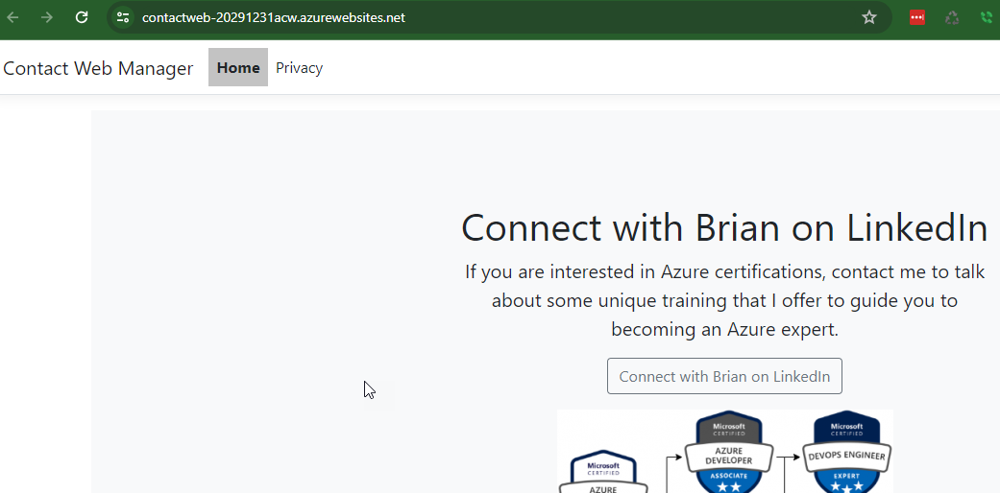
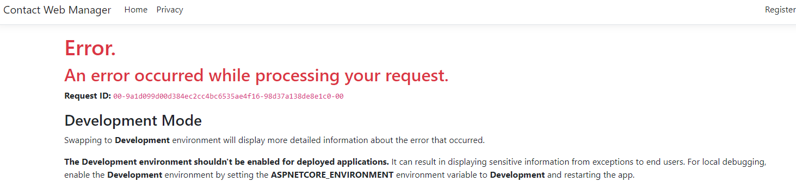
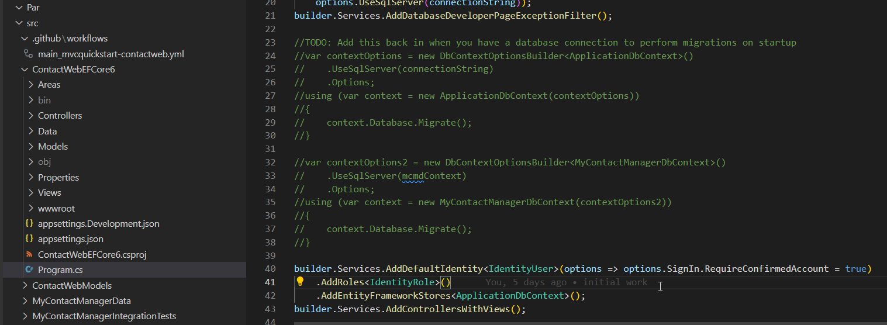
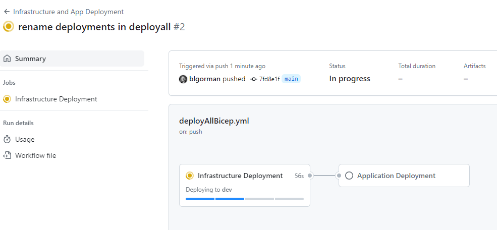

# Part 3 - Implementing CI/CD

In this part you will build out the CI/CD pipeline to deploy the application to Azure.  You will use GitHub Actions to build the pipeline (or another pipeline/action from another source control provider).

The method that is currently the best approach to deploy a web application to Azure is via the managed credentials using the login to azure and arm deployment tasks.

Note that you may be using slots in a more robust (real-world) solution.  In that case, you would publish to the slot and add an action to swap the slot with the production slot.  This walkthrough will not cover that advanced scenario. 

## Task 1: Before starting, stop automated deployments of the archtecture

Before you start this activity, modify your infrastructure as code to only be triggered by a workflow dispatch by changing the branch to something that doesn't exist.  This way you won't have any conflicts or have to wait for your architecture to deploy to see if your app works.

```yaml
name: "******** Deploy Resources"

on:
  push:
    branches: [ nowayjose ]
  workflow_dispatch:
```

## Task 2 - Create the GitHub Action

In order to create the GitHub action, you will need to create a new action file in your repository.

You already created a credential to do the architecture previously, so you can leverage the same secrets as before for this part of the walkthrough.

For this task, you'll need to create a new GitHub Action that will build and deploy the application to Azure.

1. Create a new file in the `.github/workflows` folder called `deployApplicationToAzure.yml`

Add the following code to the file:

```yaml
name: Build and deploy ContactWeb

on:
  push:
    branches:
      - main
  workflow_dispatch:

env:
  APP_PACKAGE_PATH: 'myapp'
  # set this to the dotnet version to use
  DOTNET_VERSION: '6.0.x' 
  # Put your app name here
  AZURE_WEB_APP_NAME: 'your-app-name-here' 
  # staging by default but you could change to Production if you are not creating a slot 
  AZURE_WEB_APP_SLOT: 'Production' 
  # leverage secrets for the umi credential
  AZURE_TENANT_ID:  ${{ secrets.AZURE_TENANT_ID }}
  AZURE_SUBSCRIPTION_ID: ${{ secrets.AZURE_SUBSCRIPTION_ID }}
  AZURE_CLIENT_ID_CONTACTWEB_DEV: '${{ secrets.AZURE_CLIENT_ID_CONTACTWEB_DEV }}'
  #Working Directory [must map to the location of your .NET Project]
  WORKING_DIRECTORY: 'src/ContactWebEFCore6'  

permissions:
      id-token: write
      contents: read

jobs:  
  build-and-deploy:
    runs-on: ubuntu-latest
    
    steps:
      - uses: actions/checkout@v4

      - name: Set up .NET Core
        uses: actions/setup-dotnet@v4
        with:
          dotnet-version: '${{ env.DOTNET_VERSION }}'
          include-prerelease: true

      - name: Build with dotnet
        run: dotnet build --configuration Release
        working-directory: '${{ env.WORKING_DIRECTORY }}'
        
      - name: dotnet publish
        run: dotnet publish -c Release -o ${{env.DOTNET_ROOT}}/${{ env.APP_PACKAGE_PATH }}
        working-directory: '${{ env.WORKING_DIRECTORY }}'

      - name: Login to Azure
        uses: azure/login@v2
        with:
          client-id: ${{ secrets.AZURE_CLIENT_ID }}
          tenant-id: ${{ env.AZURE_TENANT_ID }}
          subscription-id: ${{ secrets.AZURE_SUBSCRIPTION_ID }}
  
      - name: Deploy to Azure Web App
        id: deploy-to-webapp
        uses: azure/webapps-deploy@v2
        with:
          app-name: ${{ vars.APP_NAME }}
          slot-name: ${{ vars.SLOT_NAME }}
          package: ${{ env.DOTNET_ROOT }}/${{ env.APP_PACKAGE_PATH }}
```  

1. Check in changes

Check in your code and trigger the workflow.  This will allow the application to be built and deployed to Azure.  

>**Reminder:** You can find the full workflow file in the `src/GithubActions` folder in this repository if you have problems or questions.

### Task 3 - Ensure your application deployed

Make sure that the application deployed and that you can browse and see the working application.

1. Review the action for success

    Make sure your action completes successfully.  

1. Navigate to the App Service in the Azure Portal

    You should see the application deployed to the App Service.

         

1. Database is not working

    At this point, even though the settings are in place, the database is not working because migrations have not happened.

    Attempt to register as a user and you will see the following error:

    

## Task 3 - Modify the code to perform migrations

The database was never migrated.  There are a number of potential solutions for this, but now that you are sure your code is working, you can modify the code to quickly add migrations and update the database.

### Step 1 - Modify the code

In this step, you'll add the auto-migrations back to the code.

1. Open the code in your local environment and in the `Program.cs` file, find the line `TODO: Add this back in when you have a database connection to perform migrations on starup` in the `Startup.cs` file.`

    Remove the comments to ensure that both database context migrations are run on startup.

    

    ```csharp
    //TODO: Add this back in when you have a database connection to perform migrations on startup
    var contextOptions = new DbContextOptionsBuilder<ApplicationDbContext>()
      .UseSqlServer(connectionString)
      .Options;
    using (var context = new ApplicationDbContext(contextOptions))
    {
      context.Database.Migrate();
    }

    var contextOptions2 = new DbContextOptionsBuilder<MyContactManagerDbContext>()
      .UseSqlServer(mcmdContext)
      .Options;
    using (var context = new MyContactManagerDbContext(contextOptions2))
    {
      context.Database.Migrate();
    }
    ```  

1. Commit and push the code.

    >**Note**: If your database is not working correctly or wired up correctly, you will get a 500.3 error and that means you need to investigate your database connection string in the KeyVault vs the value expected.  You may also need to validate that the firewall for the sql database is allowing azure services.

### Step 2 - Register a user

Navigate to the app service and register a user.  

1. Hit the `Register` button

1. Enter some credentials like

    UserName:  

    ```text
    bob@bob.com
    ``````

    Password:  

    ```text
    Password#12345!
    ```

1. Ignore the danger message (if you get one) and hit Details, then `continue`

1. Confirm your email by clicking the link on the page.

1. Log in

    Ensure you can log in with the user you just created.

      

1. Create a contact if you want

    You can create a contact if you want to test the application further.

      

## Task 4 - Wire up the entire pipeline

>**Note:** This is optional  

If you are going to be done at this point, wire up the deployment so that the infrastructure as code is triggered by the GitHub Action and then trigger this app deployment from the infrastructure as code deployment.

If you are going to do part four, you should move on at this time and you will wire up the entire pipeline in that part.

### Step 1 - Remove the branch trigger from both workflows

You will be combining into one new workflow so you don't want these to deploy on their own.

### Step 2 - Create a new workflow

1. Create the workflow (bicep):

Add a workflow with the following two-stage deployment:

```yaml
name: Infrastructure and App Deployment

on:
  push:
    branches:
      - main
  workflow_dispatch:

env:
  CURRENT_BRANCH: ${{ github.head_ref || github.ref_name }} 
  AZURE_TENANT_ID:  ${{ secrets.AZURE_TENANT_ID }}
  AZURE_SUBSCRIPTION_ID: ${{ secrets.AZURE_SUBSCRIPTION_ID }}
  AZURE_CLIENT_ID_CONTACTWEB_DEV: '${{ secrets.AZURE_CLIENT_ID_CONTACTWEB_DEV }}'
  TEMPLATE: 'iac/deployContactWebArchitecture.bicep'
  PARAMETERS: 'iac/deployContactWebArchitecture.parameters.json'  
  DEPLOYMENT_NAME: 'BicepDeployResources'
  REGION: 'eastus'
  APP_PACKAGE_PATH: 'myapp'
  DOTNET_VERSION: '6.0.x' 
  AZURE_WEB_APP_NAME: 'ContactWeb-20291231acw' 
  AZURE_WEB_APP_SLOT: 'Production' 
  WORKING_DIRECTORY: 'src/ContactWebEFCore6' 

permissions:
  id-token: write
  contents: read

jobs:
  deploy-infrastructure:
    name: Infrastructure Deployment
    runs-on: ubuntu-latest
    environment:
      name: 'dev'

    steps:
      - name: Checkout Code
        uses: actions/checkout@v4

      - name: Log in to Azure
        uses: azure/login@v2.1.1
        with:
          client-id: ${{ env.AZURE_CLIENT_ID_CONTACTWEB_DEV }}
          tenant-id: ${{ env.AZURE_TENANT_ID }}
          subscription-id: ${{ env.AZURE_SUBSCRIPTION_ID }}

      - name: Deploy Resources
        uses: Azure/arm-deploy@v2.0.0
        with:
          scope: subscription
          subscriptionId: ${{ env.AZURE_SUBSCRIPTION_ID }}
          region: ${{ env.REGION }}
          template: '${{ env.TEMPLATE }}'
          parameters: '${{ env.PARAMETERS }}'
          deploymentName: '${{env.DEPLOYMENT_NAME}}-${{github.run_number}}'
          failOnStdErr: true

  build-and-deploy:
    runs-on: ubuntu-latest
    name: Application Deployment
    needs: deploy-infrastructure
    environment:
      name: 'dev'

    steps:
      - uses: actions/checkout@v4

      - name: Set up .NET Core
        uses: actions/setup-dotnet@v4
        with:
          dotnet-version: '${{ env.DOTNET_VERSION }}'
          include-prerelease: true

      - name: Build with dotnet
        run: dotnet build --configuration Release
        working-directory: '${{ env.WORKING_DIRECTORY }}'
        
      - name: dotnet publish
        run: dotnet publish -c Release -o ${{env.DOTNET_ROOT}}/${{ env.APP_PACKAGE_PATH }}
        working-directory: '${{ env.WORKING_DIRECTORY }}'

      - name: Login to Azure
        uses: azure/login@v2
        with:
          client-id: ${{ secrets.AZURE_CLIENT_ID }}
          tenant-id: ${{ env.AZURE_TENANT_ID }}
          subscription-id: ${{ secrets.AZURE_SUBSCRIPTION_ID }}
  
      - name: Deploy to Azure Web App
        id: deploy-to-webapp
        uses: azure/webapps-deploy@v2
        with:
          app-name: ${{ env.AZURE_WEB_APP_NAME }}
          slot-name: ${{ env.AZURE_WEB_APP_SLOT }}
          package: ${{ env.DOTNET_ROOT }}/myapp
```

>**Note**: The deployment first builds the infra, then pushes the app only when the infra is built successfully.

  

1. Terraform.

Add a workflow with the following two-stage deployment:

```yaml
name: "Infrastructure and App Deployment"

on:
  push:
    branches: 
      - main
  workflow_dispatch:

env: 
  ARM_CLIENT_ID: "${{ secrets.AZURE_CLIENT_ID_CONTACTWEB_DEV }}"
  ARM_SUBSCRIPTION_ID: "${{ secrets.AZURE_SUBSCRIPTION_ID }}"
  ARM_TENANT_ID: "${{ secrets.AZURE_TENANT_ID }}"
  CURRENT_BRANCH: ${{ github.head_ref || github.ref_name }} 
  DEPLOYMENT_NAME: 'TerraformDeployResources'
  REGION: 'eastus'
  APP_PACKAGE_PATH: 'myapp'
  # set this to the dotnet version to use
  DOTNET_VERSION: '6.0.x' 
  # Put your app name here
  AZURE_WEB_APP_NAME: 'ContactWebTerraform-20240109sam' 
  # staging by default but you could change to Production if you are not creating a slot 
  AZURE_WEB_APP_SLOT: 'Production' 
  #Working Directory
  WORKING_DIRECTORY: 'src/ContactWebEFCore6'
  
permissions:
  id-token: write
  contents: read

jobs:
  deploy-infrastructure:
    name: 'Terraform Plan'
    runs-on: ubuntu-latest
    env:
      #this is needed since we are running terraform with read-only permissions
      ARM_SKIP_PROVIDER_REGISTRATION: true
    outputs:
      tfplanExitCode: ${{ steps.tf-plan.outputs.exitcode }}

    steps:
    # Checkout the repository to the GitHub Actions runner
    - name: Checkout
      uses: actions/checkout@v4

    # Install the latest version of the Terraform CLI
    - name: Setup Terraform
      uses: hashicorp/setup-terraform@v2
      with:
        terraform_wrapper: false

    # Initialize a new or existing Terraform working directory by creating initial files, loading any remote state, downloading modules, etc.
    - name: Terraform Init
      working-directory: ${{ github.workspace }}/iac/terraform/Part2
      run: terraform init

    # Checks that all Terraform configuration files adhere to a canonical format
    # Will fail the build if not
    - name: Terraform Format
      run: terraform fmt -check

    # Generates an execution plan for Terraform
    # An exit code of 0 indicated no changes, 1 a terraform failure, 2 there are pending changes.
    - name: Terraform Plan
      id: tf-plan
      working-directory: ${{ github.workspace }}/iac/terraform/Part2
      run: |
        export exitcode=0
        terraform plan -detailed-exitcode -no-color -out tfplan || export exitcode=$?

        echo "exitcode=$exitcode" >> $GITHUB_OUTPUT
        
        if [ $exitcode -eq 1 ]; then
          echo Terraform Plan Failed!
          exit 1
        else 
          exit 0
        fi
        
    # Save plan to artifacts  
    - name: Publish Terraform Plan
      uses: actions/upload-artifact@v3
      with:
        name: tfplan
        path: ${{ github.workspace }}/iac/terraform/Part2/tfplan
        
    # Create string output of Terraform Plan
    - name: Create String Output
      id: tf-plan-string
      working-directory: ${{ github.workspace }}/iac/terraform/Part2
      run: |
        TERRAFORM_PLAN=$(terraform show -no-color tfplan)
        
        delimiter="$(openssl rand -hex 8)"
        echo "summary<<${delimiter}" >> $GITHUB_OUTPUT
        echo "## Terraform Plan Output" >> $GITHUB_OUTPUT
        echo "<details><summary>Click to expand</summary>" >> $GITHUB_OUTPUT
        echo "" >> $GITHUB_OUTPUT
        echo '```terraform' >> $GITHUB_OUTPUT
        echo "$TERRAFORM_PLAN" >> $GITHUB_OUTPUT
        echo '```' >> $GITHUB_OUTPUT
        echo "</details>" >> $GITHUB_OUTPUT
        echo "${delimiter}" >> $GITHUB_OUTPUT
        
    # Publish Terraform Plan as task summary
    - name: Publish Terraform Plan to Task Summary
      env:
        SUMMARY: ${{ steps.tf-plan-string.outputs.summary }}
      run: |
        echo "$SUMMARY" >> $GITHUB_STEP_SUMMARY
        
    # Terraform Apply
    - name: Terraform Apply
      working-directory: ${{ github.workspace }}/iac/terraform/Part2
      run: terraform apply -auto-approve ${{ github.workspace }}/iac/terraform/Part2/tfplan      

  build-and-deploy:
    runs-on: windows-latest
    needs: deploy-infrastructure
    
    steps:
    - uses: actions/checkout@v4
    
    - name: Set up .NET Core
      uses: actions/setup-dotnet@v4
      with:
        dotnet-version: ${{ env.DOTNET_VERSION }}
        include-prerelease: true
    
    - name: Build with dotnet
      run: dotnet build --configuration Release
      working-directory: '${{ env.WORKING_DIRECTORY }}'
       
    - name: dotnet publish
      run: dotnet publish -c Release -o ${{env.DOTNET_ROOT}}/${{ env.APP_PACKAGE_PATH }}
      working-directory: '${{ env.WORKING_DIRECTORY }}'
            
    - name: Login to Azure
      uses: azure/login@v2
      with:
        client-id: ${{ env.ARM_CLIENT_ID }}
        tenant-id: ${{ env.ARM_TENANT_ID }}
        subscription-id: ${{ env.ARM_SUBSCRIPTION_ID }}
  
    - name: Deploy to Azure Web App
      id: deploy-to-webapp
      uses: azure/webapps-deploy@v2
      with:
        app-name: ${{ env.APP_NAME }}
        slot-name: 'Production'
        package: ${{ env.DOTNET_ROOT }}/{{ env.APP_PACKAGE_PATH }}    
```

## Final Thoughts

There are a number of ways this final deployment could work.  Perhaps you want to keep them separate.  Perhaps you want to toggle the deployment of the infrastructure to only be deployed if something changes.  However, for simplicity, this workflow will deploy the infrastructure and then deploy the application as long as the infrastructure completes successfully.

## Completion Check

At the end of this activity, you have now created a deployment that publishes your code to Azure.  You have also modified the code to perform migrations on startup.  You can now move on to the next activity.
