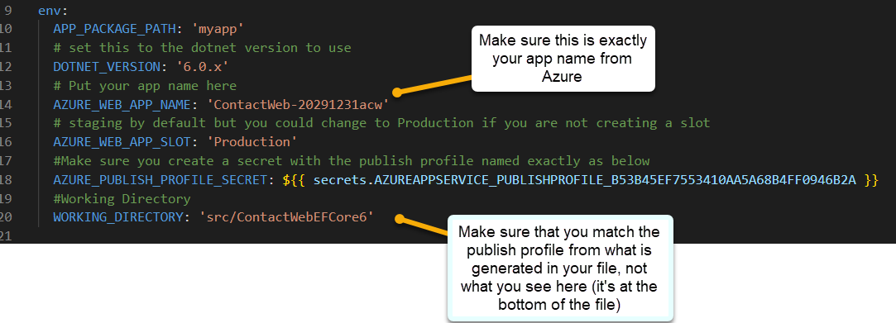

# Part 3 - Implementing CI/CD

In this part you will build out the CI/CD pipeline to deploy the application to Azure.  You will use GitHub Actions to build the pipeline (or another pipeline/action from another source control provider).

There are a number of ways to do this, but the simplest way is to just leverage the publish profile from the App Service and use the Azure Web App Deploy action to deploy the application.  This is the method that will be used in this walkthrough.

Note that in the more robust deployment solutions you may need to leverage a package manager or other tools to build the application and then deploy it, especially if your App Service is deployed privately in a network.  This walkthrough will not cover those advanced scenarios.

Also note that you may be using slots in a more robust solution.  In that case, you would publish to the slot and add an action to swap the slot with the production slot.  This walkthrough will also not cover that advanced scenario. 

## Before starting

Before you start this activity, modify your infrastructure as code to only be triggered by a workflow dispatch by changing the branch to something that doesn't exist.  This way you won't have any conflicts or have to wait for it to deploy to see if your app works.

```yaml
name: "******** Deploy Resources"
d
on:
  push:
    branches: [ nowayjose ]
  workflow_dispatch:
```

## Task 1 - Create the GitHub Action

The easiest way to build the deployment automation with GitHub is to let GitHub and Azure do it for you.  This is done by creating a GitHub Action workflow.  This workflow will be triggered by a push to the main branch of the repository, and will be created by Azure.  A secret for the publish profile xml will be added to the repository to allow the workflow to deploy the application.

### Step 1 - App Service Deployments

In this step you will create a deployment from Azure.

1. Navigate to the App Service Deployment Center in the Azure Portal

    On your app service blade, find `Deployment Center` under `Deployment` in the left navigation.

      

1. Select GitHub as the source

    You will then need to authorize your account to connect Azure to GitHub.  Follow the prompts to do so.

      

1. Select the organization, repository and branch to the repository where your ContactWeb application is located

    Make sure to select the correct repository where you have a copy of the `ContactWeb` application.

    >**Note**: You will want to also select to `Add a workflow`  This will create the GitHub Action workflow for you and add the secret for the publish profile.

1. Use the `Basic Authentication` option

    Feel free to preview the file but you can just deploy it and then preview it in GitHub (you can't change it anyway)
    

1. Hit the `Save` button at the top of the page

    This will save the deployment and create the GitHub Action workflow for you.

      

### Step 2 - What is the publish profile?

While the deployment is happening, take a minute to review the `Manage Publish Profile` option in the `Deployment Center`.  This is where you can get the publish profile for your application.  This is the file that is used to deploy the application to the App Service. You can get publish profiles for any slot in an app service.

The deployment will take the xml from this publish profile and add a github secret to the repository.  This secret will be used by the GitHub Action to deploy the application.

If you were creating this manually, you could download the publish profile, add a GitHub secret, and leverage the publish profile in this manner.  

## Task 2 - Verify the GitHub Action

The default action will fail. This is because the path for the application is nested in the repository.  You will need to update the workflow to point to the correct path.  There are a couple of other critical updates to make as well, which we can do in the next task.

### Step 1 - Review the GitHub Action

By default, the action should fail (unless you have your code at the source of the repository). You can review the action by navigating to the `Actions` tab in GitHub.

1. Navigate to the GitHub repository and select `Actions` from the top navigation

    On the `All Workflows` section, drill in to the failed deployment:

      

1. Drill in to the logs.

    You should see the following error:

    ```text
    ...
    Specify a project or solution file. The current working directory does not contain a project or solution file.
    ...
    ```  

      

### Step 2 - Update the GitHub Action  

In this step you will update the GitHub Action to point to the correct path for the application.  You will also make some other changes to the action to make it more robust.

1. Get the latest code locally to work with the `YAML` file in VSCode

    >**Note:** You can do everything in the browser if you want, but it's easier to work with the `YAML` file in VSCode.

      

1. Make some observations and changes

    Note that the name of the file is terrible.  You will want to change that.  Change it to something like:

    ```text
    deployApplicationToAzure.yml
    ```  

    Inside the file, note that there is currently a two-stage build and deploy.  For simplicity and to avoid using up actions time, changing to a single-stage deployment is easy.  In a robust solution, you would likely want to build the application and then archive the package which is leveraged for deployment as is done in this two-stage workflow.

    Change the name of the action:

    ```text
    Build and Deploy ContactWeb
    ```

    Additionally, change the build agent to `ubuntu-latest` as this is orders of magnitude faster than the `windows-latest`.  The only reason not to do this is if you are using a Windows specific feature in your application and deploying to a Windows app service.

      

```yaml
name: Build and deploy ContactWeb

on:
  push:
    branches:
      - main
  workflow_dispatch:

jobs:
  build:
    runs-on: ubuntu-latest

    steps:
      - uses: actions/checkout@v4

      - name: Set up .NET Core
        uses: actions/setup-dotnet@v1
        with:
          dotnet-version: '6.0.x'
          include-prerelease: true

#//more...
```

1. Add Environment Variables to the top of the file

    To make the deployment more robust, add the following environment variables to the top of the file:

    For the `AZURE_WEB_APP_NAME` make sure to use the name of your web application exactly as it is named in Azure.

    For the `AZURE_PUBLISH_PROFILE_SECRET` grab the value from the bottom of the file and bring it to the top.  This will make it easier to update the file in the future.

```yaml
env:
  APP_PACKAGE_PATH: 'myapp' 
  # set this to the dotnet version to use
  DOTNET_VERSION: '6.0.x' 
  # Put your app name here
  AZURE_WEB_APP_NAME: 'ContactWeb-20291231acw' 
  # staging by default but you could change to Production if you are not creating a slot 
  AZURE_WEB_APP_SLOT: 'Production' 
  #Make sure you create a secret with the publish profile named exactly as below
  AZURE_PUBLISH_PROFILE_SECRET: ${{ secrets.AZUREAPPSERVICE_PUBLISHPROFILE_YOURVALUEHEREWILLBEDIFFERENT }}
  #Working Directory
  WORKING_DIRECTORY: 'src/ContactWebEFCore6' 
```  

      

1. Change the name of the job

    We're going to reduce this to a single-stage deployment so change the job name from `build` to `build-and-deploy`

```yaml
jobs:  
  build-and-deploy:
    runs-on: ubuntu-latest
```

1. Update DotNet Version to leverage the environment variable

    Update the `uses` statement to leverage the environment variable for the dotnet version:

    ```yaml
    - name: Set up .NET Core
        uses: actions/setup-dotnet@v1
        with:
          dotnet-version: ${{ env.DOTNET_VERSION }}
          include-prerelease: true
    ```

1. Replace the remainder of the file with the following to clean it up a bit

    This change will remove the two-stage deployment and replace it with a single-stage deployment.  It will also leverage the environment variables to make the deployment more robust.  Additionally, the `working-directory` will be set to the correct path for the application.

    ```yaml
    - name: Build with dotnet
      run: dotnet build --configuration Release
      working-directory: '${{ env.WORKING_DIRECTORY }}'
      
    - name: dotnet publish
      run: dotnet publish -c Release -o ${{env.DOTNET_ROOT}}/${{ env.APP_PACKAGE_PATH }}
      working-directory: '${{ env.WORKING_DIRECTORY }}'

    - name: Deploy to Azure Web App
      id: deploy-to-webapp
      uses: azure/webapps-deploy@v2
      with:
        app-name: '${{ env.AZURE_WEB_APP_NAME }}'
        slot-name: '${{ env.AZURE_WEB_APP_SLOT }}'
        package: '${{env.DOTNET_ROOT}}/${{ env.APP_PACKAGE_PATH }}'
        publish-profile: ${{ env.AZURE_PUBLISH_PROFILE_SECRET }}
    ```

1. The final file should look like this

```yaml
name: Build and deploy ContactWeb

on:
  push:
    branches:
      - main
  workflow_dispatch:

env:
  APP_PACKAGE_PATH: 'myapp'
  # set this to the dotnet version to use
  DOTNET_VERSION: '6.0.x' 
  # Put your app name here
  AZURE_WEB_APP_NAME: 'ContactWeb-20291231acw' 
  # staging by default but you could change to Production if you are not creating a slot 
  AZURE_WEB_APP_SLOT: 'Production' 
  #Make sure you create a secret with the publish profile named exactly as below
  AZURE_PUBLISH_PROFILE_SECRET: ${{ secrets.AZUREAPPSERVICE_PUBLISHPROFILE_B53B45EF7553410AA5A68B4FF0946B2A }}
  #Working Directory
  WORKING_DIRECTORY: 'src/ContactWebEFCore6' 

jobs:  
  build-and-deploy:
    runs-on: ubuntu-latest
    
    steps:
      - uses: actions/checkout@v4

      - name: Set up .NET Core
        uses: actions/setup-dotnet@v1
        with:
          dotnet-version: '${{ env.DOTNET_VERSION }}'
          include-prerelease: true

      - name: Build with dotnet
        run: dotnet build --configuration Release
        working-directory: '${{ env.WORKING_DIRECTORY }}'
        
      - name: dotnet publish
        run: dotnet publish -c Release -o ${{env.DOTNET_ROOT}}/${{ env.APP_PACKAGE_PATH }}
        working-directory: '${{ env.WORKING_DIRECTORY }}'

      - name: Deploy to Azure Web App
        id: deploy-to-webapp
        uses: azure/webapps-deploy@v2
        with:
          app-name: '${{ env.AZURE_WEB_APP_NAME }}'
          slot-name: '${{ env.AZURE_WEB_APP_SLOT }}'
          package: '${{env.DOTNET_ROOT}}/${{ env.APP_PACKAGE_PATH }}'
          publish-profile: ${{ env.AZURE_PUBLISH_PROFILE_SECRET }}
```

>**Reminder:** You can find the full workflow file in the `src/GithubActions` folder in this repository.

### Step 3 - Ensure your application deployed

Make sure that the application deployed and that you can browse and see the working application.

1. Review the action for success

      

1. Navigate to the App Service in the Azure Portal

    You should see the application deployed to the App Service.

      

1. Database is not working

    At this point, even though the settings are in place, the database is not working because migrations have not happened.

    Attempt to register as a user and you will see the following error:

    

## Task 3 - Modify the code to perform migrations

The database was never migrated.  There are a number of potential solutions for this, but now that you are sure your code is working, you can modify the code to quickly add migrations and update the database.

### Step 1 - Modify the code

In this step, you'll add the auto-migrations back to the code.

1. Open the code in your local environment and in the `Program.cs` file, find the line `TODO: Add this back in when you have a database connection to perform migrations on starup` in the `Startup.cs` file.`

    Remove the comments to ensure that both database context migrations are run on startup.

    

    ```csharp
    //TODO: Add this back in when you have a database connection to perform migrations on startup
    var contextOptions = new DbContextOptionsBuilder<ApplicationDbContext>()
      .UseSqlServer(connectionString)
      .Options;
    using (var context = new ApplicationDbContext(contextOptions))
    {
      context.Database.Migrate();
    }

    var contextOptions2 = new DbContextOptionsBuilder<MyContactManagerDbContext>()
      .UseSqlServer(mcmdContext)
      .Options;
    using (var context = new MyContactManagerDbContext(contextOptions2))
    {
      context.Database.Migrate();
    }
    ```  

1. Commit and push the code.

    >**Note**: If your database is not working correctly or wired up correctly, you will get a 500.3 error and that means you need to investigate your database connection string in the KeyVault vs the value expected.  You may also need to validate that the firewall for the sql database is allowing azure services.

### Step 2 - Register a user

Navigate to the app service and register a user.  

1. Hit the `Register` button

1. Enter some credentials like

    UserName:  

    ```text
    bob@bob.com
    ``````

    Password:  

    ```text
    Password#12345!
    ```

1. Ignore the danger message (if you get one) and hit Details, then `continue`

1. Confirm your email by clicking the link on the page.

1. Log in

    Ensure you can log in with the user you just created.

      

1. Create a contact if you want

    You can create a contact if you want to test the application further.

      

## Task 4 - Wire up the entire pipeline

If you are going to be done at this point, wire up the deployment so that the infrastructure as code is triggered by the GitHub Action and then trigger this app deployment from the infrastructure as code deployment.

If you are going to do part four, you should move on at this time and you will wire up the entire pipeline in that part.

### Step 1 - Remove the branch trigger from both workflows

You will be combining into one new workflow so you don't want these to deploy on their own.

### Step 2 - Create a new workflow

1. Bicep

Add a workflow with the following two-stage deployment:

```yaml
name: Infrastructure and App Deployment

on:
  push:
    branches:
      - main
  workflow_dispatch:

env:
  CURRENT_BRANCH: ${{ github.head_ref || github.ref_name }} 
  AZURE_TENANT_ID:  ${{ secrets.AZURE_TENANT_ID }}
  AZURE_SUBSCRIPTION_ID: ${{ secrets.AZURE_SUBSCRIPTION_ID }}
  AZURE_CLIENT_ID_CONTACTWEB_DEV: '${{ secrets.AZURE_CLIENT_ID_CONTACTWEB_DEV }}'
  TEMPLATE: 'iac/deployContactWebArchitecture.bicep'
  PARAMETERS: 'iac/deployContactWebArchitecture.parameters.json'  
  DEPLOYMENT_NAME: 'BicepDeployResources'
  REGION: 'eastus'
  APP_PACKAGE_PATH: 'myapp'
  DOTNET_VERSION: '6.0.x' 
  AZURE_WEB_APP_NAME: 'ContactWeb-20291231acw' 
  AZURE_WEB_APP_SLOT: 'Production' 
  AZURE_PUBLISH_PROFILE_SECRET: ${{ secrets.AZUREAPPSERVICE_PUBLISHPROFILE_B53B45EF7553410AA5A68B4FF0946B2A }}
  WORKING_DIRECTORY: 'src/ContactWebEFCore6' 

permissions:
  id-token: write
  contents: read

jobs:
  deploy-infrastructure:
    name: Dev Deploy
    runs-on: ubuntu-latest
    environment:
      name: 'dev'

    steps:
      - name: Checkout Code
        uses: actions/checkout@v4

      - name: Log in to Azure
        uses: azure/login@v1.4.6
        with:
          client-id: ${{ env.AZURE_CLIENT_ID_CONTACTWEB_DEV }}
          tenant-id: ${{ env.AZURE_TENANT_ID }}
          subscription-id: ${{ env.AZURE_SUBSCRIPTION_ID }}

      - name: Deploy Resources
        uses: Azure/arm-deploy@v1.0.9
        with:
          scope: subscription
          subscriptionId: ${{ env.AZURE_SUBSCRIPTION_ID }}
          region: ${{ env.REGION }}
          template: '${{ env.TEMPLATE }}'
          parameters: '${{ env.PARAMETERS }}'
          deploymentName: '${{env.DEPLOYMENT_NAME}}-${{github.run_number}}'
          failOnStdErr: true

  build-and-deploy:
    runs-on: ubuntu-latest
    needs: deploy-infrastructure
    environment:
      name: 'dev'

    steps:
      - uses: actions/checkout@v4

      - name: Set up .NET Core
        uses: actions/setup-dotnet@v1
        with:
          dotnet-version: '${{ env.DOTNET_VERSION }}'
          include-prerelease: true

      - name: Build with dotnet
        run: dotnet build --configuration Release
        working-directory: '${{ env.WORKING_DIRECTORY }}'
        
      - name: dotnet publish
        run: dotnet publish -c Release -o ${{env.DOTNET_ROOT}}/${{ env.APP_PACKAGE_PATH }}
        working-directory: '${{ env.WORKING_DIRECTORY }}'

      - name: Deploy to Azure Web App
        id: deploy-to-webapp
        uses: azure/webapps-deploy@v2
        with:
          app-name: '${{ env.AZURE_WEB_APP_NAME }}'
          slot-name: '${{ env.AZURE_WEB_APP_SLOT }}'
          package: '${{env.DOTNET_ROOT}}/${{ env.APP_PACKAGE_PATH }}'
          publish-profile: ${{ env.AZURE_PUBLISH_PROFILE_SECRET }}
```

>**Note**: The deployment first builds the infra, then pushes the app only when the infra is built successfully.

1. Terraform.

Add a workflow with the following two-stage deployment:

```yaml
tbd
```

## Final Thoughts

There are a number of ways this final deployment could work.  Perhaps you want to keep them separate.  Perhaps you want to toggle the deployment of the infrastructure to only be deployed if something changes.  However, for simplicity, this workflow will deploy the infrastructure and then deploy the application as long as the infrastructure completes successfully.

## Completion Check

At the end of this activity, you have now created a deployment that publishes your code to Azure.  You have also modified the code to perform migrations on startup.  You can now move on to the next activity.
