# Azure App Configuration

Welcome to the bonus track! If you made it this far, that's great! You are now ready to learn about Azure App Configuration. This is a service that allows you to store your application settings and feature flags in a central place. It is a great way to decouple your application from its configuration data. It also provides a way to manage the configurations without having to redeploy your application.  Another great use for the App Configuration is for sharing configurations between multiple applications.  

In this section, you will learn how to create an App Configuration instance and how to use it in your application.  You will then reset the configuration values from the App Service to leverage the App Configuration instead of the Key Vault directly (don't worry, the Key Vault is still used to store the secrets).  You will also need to make a small code change so that the application can leverage the App Configuration.  

## Before you start

It is expected you have completed the first three parts.  If not, this part won't make sense.  Also, in the earlier part of the work, you created a service principal to execute deployments. That was created with `Contributor` access.

To complete the role assignment required in this part, you must elevate the principal to `owner` access.  You might be able to do this on the resource group only.  Without owner role on at least the resource group, the role assignment will fail.  

If you just can't get around it, you could manually add the `App Configuration Data Reader` role to the web app system managed id after deployment and just don't run the bicep for the role assignment.

You can also set the role to restricted privileges for user access:

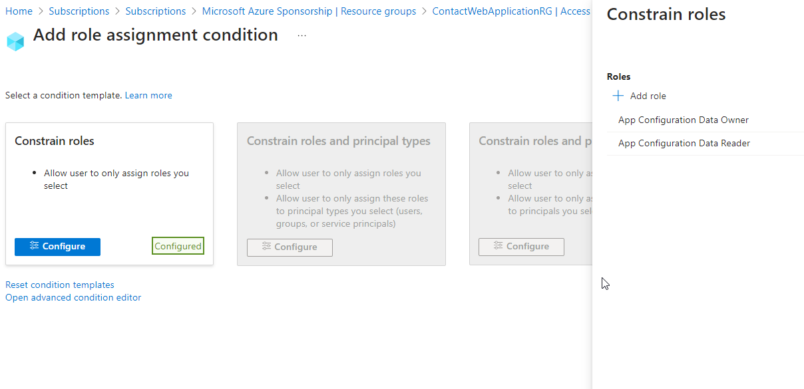  

Another note is that it has proven very difficult to get the correct id for the role definition.  For that reason I've chosen to hard-code it since it is universal across all subscriptions.  

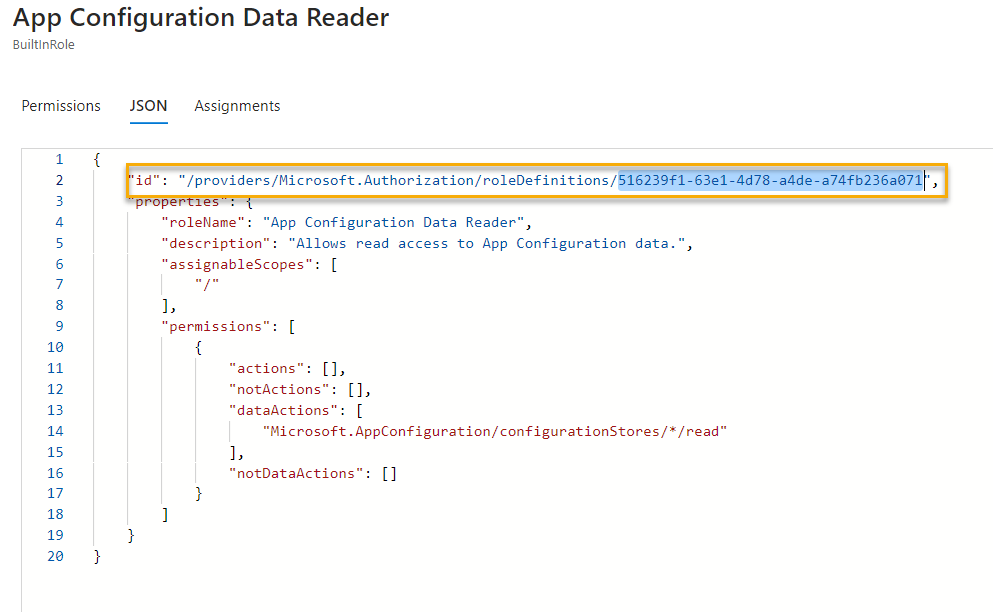  

The value is:

```text  
/providers/Microsoft.Authorization/roleDefinitions/516239f1-63e1-4d78-a4de-a74fb236a071
```  

## Part 1 - Update the Bicep for the Key Vault

In hindsight, it would have been better to have a managed identity that could be used by both the App Service and the App Configuration.  However, we are going to keep the system managed identity for the App Service and add a new user managed identity for the App Configuration.  This will allow us to use the App Configuration to get the secrets from the Key Vault.  Any additional resources that would need to access the Key Vault would use the managed identity going forward.

>**Note:** User managed identities can be shared by resources to allow for configurations and permissions like this for multiple services. However, they pose a small security risk because they are not automatically cleaned up when resources are deleted.

You will also want to add yourself to the permissions.  For this I recommend adding a group and putting your user in the group, then getting the object id for the group.  This will allow you to add other users to the group in the future without having to update the permissions in the Key Vault, as well as remove those who leave the organization, etc.

## Task 1 - Update the Existing Key Vault Bicep

In this task, you'll update the bicep to let your group and a user managed identity have appropriate permissions to the Key Vault secrets, keys, and certificates.

### Step 1 - Create your user group

In this step you'll set up your user for permission access via a group membership.

1. In the Azure Portal, navigate to Groups

    Add a new group and add yourself to the group.

    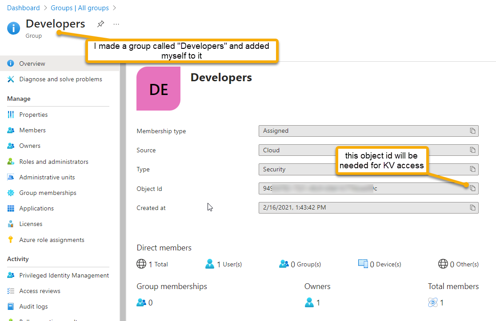  

1. Get the object ID for the group

    You will use this as a parameter to your IaC.  In reality you could also have done all of this with the CLI or via other bicep files.  However, let's draw the line since this is pretty much a one-time thing per tenant/subscription.

### Step 2 - Modify the Key Vault Bicep

In this step you'll modify the key vault bicep to create the user managed identity, and add the group and user managed identity to the permissions.

1. Two things are changing. The first is the creation of the user managed identity.  The second is the permissions.  You'll add the group and the user managed identity to the permissions.

    Update the bicep to include the following:

```bicep
param location string
@description('Provide a unique datetime and initials string to make your instances unique. Use only lower case letters and numbers')
@minLength(11)
@maxLength(11)
param uniqueIdentifier string 

@minLength(10)
@maxLength(13)
param keyVaultName string

param webAppFullName string
param databaseServerName string
param sqlDatabaseName string
@secure()
param sqlServerAdminPassword string

param developersGroupObjectId string
param keyVaultUserManagedIdentityName string

var vaultName = '${keyVaultName}${uniqueIdentifier}'
var skuName = 'standard'
var softDeleteRetentionInDays = 7

resource webApp 'Microsoft.Web/sites@2023-01-01' existing = {
  name: webAppFullName
}

resource databaseServer 'Microsoft.Sql/servers@2023-05-01-preview' existing = {
  name: databaseServerName
}

resource keyVaultUser 'Microsoft.ManagedIdentity/userAssignedIdentities@2023-01-31' = {
  name: keyVaultUserManagedIdentityName
  location: location
}

resource keyVault 'Microsoft.KeyVault/vaults@2022-07-01' = {
  name: vaultName
  location: location
  properties: {
    enabledForDeployment: true
    enabledForDiskEncryption: false
    enabledForTemplateDeployment: true
    tenantId: subscription().tenantId
    enableSoftDelete: true
    softDeleteRetentionInDays: softDeleteRetentionInDays
    sku: {
      name: skuName
      family: 'A'
    }
    accessPolicies: [
      {
        tenantId: subscription().tenantId
        objectId: webApp.identity.principalId
        permissions: {
          keys: []
          secrets: ['Get']
          certificates: []
        }
      }
      {
        tenantId: subscription().tenantId
        objectId: keyVaultUser.properties.principalId
        permissions: {
          keys: []
          secrets: ['Get']
          certificates: []
        }
      }
      {
        tenantId: subscription().tenantId
        objectId: developersGroupObjectId
        permissions: {
          keys: ['all']
          secrets: ['all']
          certificates: ['all']
        }
      }
    ]
    networkAcls: {
      defaultAction: 'Allow'
      bypass: 'AzureServices'
    }
  }
}

resource identityDBConnectionSecret 'Microsoft.KeyVault/vaults/secrets@2022-11-01' = {
  name: 'IdentityDbConnectionSecret'
  parent: keyVault
  properties: {
    value: 'Server=tcp:${databaseServer.name}${environment().suffixes.sqlServerHostname},1433;Initial Catalog=${sqlDatabaseName};Persist Security Info=False;User ID=${databaseServer.properties.administratorLogin};Password=${sqlServerAdminPassword};MultipleActiveResultSets=False;Encrypt=True;TrustServerCertificate=False;Connection Timeout=30;'
  }
}

resource contactManagerDBConnectionSecret 'Microsoft.KeyVault/vaults/secrets@2022-11-01' = {
  name: 'ContactManagerDbConnectionSecret'
  parent: keyVault
  properties: {
    value: 'Server=tcp:${databaseServer.name}${environment().suffixes.sqlServerHostname},1433;Initial Catalog=${sqlDatabaseName};Persist Security Info=False;User ID=${databaseServer.properties.administratorLogin};Password=${sqlServerAdminPassword};MultipleActiveResultSets=False;Encrypt=True;TrustServerCertificate=False;Connection Timeout=30;'
  }
}

output keyVaultName string = keyVault.name
output identityDBConnectionSecretURI string = identityDBConnectionSecret.properties.secretUri
output managerDBConnectionSecretURI string = contactManagerDBConnectionSecret.properties.secretUri
output keyVaultUserManagedIdentityName string = keyVaultUser.name
```  

1. Review the code updates

    Notice the new `keyVaultUser` identity that is created using the vault name and the `GetSecretsOnly` as part of the name to help discern what hte UMI is for.  Also notice that the `keyVaultUser` is added to the permissions with `Get` permissions for secrets.  This is the only permission that is needed for the App Configuration to get the secrets from the Key Vault.

    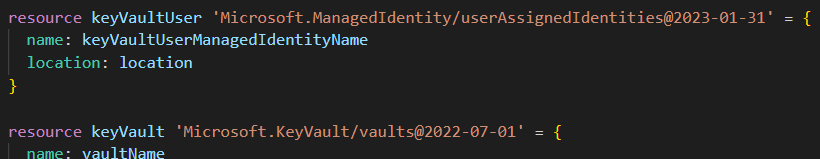  

    Note that the group id is also added to the vault permissions with `all` permissions for keys, secrets, and certificates.  This is so that you can add other users to the group and they will have the same permissions, and you can interact with the vault and secrets from your local code as well as through the portal and app configuration (even if hte App Configuration has rights if you don't you can't do anything with the secrets).

    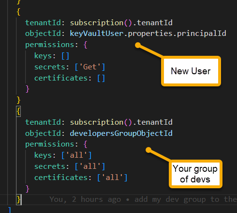  

1. Modify the params to include the new parameters

    Add the following to the params for the main deployment:

```bicep
param developersGroupObjectId string
param keyVaultUserManagedIdentityName string
```  

    These values will be passed in and the name is output because it will be configured and to avoid any possible mistakes it's easier to just leverage the name once it's created.

1. Modify the parameters file to include the new parameters

    Add the following to the parameters file (don't forget to add the comma to the previous line):

```json
        "developersGroupObjectId": {
            "value": "some-object-id-passed-in"
        },
        "keyVaultUserManagedIdentityName": {
            "value": "some umi name passed in"
        }
``````

1. Modify the main deployment

    Update the `deployContactWebArchitecture.bicep` file to include the new parameters and pass them in to the Key Vault bicep.

```bicep
param keyVaultUserManagedIdentityName string
param developersGroupObjectId string
var keyVaultUMIFullName = '${keyVaultName}-${keyVaultUserManagedIdentityName}'
```

    Note that the parameter used for the keyvault name will be decorated with the name of the vault at this top level.

    Update the call to the Key Vault bicep to include the new parameters:

```bicep  
module contactWebVault 'keyVault.bicep' = {
  name: '${keyVaultName}-deployment'
  scope: contactWebResourceGroup
  params: {
    location: contactWebResourceGroup.location
    uniqueIdentifier: uniqueIdentifier
    webAppFullName: contactWebApplicationPlanAndSite.outputs.webAppFullName
    databaseServerName: contactWebDatabase.outputs.sqlServerName
    keyVaultName: keyVaultName
    sqlDatabaseName: sqlDatabaseName
    sqlServerAdminPassword: sqlServerAdminPassword
    developersGroupObjectId: developersGroupObjectId
    keyVaultUserManagedIdentityName: keyVaultUMIFullName
  }
}
```  

1. Modify the deployContactWebArchitecture.parameters.json file

    Update the parameters file to include the new parameters:

```json
        "developersGroupObjectId": {
            "value": "your-object-id-here"
        },
        "keyVaultUserManagedIdentityName": {
            "value": "GetSecretsOnlyIdentity"
        },
```

    Make sure that you put your actual object id in the developersGroupObjectId parameter.

1. Deploy the changes & validate

    Push the changes and validate that you have the new user managed identity and the permissions are correct.

    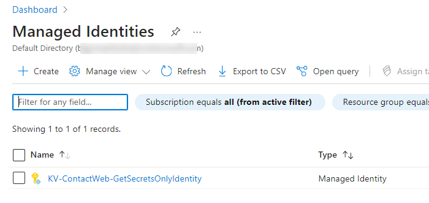  

1. Validate Key Vault access permissions include the UMI, the web app, and your user group as expected.

    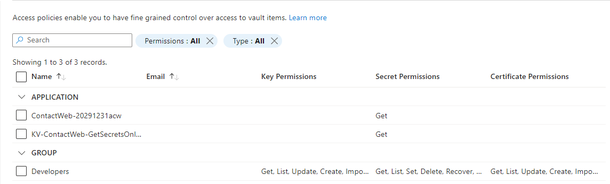  

## Task 2 - Create an App Configuration instance

In this task, you'll create an app configuration with references to the Key Vault secrets for the two database connections.  You could do additional shared settings here as well that wouldn't have to be key vault secrets, but could just be setting key-value pairs.  For this training, we're just doing the two database connections.

### Step 1 - Create the bicep

In this step, you will create the bicep to create the App Configuration instance. The instance will need to make sure to have the following:  

- App configuration with Identity
- Two KeyVault references to the Key Vault secrets
- Web App needs to have permission as `App Data Reader Role' to read the values from the App Configuration

1. Create the bicep file.

    Create a new file called `appConfigStore.bicep` and add the following:

```bicep
param location string 
@minLength(11)
@maxLength(11)
param uniqueIdentifier string 
@minLength(5)
@maxLength(12)
param appConfigStoreName string 
param identityDBConnectionStringKey string
param managerDBConnectionStringKey string 
param identityDbSecretURI string
param managerDbSecretURI string
param keyVaultUserManagedIdentityName string
param webAppName string
param roleDefinitionName string
param appDataReaderRoleId string

var configName = '${appConfigStoreName}-${uniqueIdentifier}'
var roleAssignmentId = guid('${webApp.name}', '${appDataReaderRole.name}','${appConfig.name}')

resource appDataReaderRole 'Microsoft.Authorization/roleDefinitions@2022-05-01-preview' existing = {
  name: roleDefinitionName
}

resource webApp 'Microsoft.Web/sites@2023-01-01' existing = {
  name: webAppName
}

resource keyVaultUser 'Microsoft.ManagedIdentity/userAssignedIdentities@2023-01-31' existing = {
  name: keyVaultUserManagedIdentityName
}

resource appConfig 'Microsoft.AppConfiguration/configurationStores@2023-03-01' = {
  name: configName
  location: location
  sku: {
    name: 'free'
  }
  identity: {
    type: 'UserAssigned'
    userAssignedIdentities: {
      '${keyVaultUser.id}': {}
    }
  }
  properties: {
    encryption: {}
    disableLocalAuth: false
    softDeleteRetentionInDays: 0
    enablePurgeProtection: false
  }
}

resource identityDBConnectionKeyValuePair 'Microsoft.AppConfiguration/configurationStores/keyValues@2023-03-01' = {
  name: identityDBConnectionStringKey
  parent: appConfig
  properties: {
    contentType: 'application/vnd.microsoft.appconfig.keyvaultref+json;charset=utf-8'
    value: '{"uri": "${identityDbSecretURI}"}'
  }
}

resource managerDBConnectionKeyValuePair 'Microsoft.AppConfiguration/configurationStores/keyValues@2023-03-01' = {
  name: managerDBConnectionStringKey
  parent: appConfig
  properties: {
    contentType: 'application/vnd.microsoft.appconfig.keyvaultref+json;charset=utf-8'
    value: '{"uri": "${managerDbSecretURI}"}'
  }
}

resource roleAssignment 'Microsoft.Authorization/roleAssignments@2022-04-01' = {
  name: roleAssignmentId
  scope: appConfig
  properties: {
    principalId: webApp.identity.principalId
    roleDefinitionId: appDataReaderRoleId
    principalType: 'ServicePrincipal'
  }
}

output appConfigStoreName string = appConfig.name
output appConfigStoreEndpoint string = appConfig.properties.endpoint
output dataReaderRoleName string = appDataReaderRole.name
output dataReaderRoleId string = appDataReaderRole.id
```  

This allows you to create the App Configuration instance with the Key Vault references to the secrets.  The App Configuration instance will have a user managed identity that will be used to access the Key Vault secrets.  You will get the user managed identity from the name of the user managed identity that was created in the Key Vault bicep.

### Step 2 - Create the parameters file

Add a new parameters file called `appConfigStore.parameters.json` and add the following:

```json
{
    "$schema": "https://schema.management.azure.com/schemas/2019-04-01/deploymentParameters.json#",
    "contentVersion": "1.0.0.0",
    "parameters": {
        "location": {
            "value": "eastus"
        },
        "uniqueIdentifier": {
            "value": "20291231acw"
        },
        "appConfigStoreName": {
            "value": "orgAppConfig"
        },
        "identityDBConnectionStringKey": {
            "value": "passedinfrommain"
        },
        "managerDBConnectionStringKey": {
            "value": "passedinfrommain"
        },
        "identityDbSecretURI": {
            "value": "passedinfrommain"
        },
        "managerDbSecretURI" : {
            "value": "passedinfrommain"
        },
        "webAppName" : {
            "value": "passedinfrommain"
        },
        "roleDefinitionName" : {
            "value": "App Configuration Data Reader"
        },
        "appDataReaderRoleId": {
            "value": "/providers/Microsoft.Authorization/roleDefinitions/516239f1-63e1-4d78-a4de-a74fb236a071"
        }
    }
}
```

    Note that most of the values are passed in for this to work correctly, so if you wanted to run this separately you would need to find and configure the correct values for those settings.

### Step 3 - Modify the main deployment

In this step, you will modify the main deployment to include the App Configuration bicep.

1. Modify the main bicep to include a call to the App Configuration bicep

    Add the following to the params for the main deployment:

```bicep
module orgAppConfiguration 'appConfigStore.bicep' = {
  name: '${appConfigStoreName}-deployment'
  scope: contactWebResourceGroup
  params: {
    location: contactWebResourceGroup.location
    uniqueIdentifier: uniqueIdentifier
    appConfigStoreName: appConfigStoreName
    identityDBConnectionStringKey: identityDBConnectionStringKey
    managerDBConnectionStringKey: managerDBConnectionStringKey
    identityDbSecretURI: contactWebVault.outputs.identityDBConnectionSecretURI
    managerDbSecretURI: contactWebVault.outputs.managerDBConnectionSecretURI
    keyVaultUserManagedIdentityName: contactWebVault.outputs.keyVaultUserManagedIdentityName
    webAppName: contactWebApplicationPlanAndSite.outputs.webAppFullName
    roleDefinitionName: appDataReaderRoleDefinitionName
    appDataReaderRoleId: appDataReaderRoleId
  }
}
```

    Notice a number of the parameters are passed in from the Key Vault bicep.  Additionally, the configuration setting keys are necessary for the app configuration to be able to get to the key vault secrets.  The only real new variables here are the name of the app configuration and the name of the `App Configuration Data Reader` role.

    Don't forget to add the new parameters to the main deployment parameters file.  

```bicep
@minLength(5)
@maxLength(12)
param appConfigStoreName string
param appDataReaderRoleDefinitionName string
param appDataReaderRoleId string
```  

    Add the following to the parameters file:

```json
        "appConfigStoreName": {
            "value": "orgAppConfig"
        },
        "appDataReaderRoleDefinitionName": {
            "value": "App Configuration Data Reader"
        },
        "appDataReaderRoleId": {
            "value": "/providers/Microsoft.Authorization/roleDefinitions/516239f1-63e1-4d78-a4de-a74fb236a071"
        }
```

    This will be the name of the App Configuration instance.


### Step 4 - Deploy and Validate

Push your changes and validate the deployment.

1. Validate the app configuration is created

    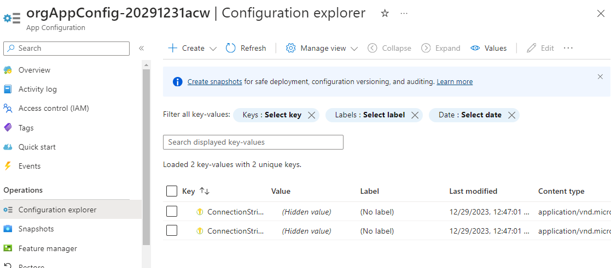  

1. Validate the two secrets are in place on the Configuration Explorer

    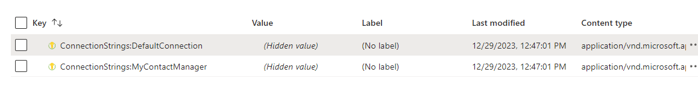  

## Task 3 - Reset the App Service to use the App Configuration and no longer directly reference the Key Vault

There are a number of things that you could do at this point.  One of them is that you could go back and remove the update/merge from previous work and you could just add the app config settings from the start of the creation of the web app.  As this is an organic feel of moving through iterations, and for simplicity, I've chosen to just create another settings update.  This time, you will reset the App configuration settings to only have the Application Insights connection string and the new endpoint URL from the previous step for the App Configuration.

### Step 1 - Create the reset bicep

The settings will not let you pass an empty object, so for this you will create a new file for reset and you will make the current settings with only the application insights connection string, and then you'll merge that with the new setting for the app configuration endpoint.

1. Create a new file called `contactWebAppServiceSettingsResetForAppConfiguration.bicep` and add the following:

```bicep
param webAppName string
param appConfigurationEndpointKey string 
param appConfigurationEndpointValue string 
param applicationInsightsConnectionStringKey string 
param applicationInsightsName string

resource webApp 'Microsoft.Web/sites@2023-01-01' existing = {
  name: webAppName
}

resource appInsights 'Microsoft.Insights/components@2020-02-02-preview' existing = {
  name: applicationInsightsName
}

//reset the current app settings with the new app settings WARNING: Wipes out everything that isn't explicitly set in the appSettings object
module resetAppConfigurationSettings 'contactWebAppServiceSettingsMerge.bicep' = {
  name: 'webAppSettings-${webAppName}'
  params: {
    currentAppSettings: { '${applicationInsightsConnectionStringKey}': appInsights.properties.ConnectionString }
    appSettings: {
      '${appConfigurationEndpointKey}' : appConfigurationEndpointValue
    }
    webAppName: webApp.name
  }
}
```

The file needs the web app and the app insights to get the objects, then merges values with the keys as appropriate, additionally, the new app configuration endpoint value must be passed in.

>**Note**: For this step I've chosen not to include a parameters file.  You could do that, but it's not necessary for this step.

### Step 2 - Add to the main deployment  

Add the reset task to the main deployment.

1. Add the following to the main deployment:

```bicep
module resetContactWebAppSettingsForAppConfiguration 'contactWebAppServiceSettingsResetForAppConfiguration.bicep' = {
  name: '${webAppName}-resettingAppSettingsForAppConfiguration'
  scope: contactWebResourceGroup
  params: {
    webAppName: contactWebApplicationPlanAndSite.outputs.webAppFullName
    appConfigurationEndpointKey: appConfigurationEndpointKey
    appConfigurationEndpointValue: orgAppConfiguration.outputs.appConfigStoreEndpoint
    applicationInsightsConnectionStringKey: appInsightsConnectionStringKey
    applicationInsightsName: contactWebApplicationInsights.outputs.applicationInsightsName
  }
}
```

    note the new parameter for the application insights connection string key.  This will map directly to the value the code is expecting to find `AzureAppConfigConnection`:

    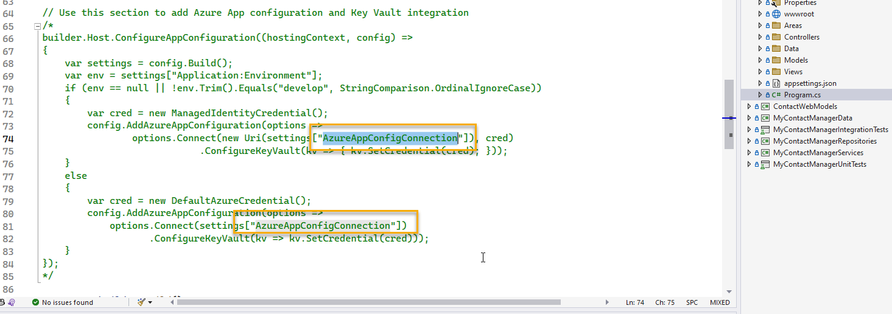  

    >**Note:** Running the code locally requires the app config connection string and a modification to the app settings.  The App Service, however, can run from Azure with these settings in place.

1. Add the new parameter in the main bicep

```bicep
@minLength(5)
@maxLength(12)
param appConfigStoreName string
param appConfigurationEndpointKey string
```

1. Add the parameters to the main deployment parameters file

```json
        "appConfigurationEndpointKey": { 
            "value": "AzureAppConfigConnection"
        }
```

### Step 3 - Deploy and Validate

Push your changes and validate the deployment.

1. The App Service Settings should now only have the Application Insights connection string and the App Configuration endpoint.

    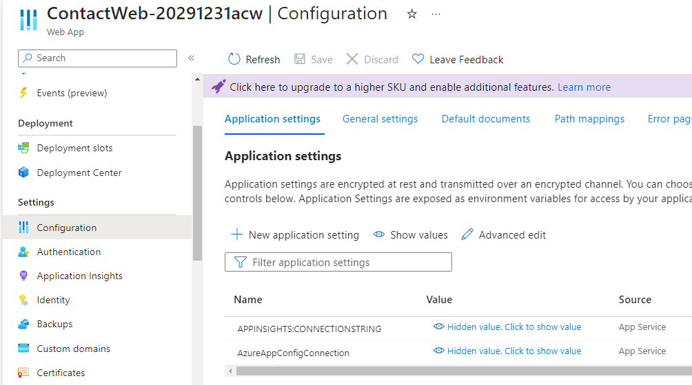  

    >**Note**: the Application gets a 500.3 error.  This is because the code needs to be modified to leverage app Configuration.  We'll do that in the next Task.

    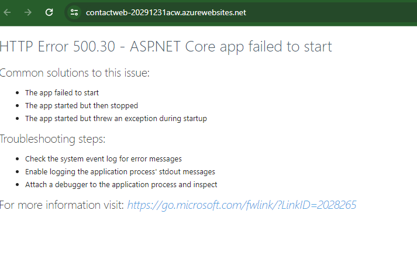  


## Task 4 - Modify the code to leverage the App Configuration

In this task, you'll modify the solution code to work against the App Configuration instead of the Key Vault directly.  

1. Get the app working locally (optional)

    You can get the app working locally by adding the app configuration connection string to your local settings.  You can get the connection string from the App Configuration instance in the portal.

    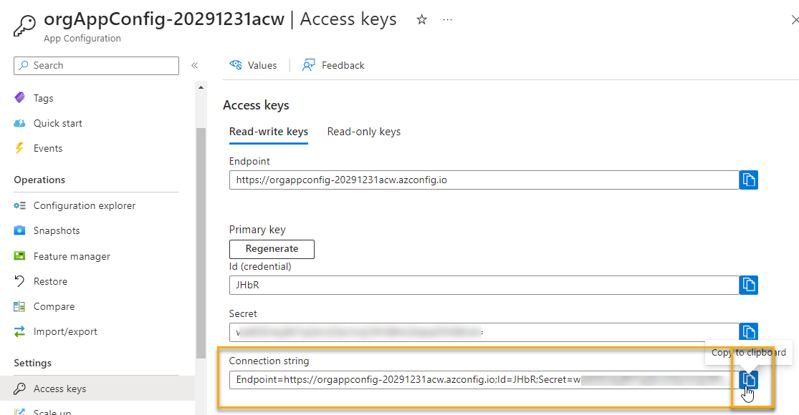  

    Add the connection string to your local settings and run the app locally.  You should be able to see the app working locally.

    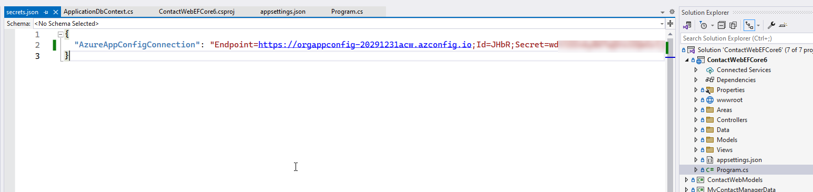  


### Step 1 - Modify the code

1. Modify the code to leverage the App Configuration

    Remove the comments to allow the code in lines 66-84 to execute.

    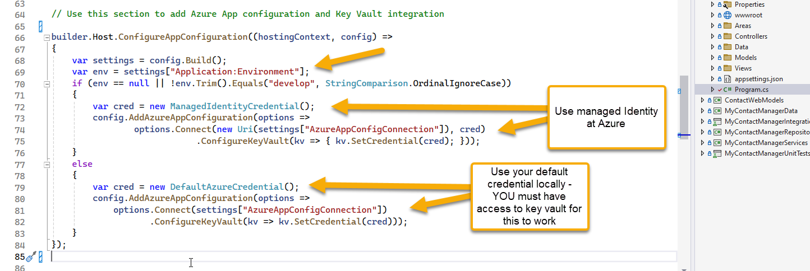  

    >**Note that the code is now using the App Configuration to get the connection string for the database.  In order for this to work locally, you will need to have access to key vault (even if the app config does, you don't from your local machine).  

    Notice at Azure, the `ManagedIdentityCredential` is used to allow authorization to resources like Key Vault.

    To toggle the `DefaultAzureCredential` for your local machine (you don't have a managed identity), add a setting to your local settings called `Application:Environment` and set it to `develop`.  This will allow you to use the `DefaultAzureCredential` to get the connection string from the Key Vault.

1. Move the code to be created prior to trying to leverage the secrets

    Cut the code and move it to the top of the file, right after line 12's `var builder = WebApplication.CreateBuilder(args);` and before the line:

    `var connectionString = builder.Configuration.GetConnectionString("DefaultConnection");`

    If you don't do this, you will get an error because the configuration is not yet set up and the connection string will be null.

    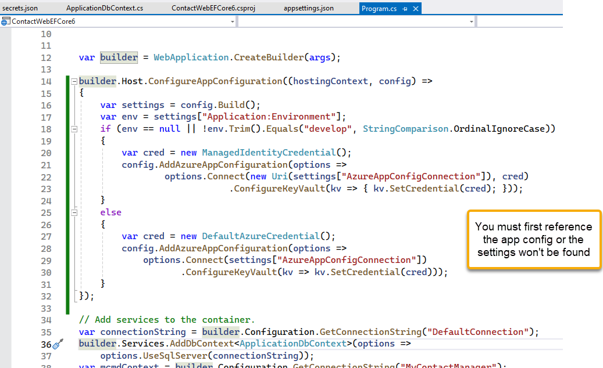  
    

1. Comment out any references to connection strings in your `appsettings.json`.

    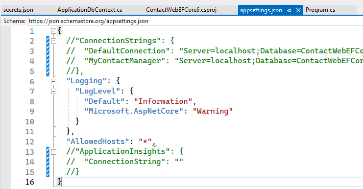  

1. Run the application locally (it will be hitting your azure db so if you don't have ip allowed on the db you may also get an error for the database).

    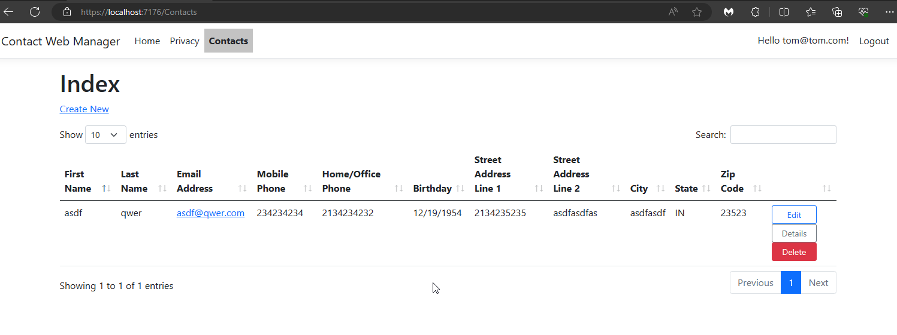  

    Run the application locally and validate that it works.  If you get a 500.3 error, make sure you check the database firewall settings and add your local IP.

    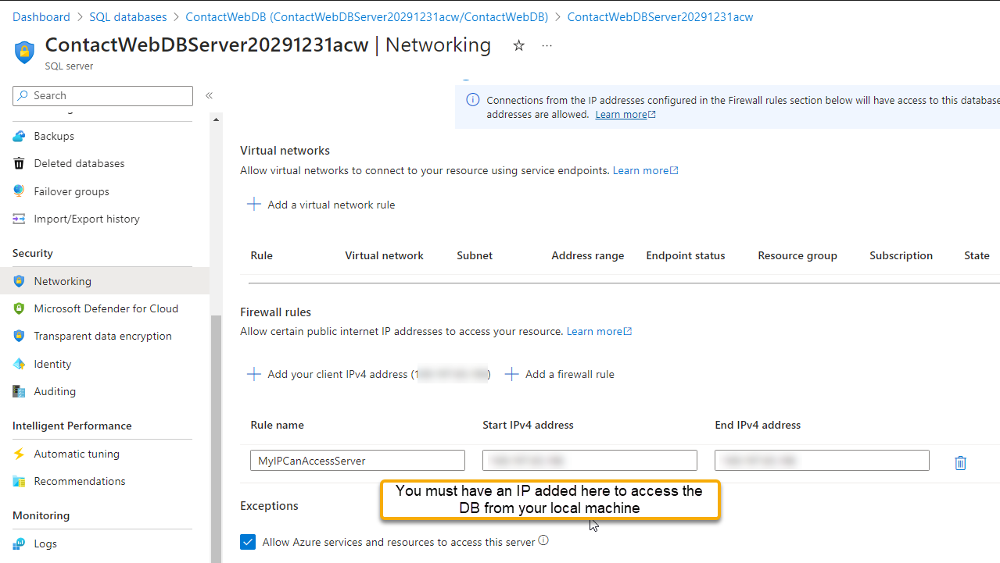  

### Step 2 - Deploy and Validate

Push your changes and validate the deployment.

1. Make sure you have updated the application code as expected and push your changes to the repo.

    This will run the final deployment where all the architecture and your application are in place.

1. Validate the application is working as expected.

    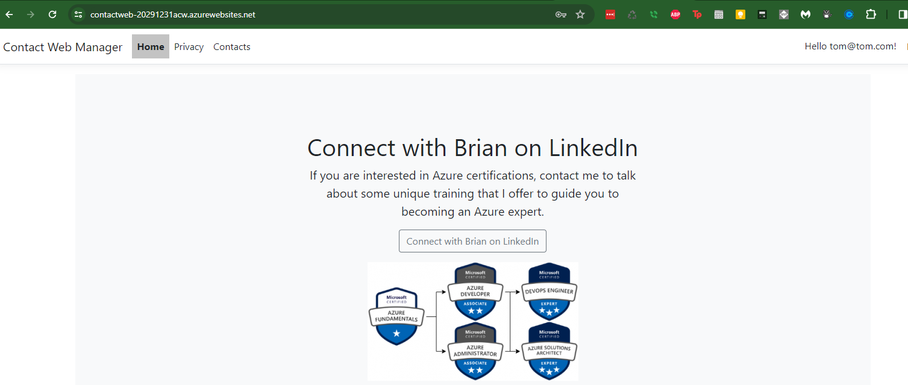  

## Completion

You have now completed the activities for this cloud workshop. We hope you enjoyed it and learned a lot during our training. Please feel free to reach out to us with any questions or feedback.  If you found any problems, please open issues on the repository. 

We'd love to hear from you!

