# ACW-InfrastructureAsCode
This repository has Infrastructure As Code walkthroughs and challenges to teach the skills and concepts around automation of Azure Resources and deployments

## What you are building

In this walkthrough training, you will learn how to work with Infrastructure as Code (IaC) using bicep and/or Terraform.  By default, you will likely see a couple of ARM templates along the way as well.

In each module, you'll build a piece of the overall architecture, and you will learn some best practices and gotchas along the way.  By the end of this training, you will have a pretty solid understanding of how to work with IaC, and you will have a fully functional application running in Azure.  To get the application into Azure, you will use IaC for the overall resources and CI/CD with GitHub (or another similar tool) to deploy the application.

## Prerequisites

Please make sure you have your machine set up and you have completed all of the prerequisites prior to our workshop start time.  If you have any questions or need help, please reach out for help prior to the day of the workshop.

### Software, tools, Github, and Azure Subscription  

You will need the following prerequisites to complete this walkthrough.  Please make sure you have them on your machine:

- Visual Studio Code [v 1.91+](https://code.visualstudio.com/download) 
    - Bicep Extension [for bicep workshop]
    - Terraform Extension [for terraform workshop]
    - Azure Tools Extension [both paths]
    - Optional: C# Extension 
- A GitHub Account (or other source control provider like ADO/BitBucket, but we're focusing on GitHub) [GitHub](https://github.com/signup?).  If you choose any other provider you will need to solve problems on your own as the walkthrough will only show interactions with GitHub.
- An Azure Subscription (you can use a free trial if you don't have one).
    >**IMPORTANT**: Please do not use a work subscription or an email associated with your work.  This walkthrough will create resources in Azure and you should not use a work subscription for this training.  If you don't have a personal subscription, you can create a free trial subscription [here](https://azure.microsoft.com/en-us/free/).  Make sure that if you create a free subscription you use a personal email address like hotmail, outlook, gmail, etc.  Do not use a work email address.
- Azure CLI [latest version, minimum 2.62+](https://learn.microsoft.com/en-us/cli/azure/install-azure-cli)
- Terraform [version 1.6.6+](https://developer.hashicorp.com/terraform/install?product_intent=terraform)
    - Windows [use Chocolatey](https://chocolatey.org/install)   

        ```text  
        choco install terraform
        ```  
    - Mac:  
        ```text  
        brew tap hashicorp/tap 
        brew install hashicorp/tap/terraform
        ```  
- GIT (required) with optional GIT command line tools [GIT](https://git-scm.com/downloads)
    - Could use a client like GitKraken or the tools in VSCode and/or Visual Studio
- Optional: Visual Studio Community or better (or JetBrains Rider) to be able to run the ASP.NET Core Web application locally (this could be optional - you could likely do this with VS Code as well). The code is complete and the extra pieces can be uncommented when the time is right, so you don't actually need to run the app locally if you don't want to. [Visual Studio Downloads](https://visualstudio.microsoft.com/downloads/)  
- Optional: .NET 6 SDK installed on your machine to develop .NET Core Web applications (for now the app is .NET 6). [Download .NET SDK](https://dotnet.microsoft.com/en-us/download/visual-studio-sdks)
- Optional: Microsoft SQL Server Developer Edition (or Express) installed on your machine [SQL Server](https://www.microsoft.com/en-us/sql-server/sql-server-downloads).
- Optional: SSMS (SQL Server Management Studio) installed on your machine [SSMS](https://learn.microsoft.com/en-us/sql/ssms/download-sql-server-management-studio-ssms?view=sql-server-ver16).  
- Optional: - Basic Programming knowledge (ASP.Net MVC with C# is used in this walkthrough, but all the code changes are given to you so you don't really need to know how to develop solutions).

### Get the starter project repository into your GitHub Account

You will need a GitHub repository to store the code and that repository will be used to set up CI/CD to Azure via GitHub Actions.  

>**Note:** If you want to use another repository like Azure DevOps, BitBucket, or GitLab, you can do that as well, but the instructions in this walkthrough and our focus in the live workshop will only show how to create GitHub actions for the IaC and CI/CD deployments.

If you get stuck, refer to the GitHub documents for:
- [How to create a repository](https://docs.github.com/en/repositories/creating-and-managing-repositories/creating-a-new-repository)  
- [How to clone a repository](https://docs.github.com/en/repositories/creating-and-managing-repositories/cloning-a-repository)
- [How to fork a repository](https://docs.github.com/en/get-started/quickstart/fork-a-repo)

#### Steps

1. For simplicity, you can fork this repo: [https://github.com/AzureCloudWorkshops/ACW-InfrastructureAsCode_Workshop](https://github.com/AzureCloudWorkshops/ACW-InfrastructureAsCode_Workshop/blob/main/README.md).

Skip to the step "Open the project in Visual Studio" below.

OR:  

1. Create a local folder for your working directory, then initialize a repository in it.
1. Download the code from the '/src/StarterProject' folder of this repository.
1. Unzip the code into a folder at the root of your local repository.  
1. Add a .gitignore file if one is not included

    ```bash
    dotnet new gitignore
    ```  

1. Open the project in Visual Studio (or VS Code) 
1. Modify the connection string to a local db of your choice
1. Run two commands to update the database
    
    ```bash
    update-database -context ApplicationDbContext
    update-database -context MyContactManagerDbContext
    ```  
    
    >**Note**: This code-base uses two different database contexts - one for identity and one for business logic.  For this reason, you'll need to migrate both contexts to your local database, and at azure (they can both use the same connection string as the database can be shared, or you could have your identity in one database and the business logic in another).

1. Ensure that you can register a user and create a contact on your local machine.
1. Commit any changes and push the changes to your remote repository if you have any pending changes.  

You should now have a local repository with the code in place, and a remote repository with the code in place.

#### Completion Check

Before proceeding, ensure that you can answer yes to the following questions:
- Do you have a remote repository with the code in place?
- Do you have a local repository with the code in place?
- [Optional] Does the application run on your local machine and work as expected to register a user and perform CRUD operations around contacts?

### Ensure that you can work with your Azure subscription from your machine

In order to make sure we get to the important parts of the workshop, we don't have time to spend on getting subscriptions set up and getting connected to our Azure account from our local machine.

For the first part of the workshop, commands will be run from the local machine into Azure.  In the second part of the workshop, we will use GitHub Actions to deploy the application to Azure.  For this reason, you need to make sure that you can work with your Azure subscription from your local machine, as well as have your GitHub account and repository set up and ready to go.

Please make sure that you have completed the following steps with your user account and Azure subscription prior to the workshop to ensure that you are ready to start working with Bicep or Terraform at the start of the day:

#### Task 1: Get Logged in to Azure from the CLI

In this first task, you will log in to Azure from the CLI.  This will allow you to run commands against your subscription.  You will need to have an Azure subscription to complete this task.  If you don't have an Azure subscription, you can create a free account [here](https://azure.microsoft.com/en-us/free/).  You will also need to make sure you have the Azure CLI installed.  You can find instructions on how to install the Azure CLI [here](https://docs.microsoft.com/en-us/cli/azure/install-azure-cli).

To get started, you will need to have a terminal open to run the azure cli.  You can do this in Visual Studio Code terminal for Bash or PowerShell, or really any other terminal as long as you can run commands (even the windows command line should work).

##### Step 1 - Ensure Azure CLI  

Begin by making sure you can run the Azure CLI.  

1. Execute the following command to validate Azure CLI is installed:

    ```bash
    az --version
    ```  
    >**Note:** if you do not see a current version of the Azure CLI as shown below, you will not be able to complete the next part of this task from your local machine.

    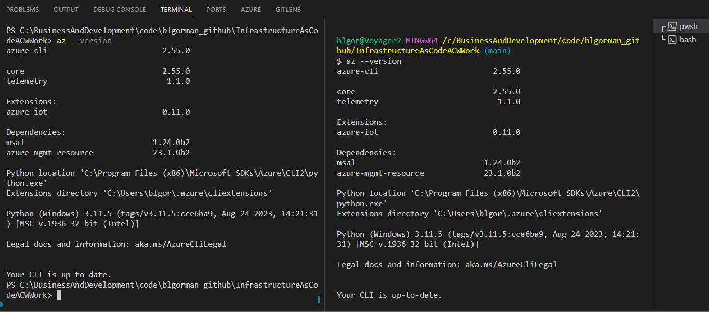

##### Step 2 - Log in to Azure

After validating the CLI is installed, make sure to continue on your local machine by logging in to Azure.

1. Log In to Azure

    Enter the following command to log in to Azure:
    ```bash  
    az login
    ```  

    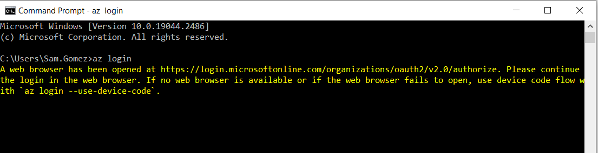  

1. A browser window will open, enter login credentials or select an account that you are already logged in to.

    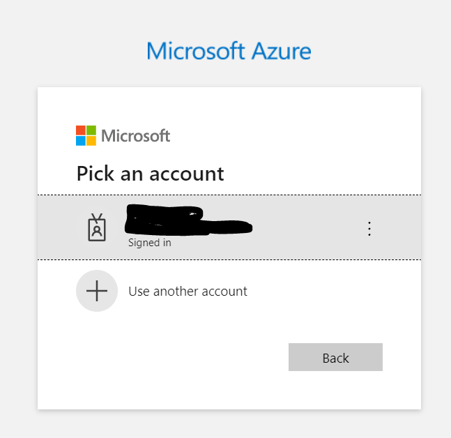  

1. A confirmation window will appear.

    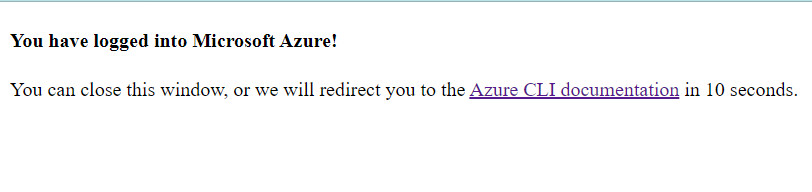  

>**Note:** If you are having trouble getting logged in from your local machine, you can use the Azure Cloud Shell to complete the work in this training.  You can find instructions on how to use the Azure Cloud Shell [here](https://docs.microsoft.com/en-us/azure/cloud-shell/overview).  You will need to use the shell and run the commands as shown in these walkthroughs, but you will need to also ensure you have the files for your deployments created in the shell as well if you go this route.  Using the azure cloud shell will not be shown in the walkthroughs, so if you go this route you will need to figure out how to create the files in the shell and run the commands as shown in the walkthroughs.

##### Step 3 - Ensure your subscription

Before doing any local deployments, it is a very good practice to make sure you are deploying to the correct subscription.  

1. Determine what subscription you are currently set to execute against.

    ```bash
    az account show
    ```  

    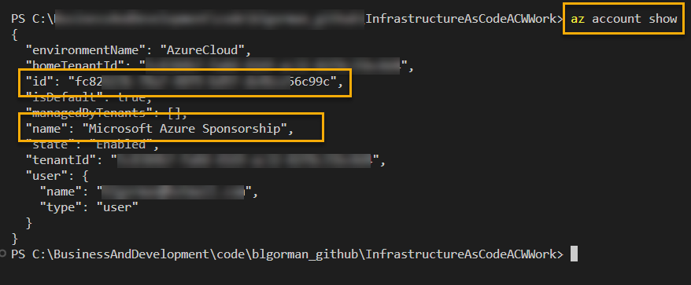 

    Review the output and determine that you are on the correct subscription.  You can see the name of the subscription and the subscription id.  Either can be used to set your subscription. 

    If you are on the correct subscription, you can continue to the next task.

1. If you need to change your subscription, you can do so by running the following commands:

    ```bash
    az account list -o table
    ```  

    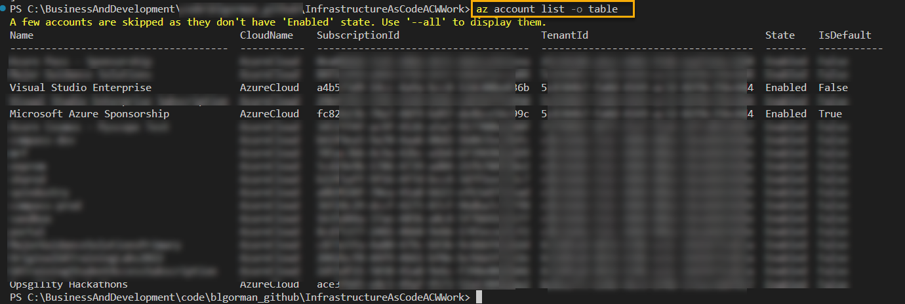  

    Then, using the subscription id or name, run the following command:

    ```bash
    az account set --subscription <either-the-subscription-id or-name-goes-here>
    ```  

    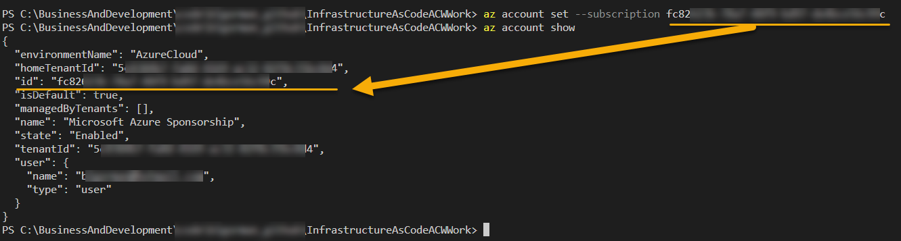

    Run the `az account show` command again to ensure you are on the correct subscription.

    Ensure you are on the correct subscription before continuing.

#### Task 2 - Create a resource group

In this second task, you'll use the Azure CLI to create a resource group.  You'll need to have an Azure subscription and you'll need to be logged in to Azure from the CLI.  If you haven't completed the first task above, please do so before continuing.  

You can create a resource group in the portal or via command line commands with the azure CLI. If you are struggling with the CLI, just pivot and go create a resource group in the portal (or switch to run the commands in the Azure Cloud Shell rather than from your local machine).

Assuming that creating a resource group is straight forward in the portal, let's do it via the CLI for the purposes of learning and validating our local machine connectivity to Azure.

##### Step 1 - Create variables

To create a resource group, you will need to set the name and location for the group. You should choose a region that is close to you that also has redundancy to match your needs.  For this walkthrough, any region will suffice, so choose one that is close to you.  You can find a list of regions [here](https://azure.microsoft.com/en-us/global-infrastructure/regions/).  

The name of the resource group should also make sense for the scope of your work.  For this, you are doing a simple deployment, so you can name it something like `iac-training-rg`.  You can name it whatever you want, but make sure it makes sense for the scope of your work and that you'll be confident you could delete the group later without fear of losing your work.

>**Note**: You may wish to create a script and run that instead of just running the command directly from the command line.  Either way, just make sure you can run commands and create resources in the correct Azure subscription.

1. Set variables to manage your group name and your location of choice (use either bash or powershell, not both):

    Bash:  

    ```bash
    rg=iac-training-rg
    loc=eastus
    echo $rg
    echo $loc
    ```  

    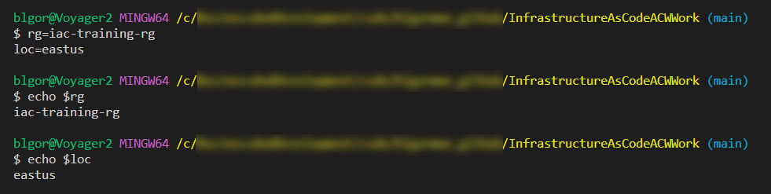

    PowerShell:  

    ```PowerShell
    $rg="iac-training-rg"
    $loc="eastus"
    echo $rg
    echo $loc
    ```  

    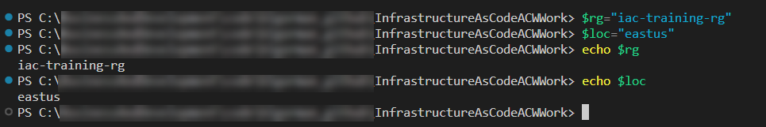

##### Step 2 - Create the resource group

With the variables in place, you can create and validate the existence of the resource group.

1. Create the group

    >**Note:** Only bash is shown below but the same `az` cli commands work in PowerShell.

    ```bash  
    az group create -n $rg -l $loc
    ```  

1. Validate the group exists via the CLI:

    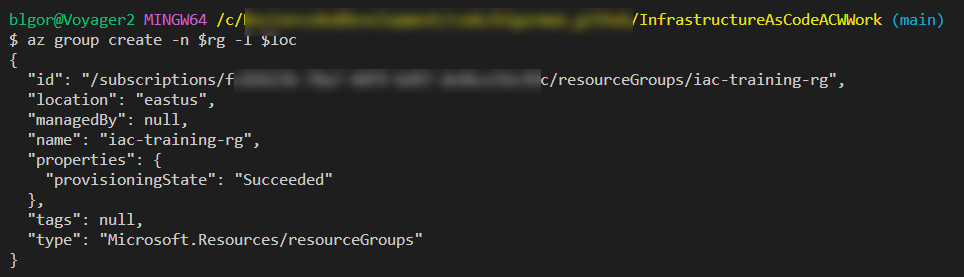  

    ```bash
    az group exists -n $rg
    ```  

    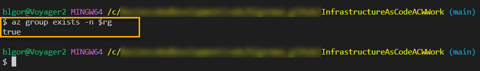

1. You can also validate in the portal

    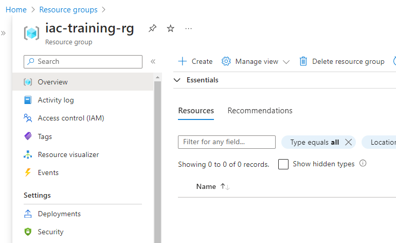

>**Note**: The name of your resource group will be whatever you name it, so don't be alarmed if you named it something different than what is shown or used any other region than `eastus`, as there are no restrictions on the name or location of the resource group for this walkthrough and any region with a resource group of any name will work.

## You are now ready

With the above prerequisites completed, you are now ready to start the workshop.  You will be able to run commands from your local machine to Azure, and you will be able to create resources in Azure.  You will also have a repository in GitHub that you can use in the later parts of the workshop to set up CI/CD to Azure via GitHub Actions.

Please proceed to the [Part 1 - Introduction to IaC](Part1-IntroductionToIaC.md) walkthrough to begin the workshop.  Note that there will usually be a common walkthrough and then a breakout walkthrough for either bicep or terraform.  You can choose to do bicep, terraform, or both for the breakouts.  Each breakout will perform identical tasks in the respective language, so you only need to do one or the other to complete the training, but you can come back later to do the other if you want to learn both.